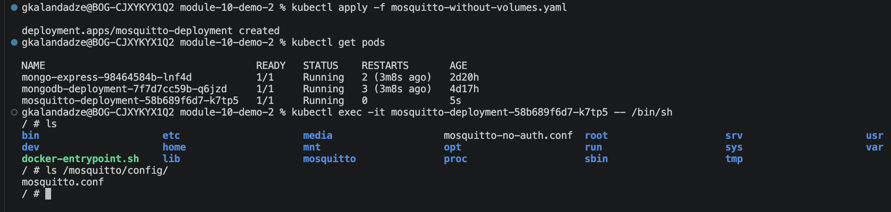
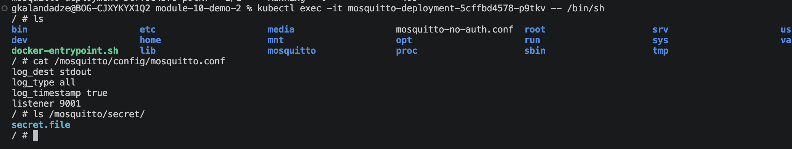

# Module 10 — Kubernetes

## Demo Project: Deploy Mosquitto Message Broker with ConfigMap and Secret Volume Types

**Technologies:** Kubernetes · Docker · Mosquitto

**Part of:** [TWN DevOps Bootcamp](https://github.com/GiorgiKalandadze/twn-devops-bootcamp)

---

## Project Description

- Deployed Eclipse Mosquitto MQTT message broker into a local Minikube cluster
- Demonstrated the difference between mounting ConfigMap/Secret as ENV VARS (Demo 1) vs as VOLUMES (this demo) — the volume approach is how production services like Mosquitto, Nginx, and Prometheus load config files
- Defined Mosquitto configuration in a ConfigMap and mounted it as a file at `/mosquitto/config/mosquitto.conf`
- Defined sensitive data in a Secret (base64-encoded) and mounted it as a file at `/mosquitto/secret/`
- Verified mounted files appear inside the running container

---

## Architecture

```
  ConfigMap — mosquitto-config-file
  (key: mosquitto.conf)
       │
       │  mounted as volume ──────────────────────────────────┐
       │                                                       ▼
       │                                          Mosquitto Pod
       │                                          /mosquitto/config/mosquitto.conf
       │
  Secret — mosquitto-secret-file
  (key: secret.file, base64-encoded)
       │
       │  mounted as volume (readOnly) ───────────────────────┐
       │                                                       ▼
       │                                          Mosquitto Pod
                                                  /mosquitto/secret/secret.file

  Minikube Cluster (local)
```

---

## Steps

### Step 1 — Start Minikube Cluster

```bash
minikube start
kubectl get nodes
```

---

### Step 2 — Deploy Mosquitto WITHOUT Volumes

Apply the baseline Deployment that uses no volumes — this lets us inspect what Mosquitto ships with by default.

[mosquitto-without-volumes.yaml](mosquitto-without-volumes.yaml) — Deployment only, `eclipse-mosquitto:2.0.15`, port 1883.

```bash
kubectl apply -f mosquitto-without-volumes.yaml
kubectl get pods
```

---

### Step 3 — Exec into the Pod and Inspect the Default Config

```bash
kubectl exec -it <mosquitto-pod-name> -- /bin/sh
ls /mosquitto/config/
```

This shows the default config folder that ships inside the image — no custom files yet.



---

### Step 4 — Delete the No-Volume Deployment

```bash
kubectl delete -f mosquitto-without-volumes.yaml
```

---

### Step 5 — Create the ConfigMap Manifest

[config-file.yaml](config-file.yaml) defines a `ConfigMap` named `mosquitto-config-file`. The data key `mosquitto.conf` becomes the filename when mounted as a volume:

```yaml
apiVersion: v1
kind: ConfigMap
metadata:
  name: mosquitto-config-file
data:
  mosquitto.conf: |
    log_dest stdout
    log_type all
    log_timestamp true
    listener 9001
```

---

### Step 6 — Create the Secret Manifest

[secret-file.yaml](secret-file.yaml) defines a `Secret` named `mosquitto-secret-file` with a base64-encoded placeholder value:

```bash
echo -n 'supersecret' | base64
# c3VwZXJzZWNyZXQ=
```

```yaml
apiVersion: v1
kind: Secret
metadata:
  name: mosquitto-secret-file
type: Opaque
data:
  secret.file: c3VwZXJzZWNyZXQ=
```

---

### Step 7 — Create the Mosquitto Deployment with Volume Mounts

[mosquitto.yaml](mosquitto.yaml) wires both the ConfigMap and Secret into the Pod via `volumes` + `volumeMounts`:

- `mosquitto-conf` → `/mosquitto/config` (ConfigMap)
- `mosquitto-secret` → `/mosquitto/secret` (Secret, `readOnly: true`)

When Kubernetes mounts the ConfigMap, each data key becomes a file — `mosquitto.conf` appears at `/mosquitto/config/mosquitto.conf`, overriding the image default. The Secret key `secret.file` is mounted base64-decoded at `/mosquitto/secret/secret.file`.

---

### Step 8 — Apply All Three Manifests

```bash
kubectl apply -f config-file.yaml -f secret-file.yaml -f mosquitto.yaml
kubectl get pods
kubectl get configmap
kubectl get secret
```

---

### Step 9 — Verify Mounted Files Inside the Container

```bash
kubectl exec -it <mosquitto-pod-name> -- /bin/sh
cat /mosquitto/config/mosquitto.conf
ls /mosquitto/secret/
```

The custom `mosquitto.conf` from the ConfigMap and `secret.file` from the Secret should both be present.



---

## What I Learned

- The two ways to consume ConfigMaps and Secrets: env vars vs volume mounts
- How a ConfigMap key becomes a filename when mounted as a volume
- How Secret volumes mount base64-decoded content as files (`readOnly`)
- Why production services rely on volume-mounted config files instead of env vars
- How to exec into a Pod to inspect its filesystem and verify mounted files

---

## Cleanup

```bash
kubectl delete -f mosquitto.yaml -f secret-file.yaml -f config-file.yaml
minikube stop
```

---
