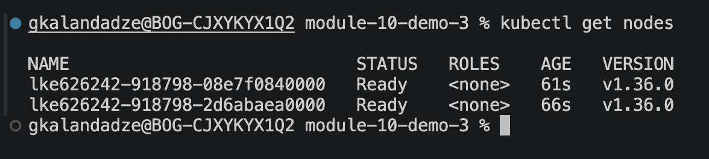
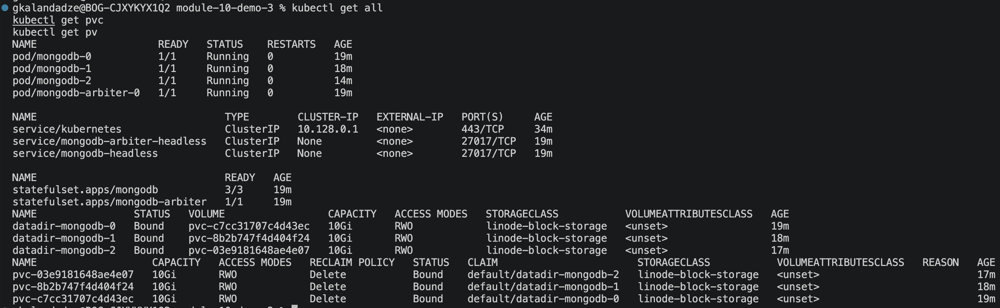
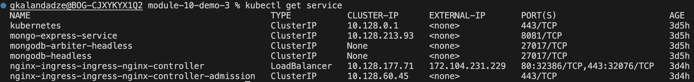
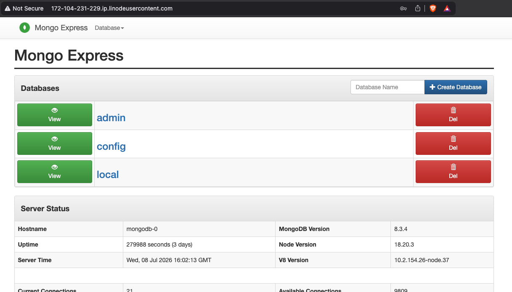

# Module 10 — Kubernetes

## Demo Project: Install a Stateful Service (MongoDB) on Kubernetes Using Helm

**Technologies:** Kubernetes · Helm · MongoDB · Mongo Express · Linode LKE · Linux

**Part of:** [TWN DevOps Bootcamp](https://github.com/GiorgiKalandadze/twn-devops-bootcamp)

---

## Project Description

- Provisioned a managed Kubernetes cluster with Linode Kubernetes Engine (LKE)
- Deployed a replicated MongoDB (StatefulSet, 3 replicas) using the Bitnami Helm chart
- Configured data persistence using Linode block storage (`linode-block-storage` storageClass) via PersistentVolumeClaims
- Deployed Mongo Express as a UI client connecting to the MongoDB primary
- Installed the NGINX Ingress Controller via Helm, which provisions a Linode NodeBalancer (LoadBalancer)
- Configured an Ingress rule to route browser traffic to the Mongo Express internal Service

---

## Architecture

```
  Browser
     │
     │  HTTP  (public IP / hostname)
     ▼
  Linode NodeBalancer  (type: LoadBalancer)
     │
     ▼
  NGINX Ingress Controller Pod
     │
     │  Ingress rule  host → mongo-express-service:8081
     ▼
  mongo-express-service  (ClusterIP)
     │
     ▼
  Mongo Express Pod
     │
     │  ME_CONFIG_MONGODB_SERVER=mongodb-headless
     ▼
  mongodb-headless  (headless Service — resolves to all pod IPs)
     │
     ▼
  MongoDB StatefulSet  (Bitnami Helm chart)
     ├─ mongodb-0  (primary)   ──▶ PVC ──▶ Linode Block Storage PV
     ├─ mongodb-1  (secondary) ──▶ PVC ──▶ Linode Block Storage PV
     └─ mongodb-2  (secondary) ──▶ PVC ──▶ Linode Block Storage PV

  LKE Cluster (Linode Kubernetes Engine)
  ─────────────────────────────────────────────────────────
  StatefulSet vs Deployment:
    Deployment  — stateless pods, any pod is identical, no stable identity
    StatefulSet — ordered pods (mongodb-0/1/2), stable DNS per pod,
                  per-pod PVC that survives rescheduling

  Helm installs the full StatefulSet, Services, Secret, and PVCs
  with one command + a values override file.

  Ingress + LoadBalancer only works on a real cloud cluster — LKE
  provisions an actual Linode NodeBalancer; Minikube cannot.

  Mongo Express connects to the mongodb-headless Service, which
  resolves to all replica-set pod IPs; the MongoDB driver then
  discovers the primary itself.
```

---

## Steps

### Step 1 — Create LKE Cluster in Linode Cloud Manager

In the Linode Cloud Manager, create a new Kubernetes cluster:

- **Region:** choose the nearest available region
- **Kubernetes version:** latest stable
- **Node pool:** add a pool (e.g. 2–3 × Linode 4 GB shared)

Download the cluster's `kubeconfig` YAML file from the Cloud Manager dashboard.

---

### Step 2 — Point kubectl at the LKE Cluster

```bash
export KUBECONFIG=<path-to-lke-kubeconfig>.yaml
kubectl get nodes
```

All nodes should show `Ready` status.



---

### Step 3 — Add the Bitnami Helm Repository

```bash
helm repo add bitnami https://charts.bitnami.com/bitnami
helm repo update
```

> **Note:** Bitnami also publishes charts via the OCI registry as the newer install method:
> `helm install mongodb oci://registry-1.docker.io/bitnamicharts/mongodb --values helm-mongodb.yaml`
> Both methods install the same chart; the OCI form skips the `helm repo add` step.

---

### Step 4 — Create the MongoDB Helm Values File

[helm-mongodb.yaml](helm-mongodb.yaml) overrides the Bitnami chart defaults:

```yaml
architecture: replicaset
replicaCount: 3

persistence:
  storageClass: linode-block-storage

auth:
  rootPassword: <PASSWORD>
```

Key overrides:
- `architecture: replicaset` — deploys a primary + secondaries instead of a single standalone pod
- `replicaCount: 3` — 1 primary + 2 secondaries
- `persistence.storageClass` — tells Kubernetes to provision Linode block storage PVs for each pod's PVC
- `auth.rootPassword` — sets the MongoDB root password (also stored in a Kubernetes Secret by the chart)

---

### Step 5 — Install MongoDB via Helm

```bash
helm install mongodb --values helm-mongodb.yaml bitnami/mongodb
```

Helm creates the StatefulSet, headless Services (`mongodb-headless`, `mongodb-arbiter-headless`), Secret, and PersistentVolumeClaims.

---

### Step 6 — Verify StatefulSet, Pods, Services, and PVCs

```bash
kubectl get all
kubectl get pvc
kubectl get pv
```

Confirm all three `mongodb-*` pods are `Running` and all PVCs are in `Bound` state (Linode block storage volumes provisioned).



---

### Step 7 — Create the Mongo Express Deployment and Service

[mongo-express.yaml](mongo-express.yaml) defines a `Deployment` and internal `ClusterIP` Service. The admin password is read from the Helm-created `mongodb` Secret via `secretKeyRef` — no hardcoded credentials:

```yaml
env:
  - name: ME_CONFIG_MONGODB_ADMINUSERNAME
    value: root
  - name: ME_CONFIG_MONGODB_SERVER
    value: mongodb-headless
  - name: ME_CONFIG_MONGODB_ADMINPASSWORD
    valueFrom:
      secretKeyRef:
        name: mongodb
        key: mongodb-root-password
```

`ME_CONFIG_MONGODB_SERVER: mongodb-headless` points to the headless Service created by the Helm chart, which resolves to all replica-set pod IPs; the MongoDB driver inside Mongo Express then discovers the primary itself.

---

### Step 8 — Apply Mongo Express

```bash
kubectl apply -f mongo-express.yaml
kubectl get pods
kubectl get svc
```

---

### Step 9 — Install the NGINX Ingress Controller via Helm

```bash
helm repo add ingress-nginx https://kubernetes.github.io/ingress-nginx
helm install nginx-ingress ingress-nginx/ingress-nginx
```

On LKE, Helm triggers Linode to provision a NodeBalancer (cloud LoadBalancer) and assign it a public IP.

---

### Step 10 — Verify the LoadBalancer External IP

```bash
kubectl get service
```

The `nginx-ingress-ingress-nginx-controller` Service should show an `EXTERNAL-IP`. This is the public Linode NodeBalancer IP that all browser traffic will enter through.



---

### Step 11 — Create the Ingress Resource

[ingress.yaml](ingress.yaml) defines a host-based Ingress rule routing to Mongo Express. `ingressClassName: nginx` must match the `IngressClass` name created by the Helm install in Step 9 (`kubectl get ingressclass`) — not the Helm release name. The `host` is set to Linode's reverse-DNS hostname for the NodeBalancer's external IP from Step 10 (dots replaced with dashes, e.g. `172.104.231.229` → `172-104-231-229.ip.linodeusercontent.com`):

```yaml
apiVersion: networking.k8s.io/v1
kind: Ingress
metadata:
  name: mongo-express
spec:
  ingressClassName: nginx
  rules:
    - host: <NODEBALANCER_IP-with-dots-as-dashes>.ip.linodeusercontent.com
      http:
        paths:
          - path: /
            pathType: Prefix
            backend:
              service:
                name: mongo-express-service
                port:
                  number: 8081
```

---

### Step 12 — Apply the Ingress

```bash
kubectl apply -f ingress.yaml
kubectl get ingress
```

---

### Step 13 — Access Mongo Express in Browser and Create a Test Database

Open `http://<NODEBALANCER_IP-with-dots-as-dashes>.ip.linodeusercontent.com` in a browser (the `host` configured in Step 11 — visiting the bare IP won't match the Ingress rule and returns a 404 from NGINX's default backend). Log in with Mongo Express's basic-auth credentials (`admin` / `pass` by default) and create a test database to verify the full stack is working.



---

## What I Learned

- How Helm charts package and deploy complex stateful applications — one command replaces dozens of YAML manifests
- StatefulSet vs Deployment: stable pod identity, ordered scaling, and per-pod PVCs that survive rescheduling
- How PersistentVolumeClaims dynamically provision Linode block storage — the `storageClass` in the values file is all that changes between cloud providers
- Why Ingress + LoadBalancer requires a real cloud cluster — LKE provisions an actual Linode NodeBalancer; Minikube cannot create an external LoadBalancer
- How the NGINX Ingress Controller acts as a single entry point and routes traffic to internal ClusterIP Services based on Ingress rules
- How to override Helm chart defaults with a custom values file instead of modifying the chart directly

---

## Cleanup

Delete resources in this order — releasing cloud infrastructure before destroying the cluster avoids orphaned Linode NodeBalancers and block storage volumes that continue to bill:

```bash
kubectl delete -f ingress.yaml
helm uninstall nginx-ingress
kubectl delete -f mongo-express.yaml
helm uninstall mongodb
kubectl delete pvc --all
```

Then delete the LKE cluster from the Linode Cloud Manager.

> **Verify in the Linode Cloud Manager** that the NodeBalancer and all block storage volumes are gone before closing out — orphaned resources continue to incur charges even after the cluster is deleted.
