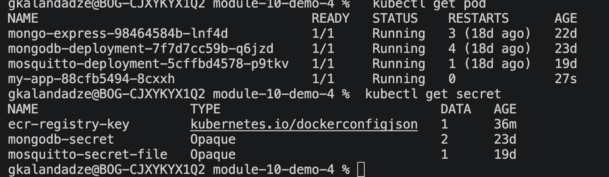

# Module 10 — Kubernetes

## Demo Project: Deploy a Web Application in Kubernetes from a Private Docker Registry (AWS ECR)

**Technologies:** Kubernetes · Helm · AWS ECR · Docker

**Part of:** [TWN DevOps Bootcamp](https://github.com/GiorgiKalandadze/twn-devops-bootcamp)

---

## Project Description

- Deployed the Java Maven web application image from a private AWS ECR repository into a local K8s cluster
- Created a Kubernetes Secret of type `docker-registry` holding ECR authentication credentials
- Referenced the Secret via `imagePullSecrets` in the application Deployment so K8s can pull the private image
- Verified the pod pulled the image successfully from the private registry

---

## Key Concept

Kubernetes cannot pull images from a private registry by default — it needs an image pull secret. The kubelet on each node authenticates to the registry using credentials stored in a Kubernetes `Secret`, referenced from the pod spec via `imagePullSecrets`.

AWS ECR authentication tokens expire after **12 hours**, so the Secret must be re-created periodically (or automated, e.g. via a CronJob) to keep pulling images. This is different from long-lived credentials like DockerHub tokens, which don't need to be rotated on a fixed schedule.

---

## Architecture

```
  AWS ECR — private repo: my-app
  <ACCOUNT_ID>.dkr.ecr.eu-north-1.amazonaws.com/my-app
     │
     │  auth via docker-registry Secret (ecr-registry-key)
     ▼
  K8s Deployment  (imagePullSecrets: ecr-registry-key)
     │
     │  kubelet pulls image using Secret credentials
     ▼
  Pod  — image pulled from private ECR repo
     │
     ▼
  Application container running (port 8080)

  ECR Auth Tokens Expire Every 12 Hours
  ─────────────────────────────────────────────────────────
  Unlike DockerHub's long-lived credentials, an ECR
  get-login-password token is only valid for 12 hours.
  The ecr-registry-key Secret must be re-created with a
  fresh token before it expires, or new pod scheduling /
  image pulls will start failing.
```

---

## Steps

### Step 1 — Authenticate Docker CLI to ECR and Confirm Access

```bash
aws ecr get-login-password --region eu-north-1 | docker login --username AWS --password-stdin <ACCOUNT_ID>.dkr.ecr.eu-north-1.amazonaws.com
```

Confirms the AWS CLI credentials are valid and the Docker CLI can authenticate against the private ECR registry.

---

### Step 2 — Create the Kubernetes docker-registry Secret

```bash
kubectl create secret docker-registry ecr-registry-key \
  --docker-server=<ACCOUNT_ID>.dkr.ecr.eu-north-1.amazonaws.com \
  --docker-username=AWS \
  --docker-password=$(aws ecr get-login-password --region eu-north-1)
```

The `docker-registry` Secret type stores the credentials as a `.dockerconfigjson` entry, in the exact format the kubelet expects when authenticating to pull an image.

---

### Step 3 — Verify the Secret

```bash
kubectl get secret ecr-registry-key --output=yaml
```

---

### Step 4 — Create app-deployment.yaml

[app-deployment.yaml](app-deployment.yaml) defines a `Deployment` referencing the private ECR image, with `imagePullSecrets` pointing at the Secret from Step 2:

```yaml
spec:
  containers:
    - name: my-app
      image: <ACCOUNT_ID>.dkr.ecr.eu-north-1.amazonaws.com/my-app:<tag>
      ports:
        - containerPort: 8080
  imagePullSecrets:
    - name: ecr-registry-key
```

---

### Step 5 — Apply the Deployment

```bash
kubectl apply -f app-deployment.yaml
```

---

### Step 6 — Verify the Pod Pulled the Private Image Successfully

```bash
kubectl get pods
kubectl describe pod <pod-name>
```

Confirm the pod status is `Running` — no `ImagePullBackOff` or `ErrImagePull` — and check the `Events` section of the describe output for a successful pull from the ECR registry.

📸 screenshot-01 — pod Running, no ImagePullBackOff



---

### Step 7 — Note on Token Expiry

ECR authentication tokens expire every **12 hours**. The `ecr-registry-key` Secret does not refresh itself — for a longer-lived cluster, re-run the same command from Step 2 to replace it with a fresh token before it expires:

```bash
kubectl delete secret ecr-registry-key

kubectl create secret docker-registry ecr-registry-key \
  --docker-server=<ACCOUNT_ID>.dkr.ecr.eu-north-1.amazonaws.com \
  --docker-username=AWS \
  --docker-password=$(aws ecr get-login-password --region eu-north-1)
```

In production this is typically automated with a CronJob that rotates the Secret on a schedule shorter than 12 hours.

---

## What I Learned

- Why Kubernetes needs an imagePullSecret to authenticate against private registries
- The `docker-registry` Secret type and how it's structured
- How ECR's short-lived auth tokens differ from static registry credentials
- How to reference a pull secret in a Deployment spec
- How to debug `ImagePullBackOff` / `ErrImagePull` errors with `kubectl describe pod`

---

## Cleanup

```bash
kubectl delete -f app-deployment.yaml
kubectl delete secret ecr-registry-key
```

