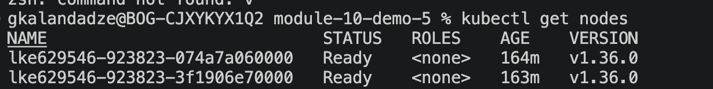
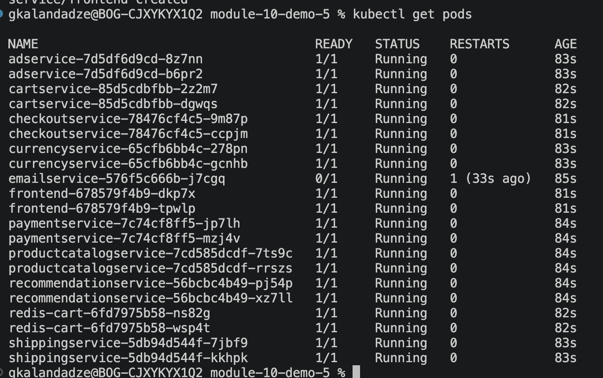
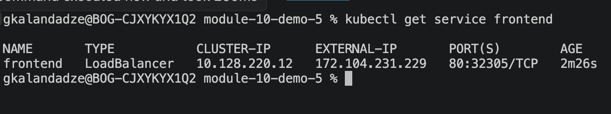
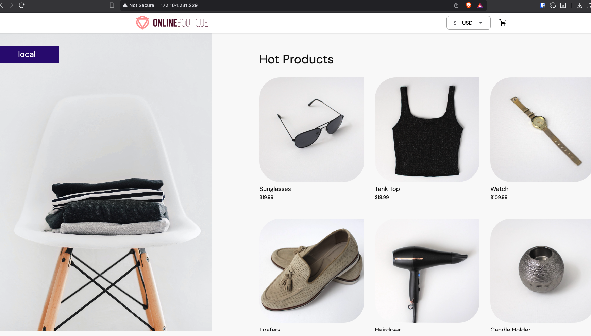

# Module 10 — Kubernetes

## Demo Project: Deploy a Microservices Application in Kubernetes with Production & Security Best Practices

**Technologies:** Kubernetes · Redis · Linux · Linode LKE

**Application source:** [microservices-demo](https://github.com/techworld-with-nana/microservices-demo) (bootcamp fork of Google's Online Boutique demo)

**Part of:** [TWN DevOps Bootcamp](https://github.com/GiorgiKalandadze/twn-devops-bootcamp)

---

## Project Description

- Deployed the "Online Boutique" microservices e-commerce application (11 services) to a managed Linode Kubernetes Engine (LKE) cluster
- Wrote/organized Kubernetes manifests (Deployment + Service) for each microservice
- Applied production and security best practices to every Deployment: readiness/liveness probes, non-root security context, no privilege escalation — plus CPU/memory requests and limits sized for the services with the heaviest measured footprint (`emailservice`, `adservice`, `redis-cart`)
- Used Redis (`redis-cart`) as the in-memory data store for the shopping cart service
- Exposed the frontend service externally via a `LoadBalancer` Service (Linode NodeBalancer)

---

## Key Concepts

**Production best practices** applied to every Deployment:
- **Readiness probes** — stop the Service from routing traffic to a pod before its dependencies (e.g. gRPC connections) are actually ready
- **Liveness probes** — let Kubernetes detect a hung/deadlocked container and restart it automatically, instead of leaving a zombie pod marked `Running`
- **CPU/memory `requests` and `limits`** — prevent a noisy pod from starving others on the same node. Set explicitly on `emailservice`, `adservice`, and `redis-cart` (the services with a known, measured resource footprint); the rest inherit the namespace/cluster defaults

**Security best practices** applied to every Deployment:
- `securityContext.runAsNonRoot: true` — containers run as an unprivileged user, limiting blast radius if a container is compromised
- `allowPrivilegeEscalation: false` — a process inside the container can't gain more privileges than its parent
- `readOnlyRootFilesystem: true` where possible — prevents an attacker (or bug) from writing to the container's filesystem at runtime. Skipped on `redis-cart`, which needs to write to its own data directory

**Networking:** internal service-to-service communication uses `ClusterIP` Services over gRPC via Kubernetes' internal DNS (e.g. `cartservice:7070`). Only `frontend` is exposed externally, via a `LoadBalancer` Service — every other service is unreachable from outside the cluster. That's the core of the security posture here: one deliberate entry point instead of eleven.

**A note on `redis-cart`'s `replicas: 2`:** two independent, uncoordinated Redis pods sit behind a single ClusterIP Service — there's no replication or clustering between them, just plain Kubernetes load-balancing across two separate in-memory stores. That means a shopping cart session can land on either pod's Service call and see different data depending on which replica handled the request. It's fine for demo throughput, but it is **not** real high availability for stateful data — a production setup would use a managed external Redis (e.g. ElastiCache) or a properly clustered Redis Helm chart instead.

---

## Architecture

```
  Browser
     │
     │  HTTP
     ▼
  Linode NodeBalancer  (frontend, type: LoadBalancer)
     │
     ▼
  frontend Pod  (Go)
     │
     ├──▶ productcatalogservice   (ClusterIP · Go)
     ├──▶ currencyservice         (ClusterIP · Node.js)
     ├──▶ cartservice             (ClusterIP · C#)
     ├──▶ recommendationservice   (ClusterIP · Python)
     ├──▶ adservice               (ClusterIP · Java)
     └──▶ checkoutservice         (ClusterIP · Go)
              │
              ├──▶ paymentservice          (ClusterIP · Node.js)
              ├──▶ shippingservice         (ClusterIP · Go)
              ├──▶ emailservice            (ClusterIP · Python)
              ├──▶ cartservice             (ClusterIP · C#)
              └──▶ productcatalogservice   (ClusterIP · Go)

  cartservice ──▶ redis-cart  (ClusterIP · Redis)

  Every Deployment above:
  ─────────────────────────────────────────────────────────
    readinessProbe + livenessProbe   (gRPC, httpGet for frontend)
    securityContext: runAsNonRoot, allowPrivilegeEscalation: false

  resources.requests / resources.limits are only set on
  emailservice, adservice, and redis-cart — sized for their
  actual measured footprint, not applied blanket to all 11.

  Only frontend is a LoadBalancer — every other Service is
  ClusterIP and unreachable from outside the cluster.
```

---

## Steps

### Step 1 — Create LKE Cluster and Verify Access

Create a new Kubernetes cluster in the Linode Cloud Manager, download the `kubeconfig`, and confirm the nodes are ready:

```bash
export KUBECONFIG=<path-to-lke-kubeconfig>.yaml
kubectl get nodes
```

📸 screenshot-01 — LKE cluster nodes ready



---

### Step 2 — Review the Base Manifests

The base manifests ship at `kubernetes-manifests/` in the [source repo](https://github.com/techworld-with-nana/microservices-demo) — one Deployment + Service per microservice, using the upstream `gcr.io/google-samples/microservices-demo/*` images. They work out of the box, but have none of the production/security hardening applied in this project.

---

### Step 3 — Add Production and Security Hardening

For each service's Deployment, add:

- `readinessProbe` + `livenessProbe` — `httpGet` for the HTTP-facing `frontend`, native gRPC probes (`grpc.port`) for the internal gRPC services
- `securityContext` — `runAsNonRoot: true`, `allowPrivilegeEscalation: false`, `readOnlyRootFilesystem: true` where the service doesn't need to write to its own filesystem
- `resources.requests` / `resources.limits` — CPU and memory, only where the service has a known resource footprint (`emailservice`, `adservice`, `redis-cart`)

---

### Step 4 — Organize Hardened Manifests

The hardened manifests live in a single [k8s-manifests/config.yaml](k8s-manifests/config.yaml) — all 11 services as `---`-separated Deployment + Service pairs, in the style used throughout this bootcamp track. `emailservice` is shown below as the pattern; all other services follow it identically (probes, non-root `securityContext`, and — for `emailservice`, `adservice`, `redis-cart` — resource limits):

```yaml
apiVersion: apps/v1
kind: Deployment
metadata:
  name: emailservice
spec:
  selector:
    matchLabels:
      app: emailservice
  template:
    metadata:
      labels:
        app: emailservice
    spec:
      securityContext:
        runAsNonRoot: true
        runAsUser: 1000
      containers:
      - name: service
        image: gcr.io/google-samples/microservices-demo/emailservice:v0.8.0
        ports:
        - containerPort: 8080
        env:
        - name: PORT
          value: "8080"
        livenessProbe:
          grpc:
            port: 8080
          periodSeconds: 5
        readinessProbe:
          grpc:
            port: 8080
          periodSeconds: 5
        resources:
          requests:
            cpu: 100m
            memory: 64Mi
          limits:
            cpu: 200m
            memory: 128Mi
        securityContext:
          allowPrivilegeEscalation: false
          runAsNonRoot: true
          readOnlyRootFilesystem: true
---
apiVersion: v1
kind: Service
metadata:
  name: emailservice
spec:
  type: ClusterIP
  selector:
    app: emailservice
  ports:
  - protocol: TCP
    port: 5000
    targetPort: 8080
```

---

### Step 5 — Apply All Manifests

```bash
kubectl apply -f k8s-manifests/config.yaml
```

---

### Step 6 — Verify All Pods Are Running and Ready

```bash
kubectl get pods
```

📸 screenshot-02 — all 11 services Running, READY 1/1



---

### Step 7 — Verify Resource Limits and Probes Were Applied

```bash
kubectl describe pod <frontend-pod>
```

Confirm the `Limits`/`Requests` and `Liveness`/`Readiness` sections show the values configured in Step 3.

---

### Step 8 — Get the LoadBalancer External IP

```bash
kubectl get service frontend
```

📸 screenshot-03 — frontend LoadBalancer with external IP



---

### Step 9 — Access the Storefront in Browser

Open `http://<LOADBALANCER_IP>` in a browser. Browse products, add items to the cart, and complete checkout to verify the full service chain (`frontend` → `cartservice` → `checkoutservice` → `paymentservice`/`shippingservice`/`emailservice`) is working end to end.

📸 screenshot-04 — storefront running in browser



---

## What I Learned

- How to structure Deployment + Service manifests for a real multi-service application
- Why resource requests/limits matter for cluster stability and scheduling
- The difference between readiness and liveness probes and when each fires
- Security context hardening: non-root containers, disabling privilege escalation
- How ClusterIP Services enable internal service discovery via Kubernetes DNS in a microservices architecture
- How a single LoadBalancer Service (frontend) is the only externally exposed entry point in a secure microservices setup

---

## Cleanup

```bash
kubectl delete -f k8s-manifests/config.yaml
```

Then delete the LKE cluster from the Linode Cloud Manager to remove the NodeBalancer and avoid ongoing charges.

---
