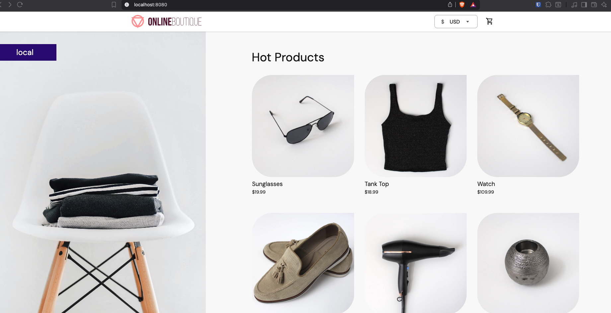
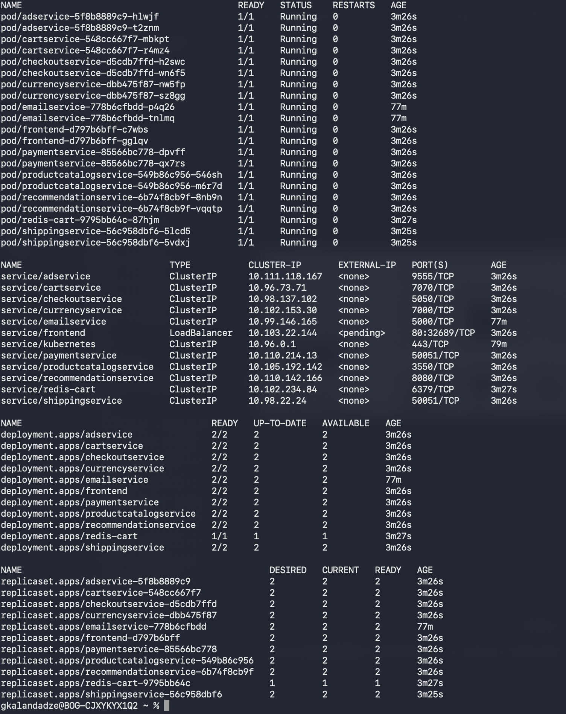

# Module 10 — Microservices on Kubernetes with Helm & Helmfile

**Technologies:** Kubernetes, Helm, Helmfile

Part of **Module 10: Container Orchestration with Kubernetes**. Two demos build on the same Online Boutique microservices app:

- **Demo 6 — Create Helm Chart for Microservices** — package the services with a reusable Helm chart and deploy them with `helm install`.
- **Demo 7 — Deploy Microservices with Helmfile** — add a single `helmfile.yaml` that declares every release and deploys the whole stack with one command.

Demo 7 is purely additive: it reuses the **exact** charts and values from Demo 6 and only swaps the manual per-service `helm install` commands for a declarative Helmfile.

## Repository layout

```
module-10-demo-6/
├── charts/
│   ├── microservice/            # shared chart, reused by all 10 stateless services
│   │   ├── Chart.yaml
│   │   ├── values.yaml          # default values (overridden per service)
│   │   └── templates/
│   │       ├── deployment.yaml
│   │       └── service.yaml
│   └── redis/                   # dedicated chart for the Redis cart cache
│       ├── Chart.yaml
│       ├── values.yaml
│       └── templates/
│           ├── deployment.yaml  # adds volume, probes, resources
│           └── service.yaml     # hardcoded ClusterIP
├── values/                      # one override file per release
│   ├── ad-service-values.yaml
│   ├── cart-service-values.yaml
│   ├── checkout-service-values.yaml
│   ├── currency-service-values.yaml
│   ├── email-service-values.yaml
│   ├── frontend-values.yaml
│   ├── payment-service-values.yaml
│   ├── productcatalog-service-values.yaml
│   ├── recommendation-service-values.yaml
│   ├── shipping-service-values.yaml
│   └── redis-values.yaml
└── helmfile.yaml                # Demo 7 — declares all 11 releases for one-command deploy
```

---

## Demo 6 — Create Helm Chart for Microservices

**Technologies:** Kubernetes, Helm

### Description

- Built a shared, reusable Helm chart (`microservice`) defining a generic `Deployment` + `Service`, reused across all 10 stateless services of the Online Boutique demo app instead of maintaining separate manifests per service.
- Parameterized every deployment/service field (`appName`, `appImage`, `appVersion`, `appReplicas`, `containerPort`, `containerEnvVars`, `servicePort`, `serviceType`) so a single template is driven entirely by values.
- Kept one small per-service values file under `values/`, each overriding only what differs (name, image, ports, env vars) while inheriting the chart's defaults for everything else.
- Created a second, purpose-built `redis` chart for the stateful cache, because the generic template can't express a mounted data volume — Redis needs a `volume`/`volumeMount`, probes, and resources that the stateless template doesn't provide.
- Wired the services together through environment variables (e.g. `frontend` → `productcatalogservice:3550`, `cartservice` → `redis-cart:6379`), matching the Online Boutique service topology.

### The `microservice` chart

A single template rendered once per service. Templated fields:

| Values key         | Used in            | Purpose                                          |
| ------------------ | ------------------ | ------------------------------------------------ |
| `appName`          | Deployment/Service | name, labels, and selector                       |
| `appImage`         | Deployment         | container image repository                       |
| `appVersion`       | Deployment         | image tag                                         |
| `appReplicas`      | Deployment         | replica count                                    |
| `containerPort`    | Deployment/Service | container port and Service `targetPort`          |
| `containerEnvVars` | Deployment         | list of `{ name, value }` env vars               |
| `servicePort`      | Service            | Service `port`                                   |
| `serviceType`      | Service            | Service type (`ClusterIP` default, `LoadBalancer` for frontend) |

The chart's own `values.yaml` supplies defaults for all eight keys, so each per-service file only overrides what differs. Keys omitted from a per-service file fall back to those defaults (e.g. `serviceType` is only set in `frontend-values.yaml`; everything else inherits `ClusterIP`).

> Note: the shared template does **not** define resource requests/limits or readiness/liveness probes — the stateless services run without them.

### The `redis` chart

Separate on purpose. Beyond the generic Deployment/Service shape, its templates add:

- an `emptyDir` **volume** mounted at `/data` (`volumeName`, `containerMountPath`)
- **liveness** and **readiness** probes (`tcpSocket` on `containerPort`)
- **resource** requests/limits (70m/200Mi → 125m/300Mi)
- **no** `containerEnvVars` block
- a Service with `type: ClusterIP` hardcoded (not templated)

Released as `redis-cart` so `cartservice` can reach it at `redis-cart:6379`.

### Services

| Values file                          | appName                  | Port  | Service type |
| ------------------------------------ | ------------------------ | ----- | ------------ |
| `ad-service-values.yaml`             | `adservice`              | 9555  | ClusterIP    |
| `cart-service-values.yaml`           | `cartservice`            | 7070  | ClusterIP    |
| `checkout-service-values.yaml`       | `checkoutservice`        | 5050  | ClusterIP    |
| `currency-service-values.yaml`       | `currencyservice`        | 7000  | ClusterIP    |
| `email-service-values.yaml`          | `emailservice`           | 5000  | ClusterIP    |
| `frontend-values.yaml`               | `frontend`               | 80    | LoadBalancer |
| `payment-service-values.yaml`        | `paymentservice`         | 50051 | ClusterIP    |
| `productcatalog-service-values.yaml` | `productcatalogservice`  | 3550  | ClusterIP    |
| `recommendation-service-values.yaml` | `recommendationservice`  | 8080  | ClusterIP    |
| `shipping-service-values.yaml`       | `shippingservice`        | 50051 | ClusterIP    |
| `redis-values.yaml`                  | `redis-cart`             | 6379  | ClusterIP    |

All microservice images are pulled from `gcr.io/google-samples/microservices-demo/*` and pinned to `v0.8.0`.

### Deploying with Helm

Install Redis first (cart depends on it), then each service using the shared chart with its values file:

```bash
# stateful cache
helm install redis-cart charts/redis -f values/redis-values.yaml

# stateless services (repeat per service)
helm install adservice            charts/microservice -f values/ad-service-values.yaml
helm install cartservice          charts/microservice -f values/cart-service-values.yaml
helm install checkoutservice      charts/microservice -f values/checkout-service-values.yaml
helm install currencyservice      charts/microservice -f values/currency-service-values.yaml
helm install emailservice         charts/microservice -f values/email-service-values.yaml
helm install frontend             charts/microservice -f values/frontend-values.yaml
helm install paymentservice       charts/microservice -f values/payment-service-values.yaml
helm install productcatalogservice charts/microservice -f values/productcatalog-service-values.yaml
helm install recommendationservice charts/microservice -f values/recommendation-service-values.yaml
helm install shippingservice      charts/microservice -f values/shipping-service-values.yaml
```

Reach the app through the `frontend` service (`LoadBalancer`).

> Demo 7 below replaces this whole block with a single `helmfile sync`.

### Accessing it on minikube

On minikube a `LoadBalancer` service stays `EXTERNAL-IP: <pending>` (no cloud LB), so bridge the frontend Service to your machine:

```bash
kubectl port-forward service/frontend 8080:80
# then open http://localhost:8080
```

`8080:80` = `localhost:8080` → the frontend Service on port **80**, which forwards to the container's port **8080**.

---

## Demo 7 — Deploy Microservices with Helmfile

**Technologies:** Kubernetes, Helm, Helmfile

Everything above (the two charts and all the values files) stays exactly the same. Demo 7 adds **one file** — `helmfile.yaml` — that declares all 11 releases in one place, so the entire stack is deployed, upgraded, and torn down as a unit instead of running 11 separate `helm install` commands.

### Description

- Added a single declarative `helmfile.yaml` listing all 11 releases (10 microservices + `redis-cart`), each pointing at the same local `charts/` and `values/` from Demo 6.
- Replaced 11 manual `helm install` commands with one `helmfile sync` — the whole app deployed (and later destroyed) in a single command.
- Demonstrated **inline value overrides** layered on top of a values file: the `rediscart` release loads `values/redis-values.yaml` and then overrides `appReplicas` and `volumeName` directly in the Helmfile.

### How `helmfile.yaml` is structured

A `releases:` list where each entry has:

- `name` — the Helm release name
- `chart` — path to the local chart (`charts/microservice` or `charts/redis`)
- `values` — a list of values files **and/or** inline override maps, applied in order (later entries win)

```yaml
releases:
  - name: rediscart
    chart: charts/redis
    values:
      - values/redis-values.yaml   # base values file
      - appReplicas: "1"           # inline override
      - volumeName: "redis-cart-data"
  - name: emailservice
    chart: charts/microservice
    values:
      - values/email-service-values.yaml
  # ... one entry per service ...
```

**Important:** the release names in the Helmfile (`rediscart`, `frontendservice`, …) are just Helm release names — the actual Kubernetes object names still come from `appName` inside each values file (`redis-cart`, `frontend`, …). So in-cluster service discovery (e.g. `cartservice` → `redis-cart:6379`) is unchanged regardless of what the releases are called.

### Deploying with Helmfile

Prerequisites: install [`helmfile`](https://github.com/helmfile/helmfile) (e.g. `brew install helmfile`); the `helm-diff` plugin is needed for `diff`/`apply` (`helm plugin install https://github.com/databus23/helm-diff`).

```bash
# preview what would change
helmfile diff

# deploy / reconcile every release to match helmfile.yaml
helmfile sync

# apply = diff, then sync only what changed
helmfile apply

# tear the whole stack down
helmfile destroy
```

Then access it exactly as in Demo 6 (`kubectl port-forward service/frontend 8080:80` → http://localhost:8080).

---

## Verified working

Deployed to a local minikube cluster — the full Online Boutique storefront serves through the frontend, and every workload reaches the desired replica count (`redis-cart` at 1, all others at 2/2). The same running result is produced whether deployed with the Demo 6 `helm install` commands or the Demo 7 `helmfile sync`.

**Storefront in the browser** (`http://localhost:8080`):



**Cluster state** (`kubectl get all`) — all pods `Running`, deployments at desired replicas:


