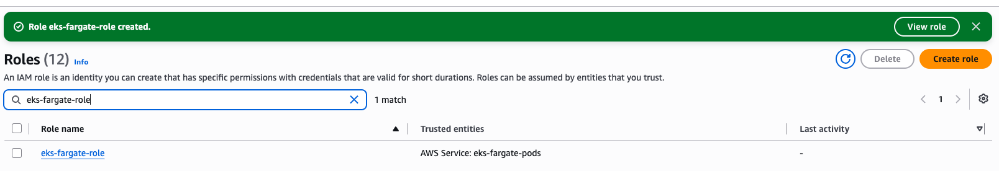
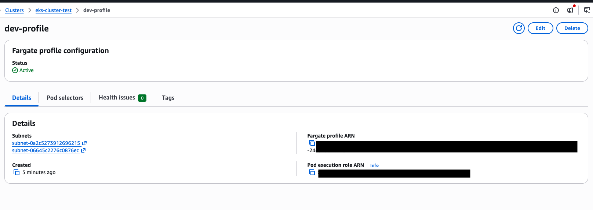
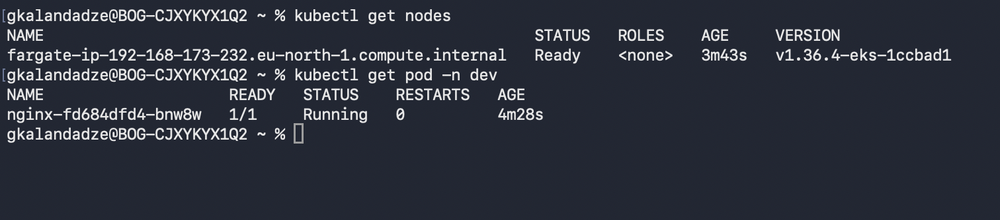

# Create EKS Cluster with Fargate Profile

## Technologies Used
Kubernetes, AWS EKS, AWS Fargate

## Project Description
- Created the IAM Role required for Fargate to run Pods on our behalf
- Configured a Fargate Profile on the existing EKS cluster, scoped to a specific namespace and label
- Deployed an example application into that namespace and verified it scheduled onto Fargate instead of a Node Group EC2 instance

## Key Concepts

**Fargate = fully-managed compute for Pods.** Unlike a Node Group (where you still own and patch EC2 worker nodes), Fargate removes worker node management entirely — AWS provisions right-sized compute per Pod, on demand, in its own managed account. You never see or manage an underlying EC2 instance.

**Fargate Pod Execution Role.** Before Fargate can run anything, it needs an IAM Role it can assume to pull images, write logs, and manage the Pod lifecycle on your behalf — similar in spirit to the Node Group Role, but scoped specifically to Fargate.

**Why subnets still matter.** Even though the compute itself runs in an AWS-managed account, Pods still need a network identity. Fargate assigns each Pod an IP address from **your** VPC's subnet range, so when configuring a Fargate Profile you must supply your own (private) subnets — this is what ties a "managed" Pod back into your VPC for networking and security group purposes.

**Fargate Profile = selector, not a server.** A Fargate Profile doesn't provision any compute by itself. It's a rule: "any Pod landing in namespace X (optionally matching label Y) gets scheduled on Fargate instead of the Node Group." Only Pods matching the selector are affected — everything else keeps scheduling normally.

## Architecture

```
                    AWS Managed Account
         ┌─────────────────────────────────────┐
         │           EKS Control Plane           │
         └───────────────────┬─────────────────────┘
                              │
                   schedules matching Pods
                              │
                              ▼
         ┌─────────────────────────────────────┐
         │     AWS Fargate (managed compute)     │
         │                                        │
         │   Pod IP address <- from YOUR VPC's    │
         │       private subnet range             │
         └───────────────────┬─────────────────────┘
                              │
                              ▼
                 Your VPC (private subnets)
                 Namespace: dev
                 Selector match: label profile=dev
                              │
                              ▼
                  Example application Pod
                  (no EC2 worker node involved)

Fargate Profile = selector rule:
  namespace == dev  AND  label profile: dev
      -> schedule on Fargate
  (everything else -> Node Group, as before)
```

## Steps

1. **Create the Fargate Pod Execution Role**
   Create an IAM Role with a trust relationship allowing the `eks-fargate-pods.amazonaws.com` service to assume it, and attach the `AmazonEKSFargatePodExecutionRolePolicy`. This is what allows Fargate to run Pods, pull images, and write logs on your behalf.
   📸 `screenshot-01` — Fargate Pod Execution Role created and visible in the IAM Roles list
   

2. **Create the Fargate Profile**
   On the existing EKS cluster, create a new Fargate Profile:
   - Attach the Pod Execution Role created above
   - Select your VPC's **private subnets** — required because Fargate Pods still receive an IP address from your subnet range, even though the compute itself runs in AWS's managed account
   - Configure a selector: namespace `dev`, matching label `profile: dev`

   Only Pods landing in the `dev` namespace with the `profile: dev` label will be scheduled onto Fargate; everything else continues to use the Node Group as before.
   📸 `screenshot-02` — Fargate Profile created and showing status `Active`
   

3. **Deploy an Example Application onto Fargate**
   ```bash
   kubectl create namespace dev
   kubectl apply -f fargate-app.yaml
   ```
   The manifest places the Deployment in the `dev` namespace with the `profile: dev` label on the Pod template, so it matches the Fargate Profile selector.

4. **Verify the Pod Scheduled on Fargate (not the Node Group)**
   ```bash
   kubectl get pods -n dev -o wide
   kubectl get nodes
   ```
   A Pod running on Fargate shows a dedicated virtual node named like `fargate-ip-xx-xx-xx-xx.<region>.compute.internal` — distinct from the EC2 instances in the Node Group — confirming it was scheduled on Fargate rather than existing worker capacity.
   📸 `screenshot-03` — Pod `Running` on a Fargate virtual node, with the example app visible in the browser (if exposed via LoadBalancer/port-forward)
   

## What I Learned
- The difference between a Fargate Profile and a Node Group: one is a scheduling rule for serverless Pods, the other is a pool of EC2 workers you manage
- Why Fargate still requires VPC subnets even though it's "serverless" — Pod networking is still tied to your VPC
- How a Fargate Profile's namespace + label selector determines which Pods get Fargate treatment versus Node Group scheduling
- The dedicated IAM Role Fargate needs, separate from the Node Group Role, scoped to its own trust relationship
- How to identify a Fargate-scheduled Pod from `kubectl get nodes` / `get pods -o wide` output (the virtual `fargate-ip-...` node name)
- When Fargate makes sense versus a Node Group: no node patching/sizing, pay-per-Pod — good fit for bursty or unpredictable workloads; a Node Group remains more cost-effective for steady, predictable baseline load

## Cleanup
Delete resources in reverse order of creation to avoid orphaned, still-billed AWS resources:

```bash
# 1. Remove the example application
kubectl delete -f fargate-app.yaml
kubectl delete namespace dev

# 2. Delete the Fargate Profile
# via EKS Console -> Compute -> Fargate Profiles -> Delete
# (must finish deleting before the Pod Execution Role can be safely removed)

# 3. Delete the Fargate Pod Execution Role
# via IAM Console
```

Note: Fargate Profile deletion can take a few minutes, as AWS must first terminate any Pods still running under that profile.

## Screenshots

| # | Description |
|---|---|
| screenshot-01 | Fargate Pod Execution Role created, visible in IAM Roles |
| screenshot-02 | Fargate Profile created, status `Active` |
| screenshot-03 | Example app Pod `Running` on a Fargate virtual node |