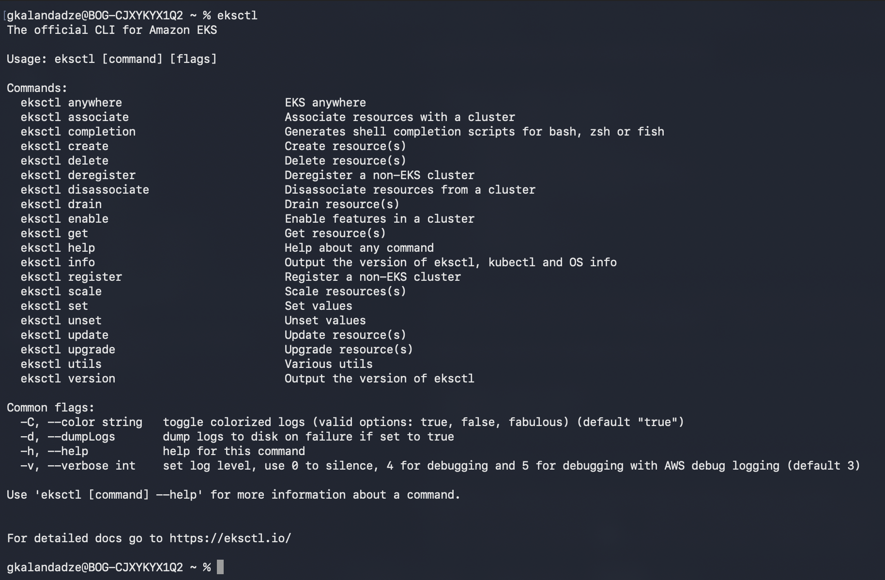
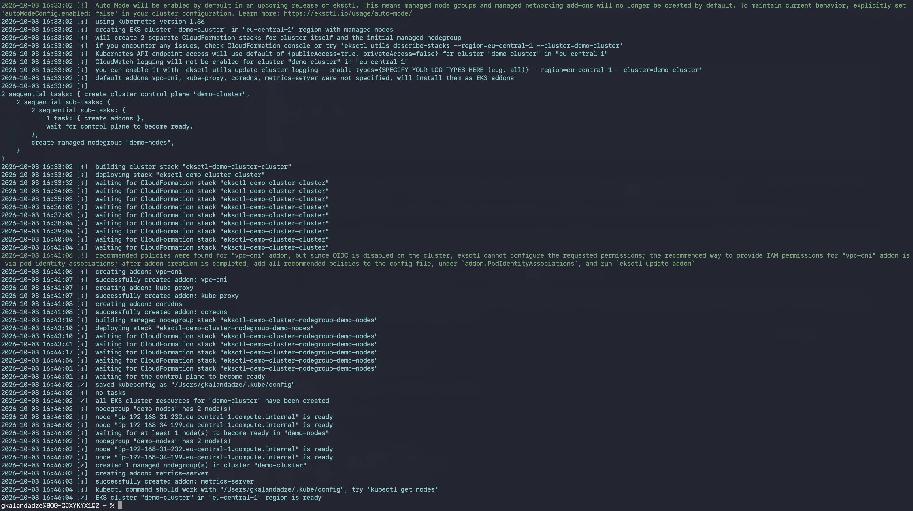
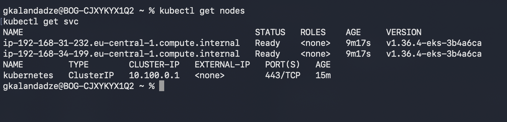
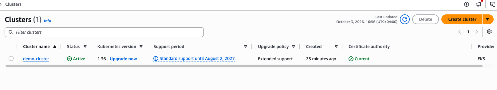

# Create EKS Cluster with eksctl

## Technologies Used
Kubernetes, AWS EKS, eksctl, Linux

## Project Description
- Installed `eksctl`, the official AWS command-line tool for working with EKS clusters
- Configured AWS credentials so `eksctl` could authenticate against the AWS account
- Created a fully working EKS cluster — Control Plane, VPC, Node Group, and Auto Scaling configuration — with a single command
- Verified the cluster and worker nodes came up correctly and kubectl was configured automatically

## Key Concepts

**Why eksctl.** In the first EKS demo of this module, creating a cluster took 8 manual steps across IAM, CloudFormation, EKS, and Node Group configuration. `eksctl` automates all of that into one command: it creates the IAM Roles, the VPC (via CloudFormation), the EKS Control Plane, and the Node Group, then configures `kubectl` to point at the new cluster — with zero manual clicking through the AWS Console.

**What happens under the hood.** `eksctl` isn't magic — it still uses CloudFormation behind the scenes, the same mechanism used manually in the Node Group demo. Running `eksctl create cluster` typically creates **two CloudFormation stacks**: one for the Control Plane + VPC, and one for the Node Group. You can inspect both in the CloudFormation Console even though you never wrote a template yourself.

**Trade-off versus the manual approach.** The manual Node Group demo makes every decision explicit and visible — useful for learning what EKS actually requires. `eksctl` trades that visibility for speed: great for spinning up clusters repeatably (e.g. in CI, or for throwaway test clusters), but you're relying on `eksctl`'s sensible defaults for anything you don't explicitly flag.

## Architecture

```
Local Machine
   │
   │ eksctl create cluster --name ... --nodegroup-name ... (single command)
   ▼
eksctl (orchestrates AWS APIs on your behalf)
   │
   ├──► CloudFormation Stack 1: VPC + EKS Control Plane
   │        - Public + private subnets
   │        - EKS Cluster IAM Role
   │        - EKS Control Plane
   │
   └──► CloudFormation Stack 2: Node Group
            - Node Group IAM Role
            - Auto Scaling Group (min/max/desired)
            - EC2 worker nodes (Node Group)

eksctl also auto-updates local kubeconfig
   │
   ▼
kubectl ─── ready to use immediately after the command completes
```

## Steps

1. **Install eksctl and Connect to the AWS Account**
   Install `eksctl` (e.g. via Homebrew on macOS, or the official binary release on Linux), and make sure AWS credentials are already configured locally (`aws configure` or existing credentials/profile) so `eksctl` can authenticate.
   ```bash
   eksctl version
   aws sts get-caller-identity
   ```
   📸 **Screenshot 1** — `eksctl` installed and successfully authenticated against the AWS account
   

2. **Create the Cluster with a Single Command**
   ```bash
   eksctl create cluster \
     --name demo-cluster \
     --version 1.36 \
     --region eu-central-1 \
     --nodegroup-name demo-nodes \
     --node-type t2.micro \
     --nodes 2 \
     --nodes-min 1 \
     --nodes-max 3
   ```
   This single command provisions the VPC, IAM Roles, EKS Control Plane, and an Auto Scaling Node Group (2 nodes to start, scaling between 1 and 3) — equivalent to all 6 manual steps from the Node Group demo.
   📸 **Screenshot 2** — `eksctl create cluster` running / completed in the terminal
   

3. **Verify the Cluster and Node Group**
   `eksctl` automatically updates the local kubeconfig, so `kubectl` works immediately with no extra `update-kubeconfig` step.
   ```bash
   kubectl get nodes
   kubectl get svc
   ```
   📸 **Screenshot 3** — worker nodes `Ready`, confirming the cluster is fully operational
   
   

## What I Learned
- How `eksctl` collapses the entire manual EKS setup (IAM Roles, VPC, Control Plane, Node Group) into a single command
- That `eksctl` still relies on CloudFormation under the hood — it's a convenience layer, not a different provisioning model
- How to pass Auto Scaling bounds (`--nodes-min` / `--nodes-max`) directly at cluster creation time, instead of configuring Cluster Autoscaler as a separate step afterward
- `eksctl` automatically configures local kubeconfig — no manual `aws eks update-kubeconfig` step needed
- **Instance size gotcha:** `t2.micro` (1 vCPU, 1 GiB RAM) is extremely tight for EKS — the required system Pods (`kube-proxy`, `aws-node`/VPC CNI, CoreDNS) already consume a meaningful share of that single node's capacity, leaving little headroom for actual workloads. Fine for a learning demo; `t3.medium` or larger is the realistic minimum for anything beyond "hello world"
- The trade-off between the manual approach (full visibility into every resource) and `eksctl` (speed, at the cost of relying on sensible defaults)

## Cleanup
```bash
eksctl delete cluster --name demo-cluster --region eu-central-1
```
This tears down both CloudFormation stacks (Node Group and Control Plane/VPC) in the correct order automatically — no manual cleanup steps required, unlike the manual Node Group demo.

Afterward, verify in the CloudFormation Console that both stacks show `DELETE_COMPLETE`, and check the EC2 and EKS Consoles to confirm no resources remain.

## Screenshots

| # | Description |
|---|---|
| screenshot-01 | `eksctl` installed and authenticated against the AWS account |
| screenshot-02 | `eksctl create cluster` command running/completed |
| screenshot-03 | Worker nodes `Ready` (`kubectl get nodes`) |
| screenshot-04 | The two CloudFormation stacks `eksctl` created automatically |