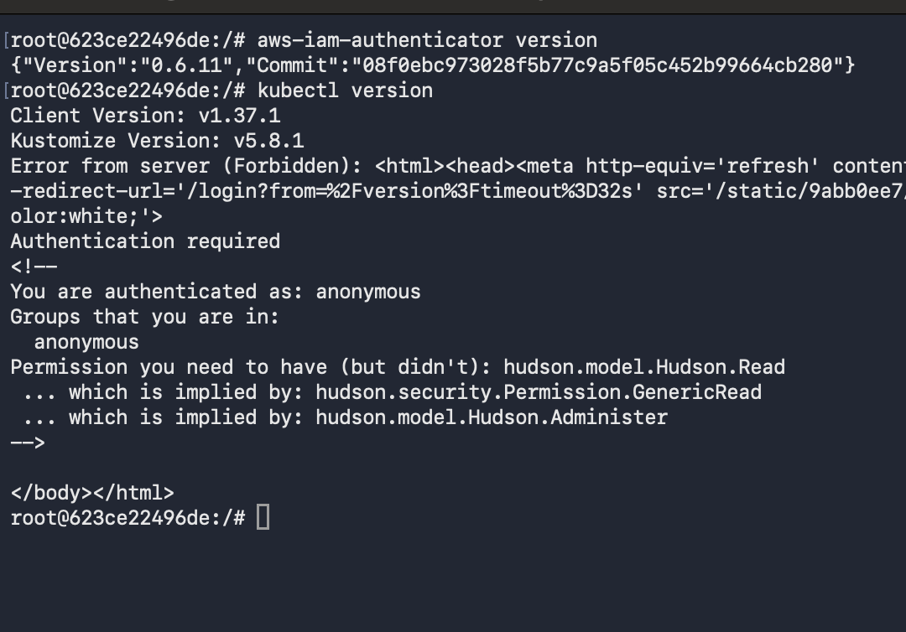
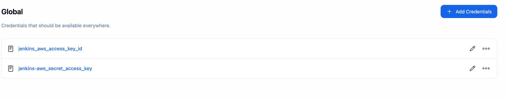
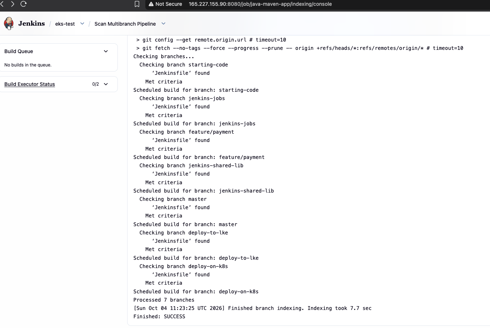
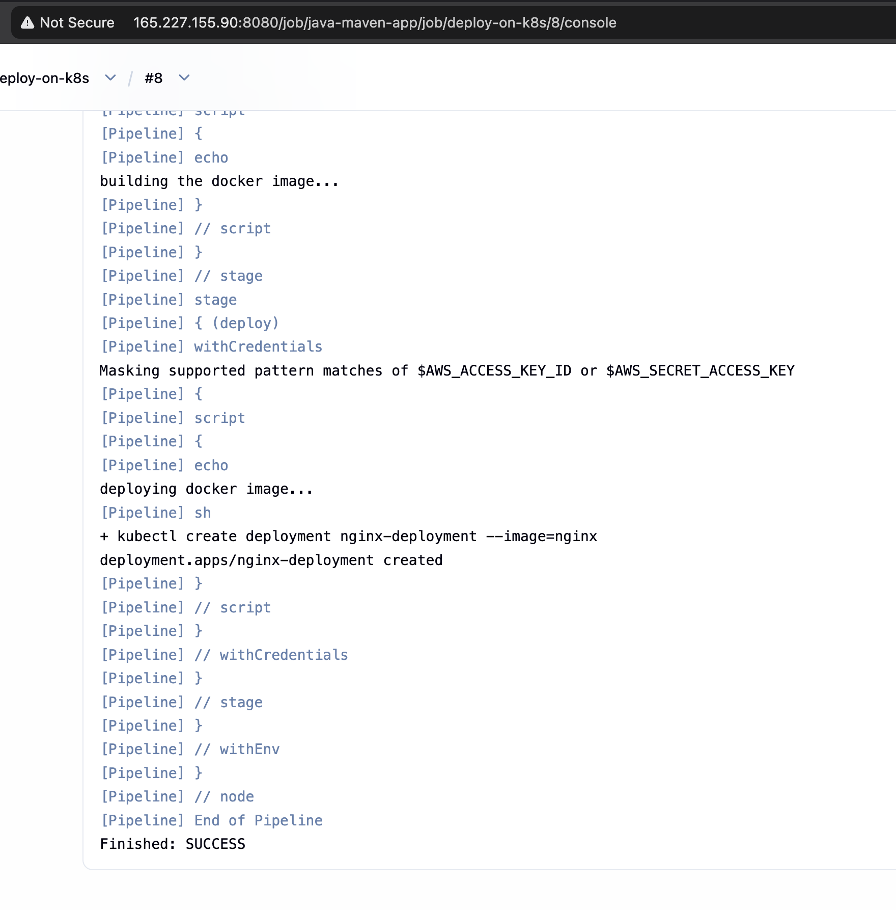
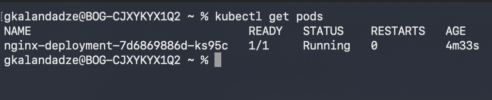
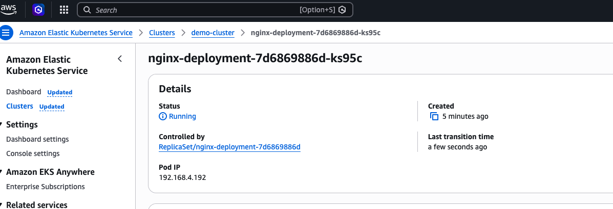

# CD - Deploy to EKS Cluster from Jenkins Pipeline

## Technologies Used
Kubernetes, Jenkins, AWS EKS, Docker, Linux

## Project Description
- Installed `kubectl` and `aws-iam-authenticator` inside the existing Jenkins Docker container (running on the DigitalOcean Droplet from earlier modules)
- Created a kubeconfig file on the Droplet host (authenticated against the EKS cluster) and copied it into the Jenkins container
- Added AWS credentials to Jenkins as two separate Secret text entries (Access Key ID and Secret Access Key)
- Extended the existing multibranch Jenkinsfile with a `deploy` stage that authenticates with AWS and applies a simple deployment to the EKS cluster

## Architecture

```
GitLab (twn-java-maven-app, multibranch) ── branch: deploy-on-k8s
         │
         ▼
Jenkins (existing Docker container on DigitalOcean Droplet)
  ├── kubectl + aws-iam-authenticator   (installed this demo)
  ├── KUBECONFIG                        (created on Droplet host, docker cp'd in)
  └── Jenkins credentials (Secret text):
        jenkins_aws_access_key_id
        jenkins-aws_secret_access_key
         │
         │ Jenkinsfile "deploy" stage
         │   withCredentials([...AWS keys...]) {
         │     kubectl create deployment nginx-deployment --image=nginx
         │   }
         ▼
   AWS authentication (via aws-iam-authenticator, using the exported AWS keys)
         │
         ▼
   EKS Cluster (demo-cluster)
     nginx-deployment Pod running
```

## Steps

1. **Start the Existing Jenkins Container on the Droplet**
   Jenkins was already set up as a Docker container in earlier modules — just confirmed it was running, with `kubectl` and `aws-iam-authenticator` already installed inside it from the previous demo.
   📸 **Screenshot 1** — `aws-iam-authenticator version` and `kubectl version` run inside the Jenkins container; note the `kubectl version` server-side error here is the `localhost:8080` gotcha described above (occurred before `KUBECONFIG` was set)
   

2. **Create the kubeconfig on the Droplet and Copy It Into the Container**
   ```bash
   # on the Droplet host (AWS CLI already configured there)
   aws eks update-kubeconfig --name demo-cluster --region eu-north-1 --kubeconfig ./kubeconfig-eks

   # copy it into the running Jenkins container
   docker cp ./kubeconfig-eks <jenkins-container>:/var/jenkins_home/.kube/config
   ```

3. **Add AWS Credentials to Jenkins**
   Read the key pair from the Droplet's AWS CLI config:
   ```bash
   cat ~/.aws/credentials
   ```
   Added as two separate **Secret text** credentials in Jenkins (Manage Jenkins → Credentials → Global):
   - `jenkins_aws_access_key_id`
   - `jenkins-aws_secret_access_key`
   📸 **Screenshot 2** — both Secret text credentials visible in the Jenkins Global credentials store
   

4. **Confirm the Multibranch Pipeline Picks Up the Branch**
   The multibranch pipeline automatically scanned all branches and found a `Jenkinsfile` on each, including `deploy-on-k8s` — the branch containing the EKS deploy stage for this demo.
   📸 **Screenshot 3** — multibranch pipeline scan log showing all 7 branches processed, including `deploy-on-k8s`
   

5. **Extend the Jenkinsfile with a Deploy Stage**
   ```groovy
   stage('deploy') {
       steps {
           script {
               withCredentials([
                   string(credentialsId: 'jenkins_aws_access_key_id', variable: 'AWS_ACCESS_KEY_ID'),
                   string(credentialsId: 'jenkins-aws_secret_access_key', variable: 'AWS_SECRET_ACCESS_KEY')
               ]) {
                   echo 'deploying docker image...'
                   sh 'kubectl create deployment nginx-deployment --image=nginx'
               }
           }
       }
   }
   ```
   Kept deliberately simple — a single imperative `kubectl create deployment` command — to prove the Jenkins → EKS connection works end to end before layering on real manifests and dynamic image tags in later demos.

6. **Run the Pipeline and Confirm Success**
   ```bash
   kubectl create deployment nginx-deployment --image=nginx
   deployment.apps/nginx-deployment created
   ```
   📸 **Screenshot 4** — Jenkins pipeline console output: credentials masked, deploy stage runs, `Finished: SUCCESS`
   

7. **Verify via kubectl**
   ```bash
   kubectl get pods
   ```
   📸 **Screenshot 5** — `nginx-deployment` Pod `Running`, `1/1` ready
   

8. **Verify via the AWS Console**
   Cross-checked the same Pod directly in the EKS console under the `demo-cluster` cluster.
   📸 **Screenshot 6** — Pod details in the AWS EKS Console, status `Running`
   

## What I Learned
- How to extend an already-running Jenkins container with new tooling (`kubectl`, `aws-iam-authenticator`) rather than starting from scratch
- Creating a kubeconfig on a host that already has the AWS CLI configured, then `docker cp`-ing it into the Jenkins container, is simpler than reconfiguring AWS CLI access from inside the container
- Storing an AWS key pair as two separate Secret text credentials in Jenkins and exporting them with `withCredentials` is a perfectly workable alternative to the AWS Credentials plugin binding
- **The `localhost:8080` gotcha**: without `KUBECONFIG` explicitly set, `kubectl` silently falls back to a legacy default API address that happens to collide with Jenkins' own web port — producing a confusing Jenkins-flavored "Forbidden/anonymous" error that looks like a Kubernetes auth failure but isn't
- EKS automatically grants the cluster-creating IAM identity full access — which is why this demo worked without touching `aws-auth` — but any other IAM identity (e.g. a dedicated CI/CD user) would need to be explicitly granted access first
- Keeping the first working deploy stage as simple as possible (one imperative command) before introducing real manifests and dynamic versioning

## Cleanup
```bash
# Remove the deployed application from the cluster
kubectl delete deployment nginx-deployment

# Remove the AWS credentials from Jenkins via the UI
# (Manage Jenkins -> Credentials -> delete jenkins_aws_access_key_id and jenkins-aws_secret_access_key)

# Remove the kubeconfig from inside the Jenkins container, if no longer needed
docker exec <jenkins-container> rm /var/jenkins_home/.kube/config
```

## Screenshots

| # | Description |
|---|---|
| screenshot-01 | `aws-iam-authenticator` and `kubectl` installed in the Jenkins container (localhost:8080 gotcha visible) |
| screenshot-02 | AWS access key credentials stored in Jenkins as Secret text |
| screenshot-03 | Multibranch pipeline scan finding the `deploy-on-k8s` branch |
| screenshot-04 | Jenkins pipeline console output — deploy stage `SUCCESS` |
| screenshot-05 | `kubectl get pods` — `nginx-deployment` Running |
| screenshot-06 | AWS EKS Console — pod details, status Running |