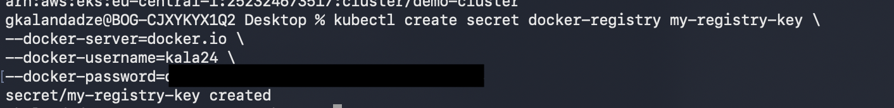
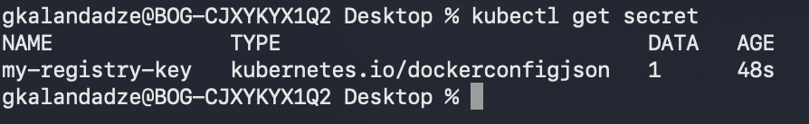
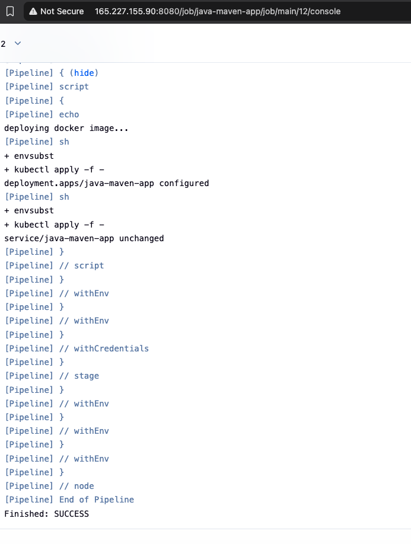
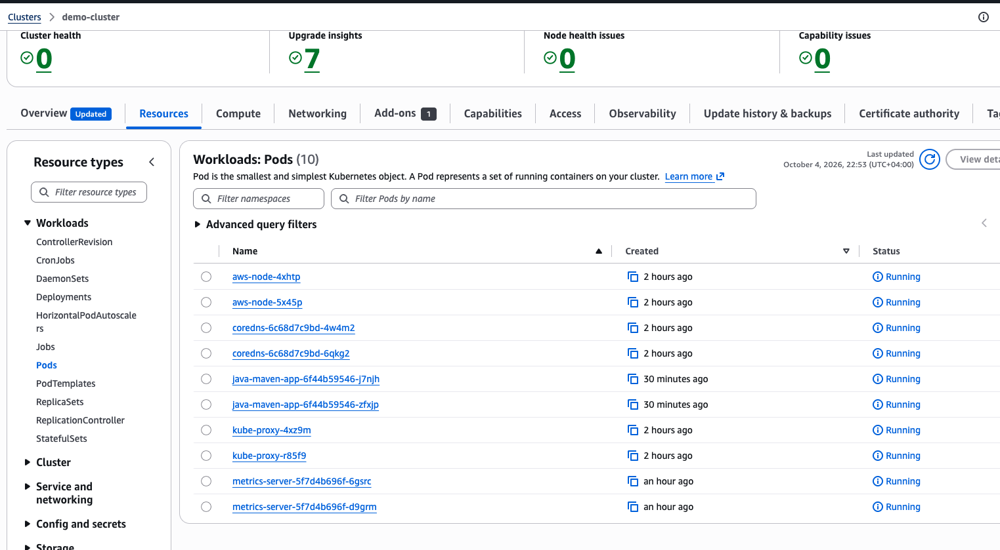

# Complete CI/CD Pipeline with EKS and Private DockerHub Registry

## Technologies Used
Kubernetes, Jenkins, AWS EKS, Docker Hub, Java, Maven, Linux, Docker, Git

## Project Description
- Wrote Kubernetes manifest files (Deployment + Service) for the Java Maven application, templated with environment-variable placeholders
- Created a Kubernetes `docker-registry` Secret so the EKS cluster itself can pull images from the **private** DockerHub repository
- Integrated a deploy step into the existing CI pipeline that builds and pushes a versioned image to DockerHub, then deploys that exact image to the EKS cluster
- Assembled the full CI/CD pipeline end to end:
  a. CI step: Increment version
  b. CI step: Build artifact for the Java Maven application
  c. CI step: Build and push Docker image to DockerHub
  d. CD step: Deploy the new application version to the EKS cluster
  e. CD step: Commit the version update back to Git


## Architecture

```
GitLab (java-maven-app, branch: main)
       │
       ▼
┌─────────────────────────── Jenkins Pipeline ───────────────────────────┐
│                                                                          │
│  1) increment version   — mvn versions:set, IMAGE_NAME = version-BUILD# │
│  2) build app           — mvn clean package                            │
│  3) build image         — docker build, login to DockerHub,            │
│                           docker push kala24/java-maven-app:IMAGE_NAME  │
│  4) deploy               — envsubst kubernetes/deployment.yaml          │
│                            envsubst kubernetes/service.yaml             │
│                            kubectl apply -f -   (against EKS)           │
│  5) commit version update — push pom.xml bump back to GitLab            │
│                                                                          │
└──────────────────────────────────────────────────────────────────────────┘
       │                                          │
       ▼                                          ▼
 DockerHub (private: kala24/java-maven-app)   EKS Cluster (demo-cluster)
       ▲                                          │
       │                                          ▼
       └──── pulled using imagePullSecrets ──  java-maven-app Pod
             (Secret: my-registry-key,            Running
              kubernetes.io/dockerconfigjson)
```

## Steps

1. **Write the Kubernetes Manifests**
   Created `kubernetes/deployment.yaml` and `kubernetes/service.yaml`, templated with `${APP_NAME}`, `${DOCKER_REPO}`, and `${IMAGE_NAME}` placeholders (see files in this folder). The Deployment references `imagePullSecrets: my-registry-key` so the cluster can pull the private image.

2. **Create the Image Pull Secret on the EKS Cluster**
   ```bash
   kubectl create secret docker-registry my-registry-key \
     --docker-server=docker.io \
     --docker-username=kala24 \
     --docker-password=<DOCKERHUB_PASSWORD>
   ```
   📸 **Screenshot 1** — `my-registry-key` Secret created against the EKS `demo-cluster` context
   

   ```bash
   kubectl get secret
   ```
   📸 **Screenshot 2** — Secret confirmed, type `kubernetes.io/dockerconfigjson`
   

3. **Extend the Jenkinsfile's Build-Image Stage for DockerHub**
   Reused the existing DockerHub credential already configured in Jenkins from the earlier Jenkins CI modules to build and push a versioned image tag.

4. **Add the Deploy Stage**
   Reused the `jenkins_aws_access_key_id` / `jenkins-aws_secret_access_key` credentials and the kubeconfig already present in the Jenkins container from the standalone EKS deploy demo, with `APP_NAME` added as a stage-level environment variable so `envsubst` has everything it needs.

5. **Run the Full Pipeline**
   ```
   deploying docker image...
   + envsubst
   + kubectl apply -f -
   deployment.apps/java-maven-app configured
   + envsubst
   + kubectl apply -f -
   service/java-maven-app unchanged
   Finished: SUCCESS
   ```
   📸 **Screenshot 3** — Jenkins console output, deploy stage applying both manifests, `Finished: SUCCESS`
   

6. **Verify the Deployment on EKS**
   ```bash
   kubectl get pods
   kubectl get svc java-maven-app
   ```

   Cross-checked directly in the AWS EKS Console: the `java-maven-app` Pods appear alongside the cluster's system Pods (`aws-node`, `coredns`, `kube-proxy`, `metrics-server`), all showing `Running`.
   📸 **Screenshot 4** — `java-maven-app` Pods `Running` in the EKS Console, `demo-cluster` → Resources → Pods
   

## What I Learned
- A private registry needs credentials in two separate directions: Jenkins needs push access, the cluster separately needs pull access — these are not the same credential and not interchangeable
- How a Kubernetes `docker-registry` Secret (`kubernetes.io/dockerconfigjson`) is created and referenced via `imagePullSecrets` in a Deployment spec
- Using `envsubst` to inject pipeline-generated values (image tag, app name) into Kubernetes manifests at deploy time, instead of maintaining static YAML with hardcoded versions
- Chaining the version-increment, build, and Git-commit stages (from earlier Jenkins modules) together with a deploy-to-EKS stage into one complete pipeline
- Reusing credentials and tooling already set up in earlier demos (kubeconfig, AWS keys) rather than re-provisioning them per pipeline
- Seeing the full loop close: a single pipeline run produces a new image, deploys it, and records the version bump back in source control

## Cleanup
```bash
# Remove the deployed application from the cluster
kubectl delete -f kubernetes/service.yaml
kubectl delete -f kubernetes/deployment.yaml

# Remove the image pull secret
kubectl delete secret my-registry-key

# Optionally remove old image tags from the DockerHub repository via the DockerHub UI
```

## Screenshots

| # | Description |
|---|---|
| screenshot-01 | `my-registry-key` docker-registry Secret created on the EKS cluster |
| screenshot-02 | Secret confirmed via `kubectl get secret` |
| screenshot-03 | Jenkins deploy stage console output — `SUCCESS` |
| screenshot-04 | Pipeline console output confirming the deploy stage finished `SUCCESS` |
| screenshot-05 | `java-maven-app` Pods `Running` in the AWS EKS Console |