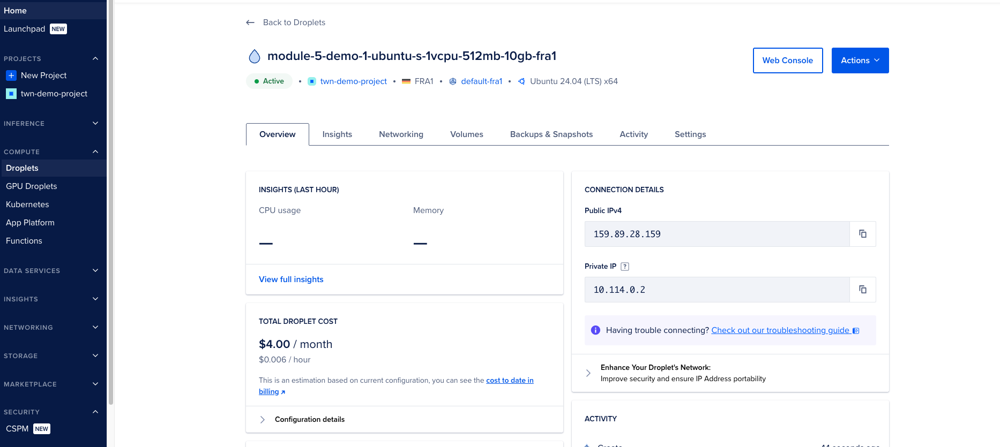
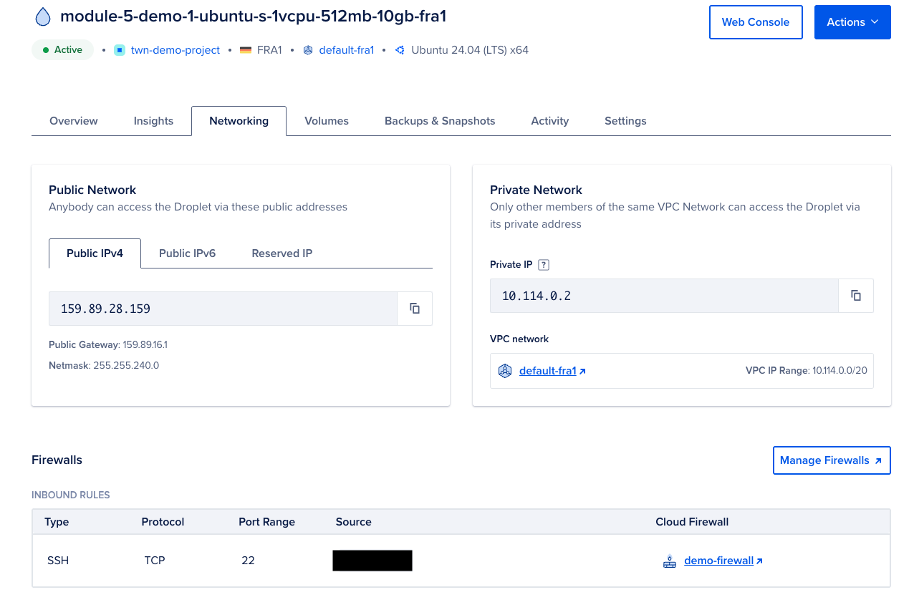
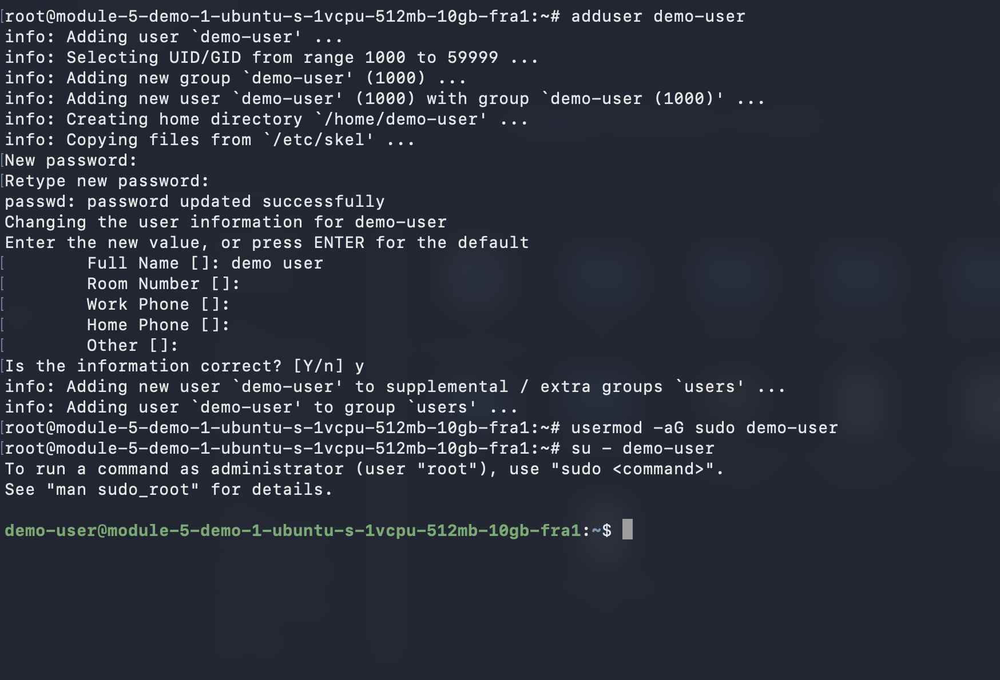
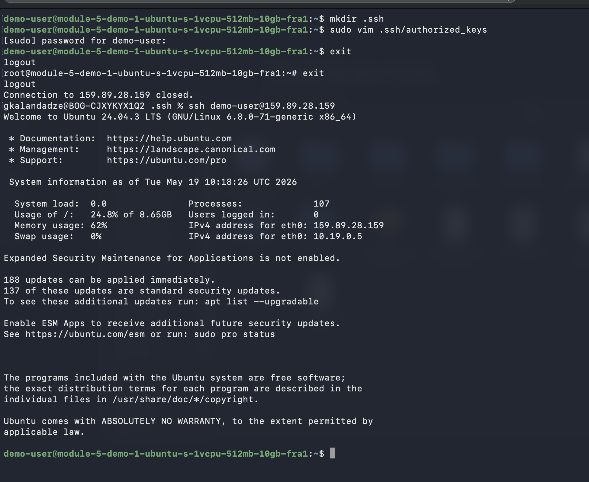
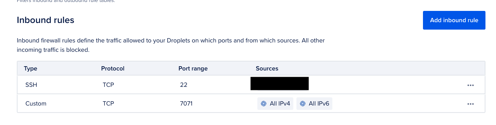
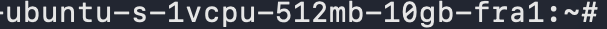
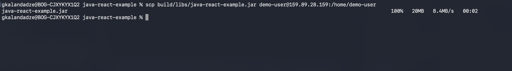
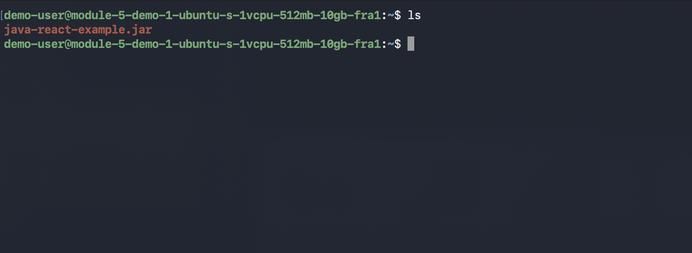
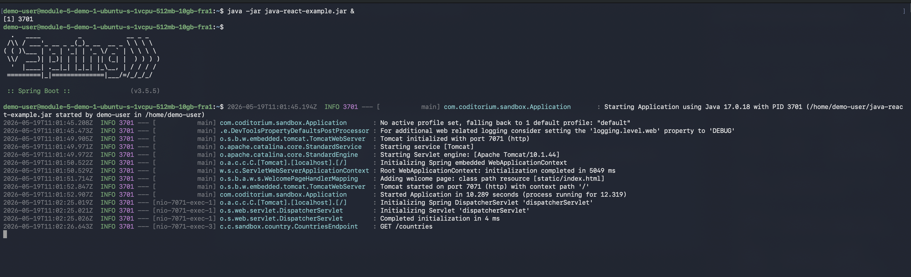
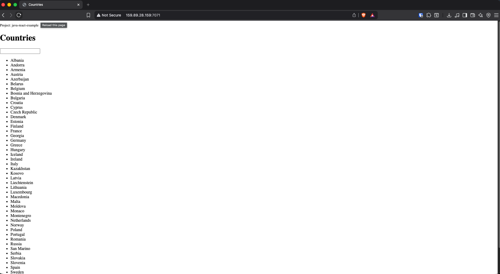

# Module 5 — Cloud & Infrastructure as Service Basics

## Demo Project: Create Server and Deploy Application on DigitalOcean

**Technologies:** DigitalOcean · Linux · Java · Gradle · SSH

**Application source:** [java-react-example](https://gitlab.com/twn-devops-bootcamp-nowis/java-react-example)

**Part of:** [TWN DevOps Bootcamp](https://github.com/GiorgiKalandadze/twn-devops-bootcamp)

---

## Project Description

- Setup and configure a server on DigitalOcean
- Create and configure a new Linux user on the Droplet (security best practice)
- Deploy and run a Java Gradle application on Droplet

---

## Architecture

```
  Local Machine
       │
       │  ssh / scp
       ▼
  DigitalOcean Droplet — FRA1 — Ubuntu 24.04 LTS
  module-5-demo-1-ubuntu-s-1vcpu-512mb-10gb-fra1
       │  user: demo-user
       │
       │  java -jar
       ▼
  java-react-example.jar → port 7071
       │
       │  HTTP
       ▼
  Browser — Countries App

  Firewall (demo-firewall)
  ┌─────────────────────────────────────────┐
  │  TCP 22   — SSH        — your IP only   │
  │  TCP 7071 — App        — all IPs        │
  └─────────────────────────────────────────┘
```

---

## Steps

### Step 1 — Create Droplet on DigitalOcean

Create a new Droplet:

- **Image:** Ubuntu 24.04 (LTS) x64
- **Size:** s-1vcpu-512mb-10gb ($4/month)
- **Region:** Frankfurt (FRA1)
- **Authentication:** SSH key



---

### Step 2 — Add SSH Firewall Rule

Create and attach a Cloud Firewall (`demo-firewall`). Add an inbound SSH rule restricted to your IP only so no one else can reach port 22.



---

### Step 3 — SSH as Root and Create Non-Root User

```bash
ssh root@<DROPLET_IP>

adduser demo-user
usermod -aG sudo demo-user
su - demo-user
```



---

### Step 4 — SSH Directly as demo-user

Set up SSH key authentication for `demo-user`, then connect from your local machine directly — no longer using root:

```bash
# On the Droplet (as demo-user)
mkdir ~/.ssh
sudo vim ~/.ssh/authorized_keys    # paste your public key

# On your local machine
ssh demo-user@<DROPLET_IP>
```



---

### Step 5 — Open Application Port in Firewall

Add a second inbound rule to allow browser access to the app:

| Type   | Protocol | Port | Source             |
|--------|----------|------|--------------------|
| SSH    | TCP      | 22   | Your IP only       |
| Custom | TCP      | 7071 | All IPv4, All IPv6 |



---

### Step 6 — Install Java on the Droplet

```bash
sudo apt update
sudo apt install openjdk-17-jre-headless
```



---

### Step 7 — Build JAR Locally and Copy to Droplet

On your local machine, build the Gradle project and transfer the JAR:

```bash
./gradlew build

scp build/libs/java-react-example.jar demo-user@<DROPLET_IP>:/home/demo-user
```



---

### Step 8 — Verify JAR Arrived on the Server

```bash
ls ~
```



---

### Step 9 — Run the Application

```bash
java -jar java-react-example.jar &
```

Spring Boot starts on port 7071.



---

### Step 10 — Access the Application in Browser

```
http://<DROPLET_IP>:7071
```



---

## What I Learned

- How to provision and configure a cloud server (Droplet) on DigitalOcean
- Linux security best practice: never run applications as root — always use a dedicated non-root user
- How to set up SSH key-based authentication for a non-root Linux user
- How to control network access with cloud firewall rules (least-privilege: allow only what is needed)
- How to build a Java Gradle application locally and transfer the JAR to a remote server with `scp`
- How to run a Java JAR on a Linux server
