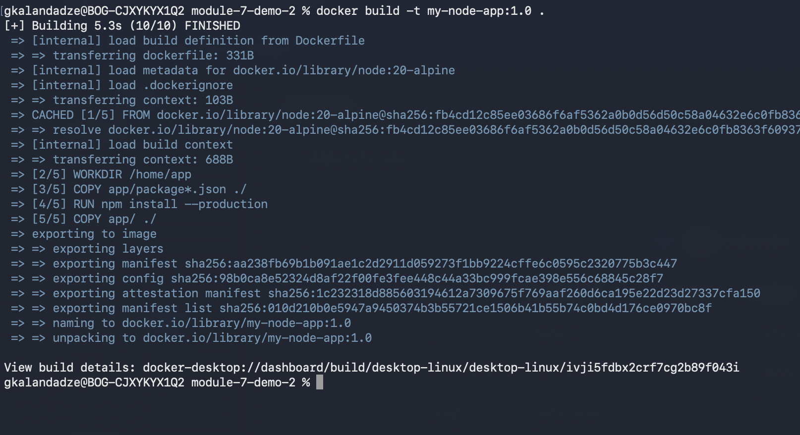
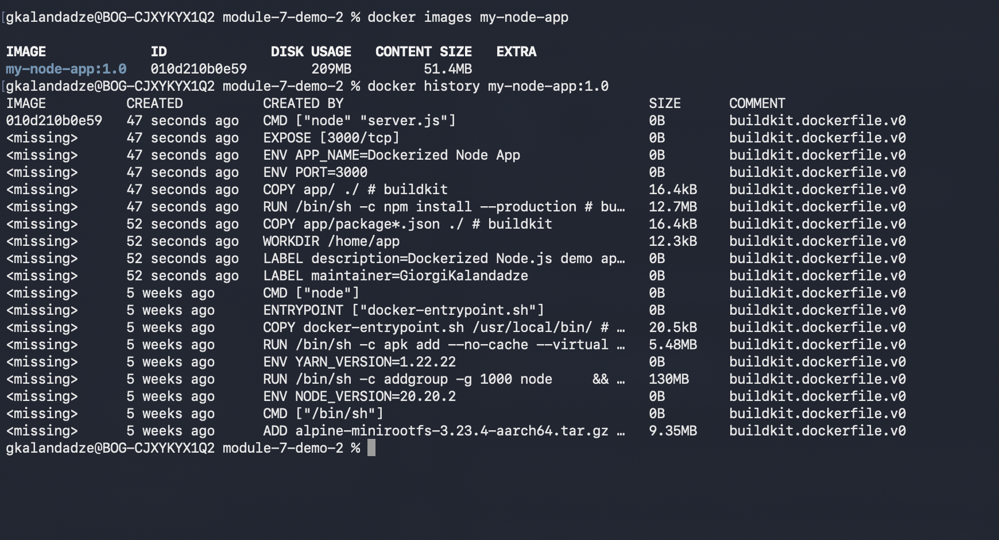
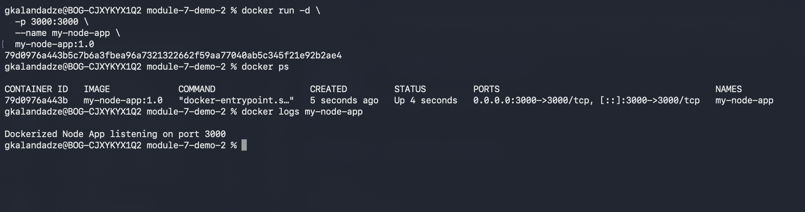
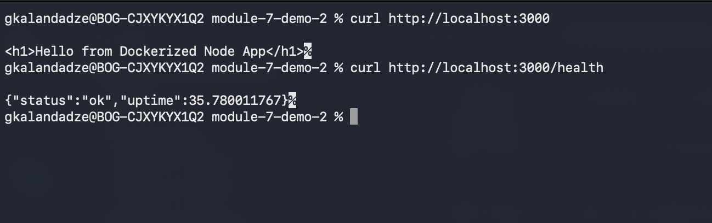
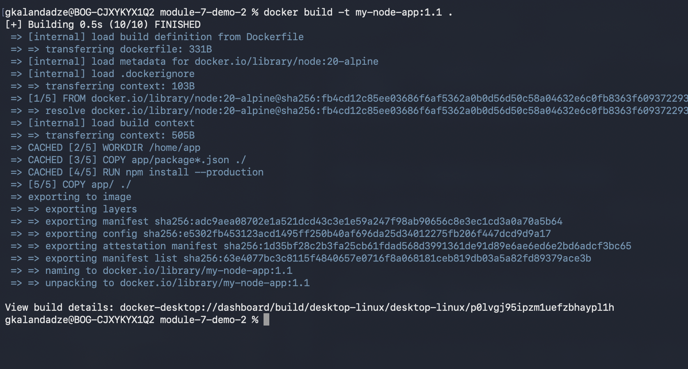

# Module 7 — Containers with Docker

## Demo Project: Dockerize Node.js Application

**Technologies:** Docker · Node.js

**Application source:** [app](./app/)

**Part of:** [TWN DevOps Bootcamp](https://github.com/GiorgiKalandadze/twn-devops-bootcamp)

---

## Project Description

- Write a minimal Express app with `/` and `/health` endpoints
- Write a production-ready Dockerfile using `node:20-alpine` as the base image
- Exploit layer caching by copying `package.json` before source code
- Use `.dockerignore` to keep `node_modules` and secrets out of the build context
- Build, inspect, run, and test the containerized app locally

---

## Architecture

```
  Source Code + Dockerfile
         │
         │  docker build -t my-node-app:1.0 .
         ▼
  Image: my-node-app:1.0
  ┌─────────────────────────────┐
  │  Layer 1 — node:20-alpine   │
  │  Layer 2 — WORKDIR          │
  │  Layer 3 — npm install      │  ← cached when only code changes
  │  Layer 4 — COPY app/        │
  └─────────────────────────────┘
         │
         │  docker run -d -p 3000:3000
         ▼
  Container: my-node-app
  port 3000 → localhost:3000
         │
         │  HTTP
         ▼
  Browser / curl
```

---

## Steps

### Step 1 — Verify Docker is Installed

```bash
docker --version
docker ps
```

---

### Step 2 — Explore the Application

```bash
ls app/
cat app/server.js
cat app/package.json
```

The app is a minimal Express server with two endpoints:
- `GET /` — returns an HTML greeting
- `GET /health` — returns `{ status: 'ok', uptime: ... }` as JSON

The `APP_NAME` and `PORT` can be overridden with environment variables at runtime.

---

### Step 3 — Walk Through the Dockerfile

```dockerfile
FROM node:20-alpine
```
Alpine-based image — ~150 MB vs ~1 GB for the full `node:20` image.

```dockerfile
LABEL maintainer="GiorgiKalandadze"
LABEL description="Dockerized Node.js demo application"
```
Metadata baked into the image. Visible in `docker inspect`.

```dockerfile
WORKDIR /home/app
```
Creates the directory and sets it as the working directory for all subsequent instructions.

```dockerfile
COPY app/package*.json ./
RUN npm install --production
```
**Layer caching trick**: `package.json` is copied and dependencies installed _before_ application code. Docker caches this layer and skips re-running `npm install` on rebuilds as long as `package.json` hasn't changed.

```dockerfile
COPY app/ ./
```
Application source code copied _after_ dependencies — so a code change doesn't bust the `npm install` cache layer.

```dockerfile
ENV PORT=3000
ENV APP_NAME="Dockerized Node App"
```
Default environment variables — can be overridden with `-e` at `docker run`.

```dockerfile
EXPOSE 3000
```
Documentation only — tells other developers which port the app uses. Does **not** publish the port. The `-p` flag on `docker run` does that.

```dockerfile
CMD ["node", "server.js"]
```
Entry point executed when a container starts. Array form (exec form) avoids wrapping in a shell, so signals reach the Node process directly.

---

### Step 4 — Walk Through .dockerignore

```
node_modules       # prevents local node_modules from being copied over the npm install layer
npm-debug.log      # noise
.git               # no git history in production images
.env               # keeps secrets out of the image
*.md               # documentation
.DS_Store          # macOS metadata
```

Without `.dockerignore`, Docker sends the entire directory as the build context — including `node_modules` (potentially hundreds of MBs) — before it even starts executing the Dockerfile.

---

### Step 5 — Build the Image

```bash
docker build -t my-node-app:1.0 .
```

The `.` is the build context — the directory whose contents Docker sends to the daemon. Watch the output: each `FROM`, `COPY`, `RUN` line is a separate layer.

```bash
docker images my-node-app
```



---

### Step 6 — Inspect the Image

```bash
docker images my-node-app
docker history my-node-app:1.0
```

`docker history` lists every layer from bottom (base image) to top. Note how thin the Alpine base is compared to a full Node image.



---

### Step 7 — Run the Container

```bash
docker run -d \
  -p 3000:3000 \
  --name my-node-app \
  my-node-app:1.0

docker ps
docker logs my-node-app
```

Logs should show: `Dockerized Node App listening on port 3000`



---

### Step 8 — Test the Application

```bash
curl http://localhost:3000
curl http://localhost:3000/health
```

Expected responses:
- `/` → `<h1>Hello from Dockerized Node App</h1>`
- `/health` → `{"status":"ok","uptime":...}`



---

### Step 9 — Demonstrate Layer Caching

Edit `app/server.js` — change the `/` response message (anything that is **not** `package.json`):

```bash
# e.g. change "Hello from" to "Hi from" in server.js
docker build -t my-node-app:1.1 .
```

Observe the build output. The `npm install` layer shows `CACHED` because `package.json` was not touched. Only the `COPY app/` layer rebuilds.



---

### Step 10 — Tag and Clean Up

Tag the image as `latest`:

```bash
docker tag my-node-app:1.0 my-node-app:latest
docker images my-node-app
```

Full cleanup:

```bash
docker stop my-node-app
docker rm my-node-app
docker rmi my-node-app:1.0 my-node-app:1.1 my-node-app:latest
```

---

## What I Learned

- Dockerfile instruction order matters for layer caching — copy `package.json` before source code so `npm install` is not re-run on every code change
- `.dockerignore` shrinks the build context and keeps secrets out of the image filesystem
- `docker history` reveals image layers; `docker inspect` shows full metadata including labels and environment variables
- `node:20-alpine` is ~150 MB; `node:20` (Debian) is ~1 GB — base image choice has a real cost
- `EXPOSE` is documentation only — `-p` on `docker run` actually publishes the port to the host
- `LABEL` adds searchable metadata to images and shows up in `docker inspect`
- The exec form of `CMD` (`["node", "server.js"]`) delivers OS signals directly to the process — important for graceful shutdown

---

## Useful Reference Commands

```bash
docker build -t name:tag .          # build image from Dockerfile in current dir
docker images                       # list local images
docker history name:tag             # show image layers
docker inspect name:tag             # full image metadata (JSON)
docker run -d -p host:container ... # run container in background
docker ps                           # running containers
docker ps -a                        # all containers including stopped
docker logs -f container            # stream container logs
docker exec -it container sh        # open shell in running container
docker stop / rm / rmi              # stop / remove container / remove image
docker system prune -a              # remove all stopped containers and unused images
```

---

## Cleanup

```bash
docker stop my-node-app
docker rm my-node-app
docker rmi my-node-app:1.0 my-node-app:1.1 my-node-app:latest
```

---

## Screenshots (5 total)

| # | Filename | Shows |
|---|---|---|
| 05 | `05-docker-build.png` | `docker build` output and image in `docker images` |
| 06 | `06-docker-history.png` | `docker images` + `docker history` layer list |
| 07 | `07-container-running.png` | `docker ps` + `docker logs my-node-app` |
| 08 | `08-curl-app.png` | `curl /` and `curl /health` responses |
| 09 | `09-layer-caching.png` | Second build with `CACHED` lines on the `npm install` layer |

---

*Estimated time: 30–40 minutes · Cost: $0*
