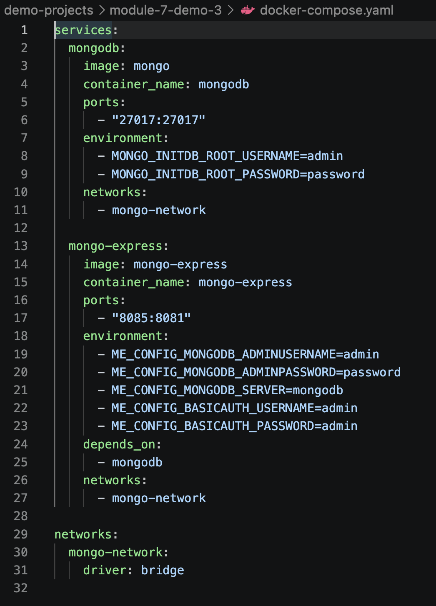
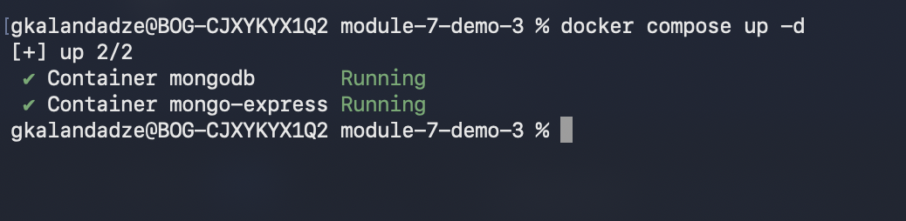
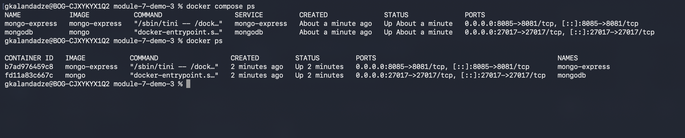
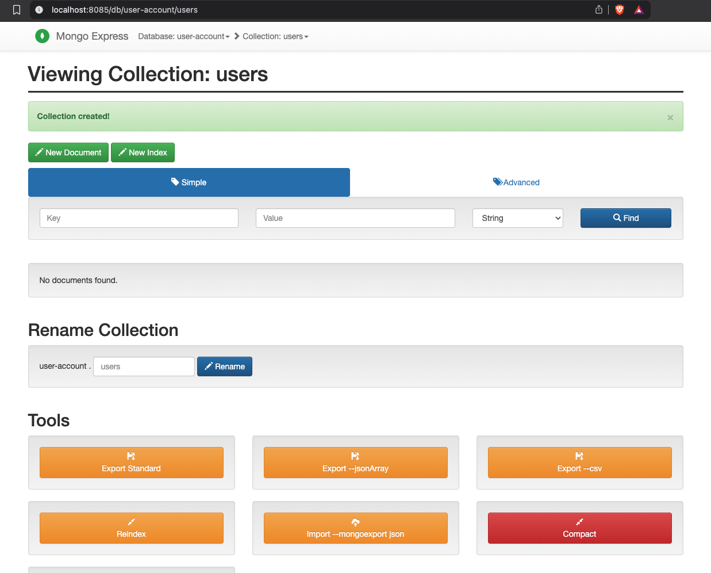

# Module 7 — Containers with Docker

## Demo Project: Docker Compose — Run Multiple Docker Containers

**Technologies:** Docker · Docker Compose · MongoDB · Mongo Express

**Part of:** [TWN DevOps Bootcamp](https://github.com/GiorgiKalandadze/twn-devops-bootcamp)

---

## Project Description

This demo runs the same MongoDB + Mongo Express setup as Demo 1, but replaces the three separate `docker run` commands and `docker network create` with a single `docker-compose.yaml` file.

- Define multiple services, a shared network, and environment variables in one file
- Start the entire stack with one command: `docker compose up -d`
- Understand `depends_on`, auto-created networks, and service-name DNS
- Observe that data is ephemeral without volumes (fixed in Demo 4)

---

## Architecture

```
  docker-compose.yaml
  ┌──────────────────────────────────────────────────────┐
  │                                                      │
  │  service: mongodb          service: mongo-express    │
  │  image: mongo              image: mongo-express      │
  │  port 27017:27017          port 8085:8081            │
  │                            depends_on: mongodb       │
  │                                                      │
  │            network: mongo-network (bridge)           │
  │    (service names registered as DNS automatically)   │
  └──────────────────────────────────────────────────────┘
         │                            │
         │  mongodb://admin@mongodb   │  http://localhost:8085
         └────────────────────────────┘
                                      │
                                      ▼
                                   Browser
```

---

## Steps

### Step 1 — Verify Docker Compose is Installed

```bash
docker compose version
```

---

### Step 2 — Walk Through docker-compose.yaml

```bash
cat docker-compose.yaml
```

Key points:
- **`services`** — each key (`mongodb`, `mongo-express`) is both the service name and its DNS hostname inside the network
- **`image`** — pulled from Docker Hub if not cached locally
- **`ports`** — `host:container` mapping, same as `-p` in `docker run`
- **`environment`** — same env vars as the `-e` flags from Demo 1
- **`depends_on`** — Compose starts `mongodb` before `mongo-express`; note it waits for container *start*, not Mongo *readiness* — mongo-express may restart once while waiting
- **`networks`** — both services share `mongo-network`; no `docker network create` needed
- The `networks:` block at the bottom defines the network; Compose auto-creates it on `up`



---

### Step 3 — Start the Stack

```bash
docker compose up -d
```

`-d` runs in detached mode (background). Compose creates the network, pulls any missing images, and starts the containers in dependency order.



---

### Step 4 — Verify Both Services are Running

```bash
docker compose ps
docker ps
```



---

### Step 5 — View Logs

```bash
docker compose logs -f mongo-express
```

Mongo Express may show a connection error and restart once — this is expected. `depends_on` only waits for the MongoDB *container* to start, not for Mongo to be ready to accept connections. Once Mongo is up, Mongo Express connects successfully.

---

### Step 6 — Open Mongo Express and Create Database

Open: `http://localhost:8085`
Login: `admin` / `admin`

Create database: `user-account`, collection: `users`



---

### Step 7 — Tear Down

```bash
docker compose down
```

One command stops and removes both containers **and** the network. Compare to Demo 1 where this required three `docker stop`, three `docker rm`, and a `docker network rm`.

---

### Step 8 — Bring Back Up and Observe Data Loss

```bash
docker compose up -d
```

Open `http://localhost:8085` — the `user-account` database is gone. No volume was defined, so all data lives inside the container filesystem and is destroyed on `docker compose down`.

> This is addressed in Demo 4 by adding a named volume to the Compose file.

---

## What I Learned

- One YAML file replaces a series of `docker run` commands — version-controllable, shareable, reproducible
- Compose auto-creates a network for all services and registers each service name as a DNS hostname — no `docker network create` needed
- `depends_on` controls container startup order but **not readiness** — app-level health checks are needed for true ordering
- `docker compose up -d` and `docker compose down` replace all the individual `docker` commands from Demo 1
- Compose project name defaults to the parent folder name — containers and networks get that prefix
- Data is ephemeral without volumes — every `down` wipes the database
- Newer Docker uses `docker compose` (space); older installs use `docker-compose` (hyphen) — both work

---

## Useful Reference Commands

```bash
docker compose up -d                    # start all services in background
docker compose down                     # stop + remove containers AND network
docker compose down -v                  # also remove volumes (full reset)
docker compose ps                       # list service status
docker compose logs -f mongo-express    # follow logs of one service
docker compose restart mongo-express    # restart one service
docker compose pull                     # pull latest images for all services
docker compose config                   # validate and print the resolved YAML
```

---

## Cleanup

```bash
docker compose down
docker rmi mongo mongo-express
```

---

## Screenshots (4 total)

| # | Filename | Shows |
|---|---|---|
| 01 | `01-compose-file.png` | `cat docker-compose.yaml` output |
| 02 | `02-compose-up.png` | `docker compose up -d` output |
| 03 | `03-compose-ps.png` | `docker compose ps` with both services running |
| 04 | `04-mongo-express-ui.png` | Browser at `localhost:8085` — Mongo Express home |

---
