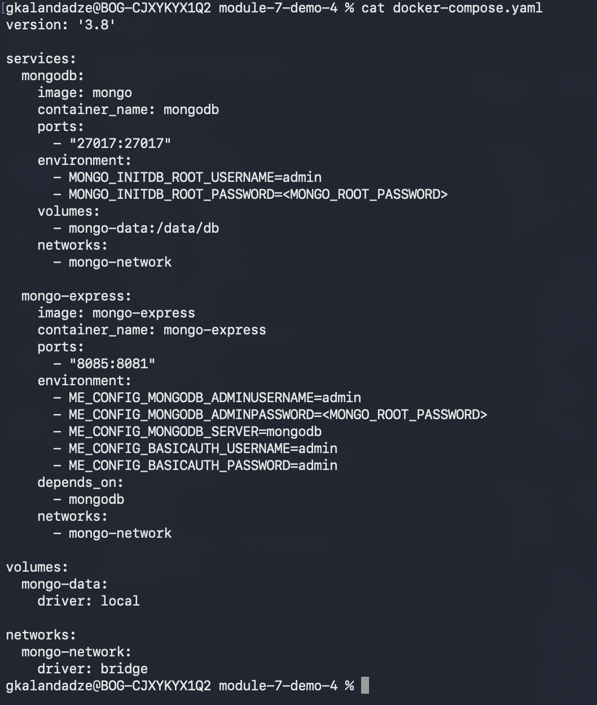
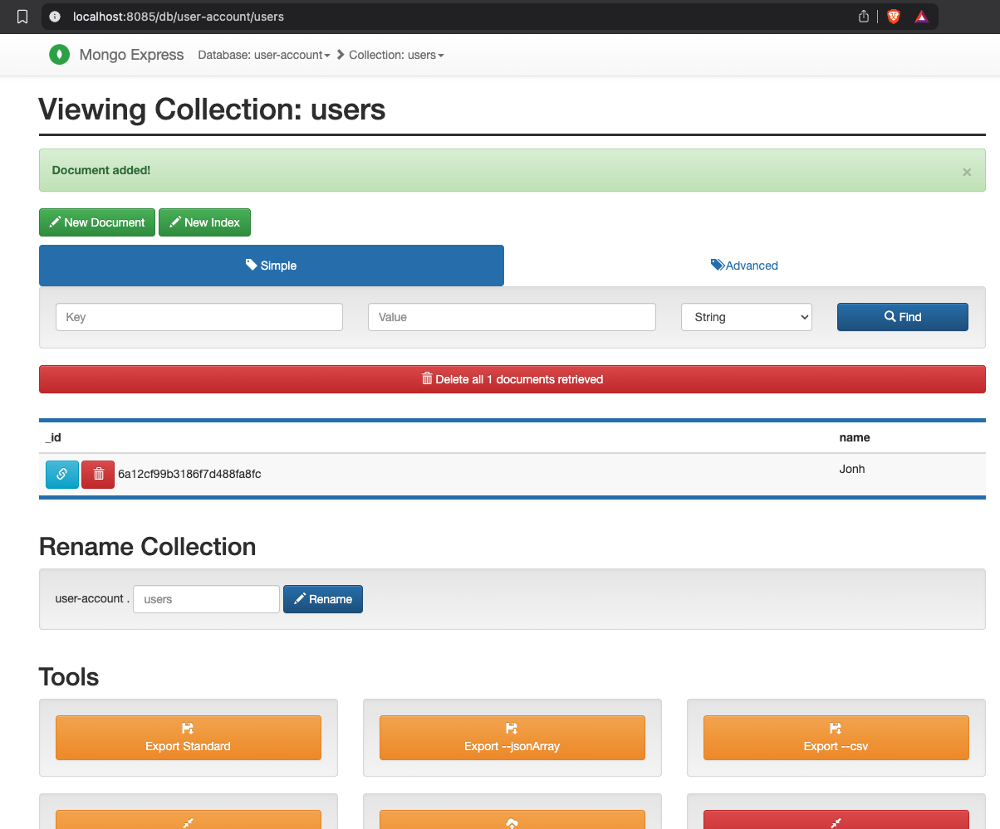
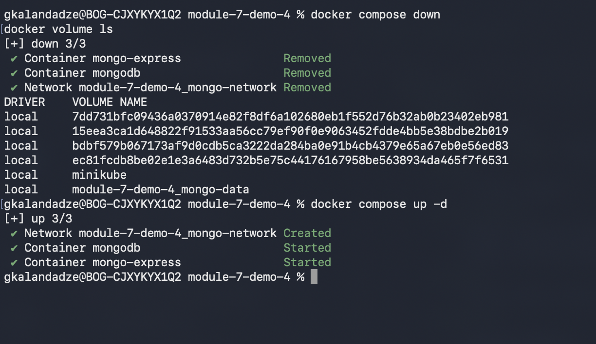
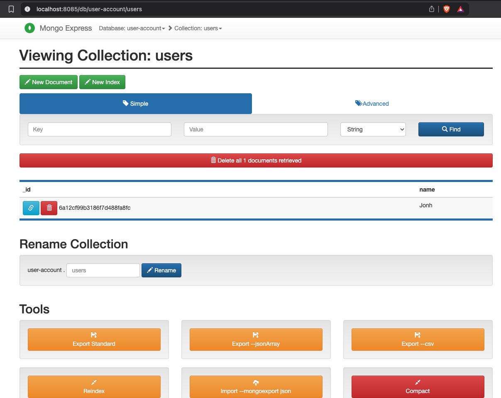
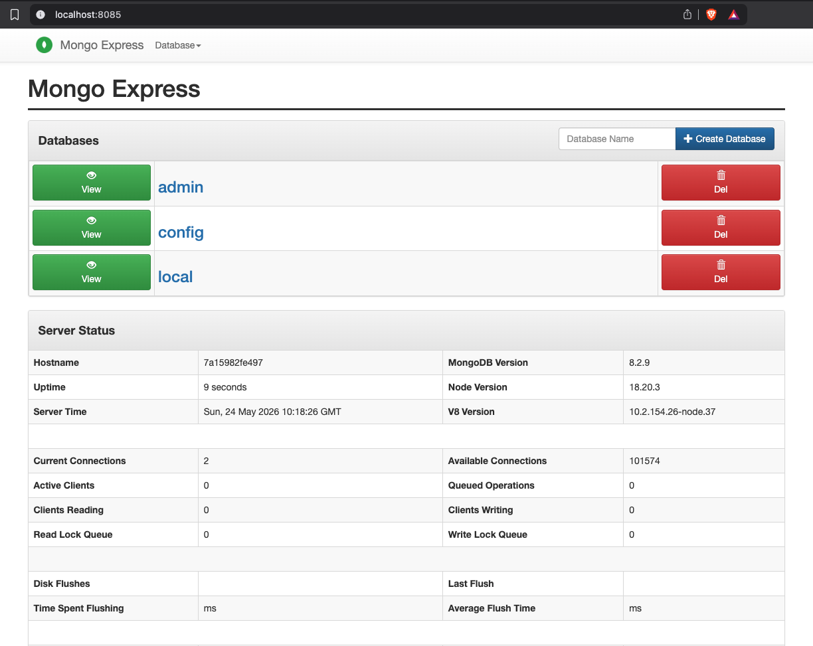

# Module 7 — Containers with Docker

## Demo Project: Persist Data with Docker Volumes

**Technologies:** Docker · Docker Compose · MongoDB · Mongo Express

**Part of:** [TWN DevOps Bootcamp](https://github.com/GiorgiKalandadze/twn-devops-bootcamp)

---

## Project Description

Builds on Demo 3 (Docker Compose) by adding a named volume to MongoDB. Without a volume, every `docker compose down` destroys the database — the container filesystem is ephemeral. A named volume decouples data from the container lifecycle so data survives teardown and restart.

- Understand the three Docker storage types and when to use each
- Add a named volume declaration to `docker-compose.yaml`
- Prove data persists across `docker compose down` / `up` cycles
- Prove data is destroyed by `docker compose down -v`

---

## Architecture

```
  docker-compose.yaml
  ┌──────────────────────────────────────────────────────┐
  │                                                      │
  │  service: mongodb                                    │
  │  image: mongo                                        │
  │  /data/db  ──────────────► volume: mongo-data        │
  │                             (managed by Docker,      │
  │                              survives container      │
  │  service: mongo-express      teardown)               │
  │  image: mongo-express                                │
  │  port 8085:8081                                      │
  │                                                      │
  │            network: mongo-network (bridge)           │
  └──────────────────────────────────────────────────────┘
         │
         │  docker compose down   → containers gone, volume SURVIVES
         │  docker compose down -v → containers AND volume gone
         ▼
       Browser  http://localhost:8085
```

---

## Docker Storage Types

| Type | Syntax | Managed by | Use case |
|---|---|---|---|
| Host volume (bind mount) | `-v /host/path:/container/path` | You | Dev — easy to inspect files directly on the host |
| Named volume | `-v volume-name:/container/path` | Docker | Production — Docker manages the storage location |
| Anonymous volume | `-v /container/path` | Docker | Rare — Docker creates a temporary unnamed volume |

This demo uses a **named volume** — the standard choice for persistent app data.

---

## Steps

### Step 1 — Walk Through docker-compose.yaml

```bash
cat docker-compose.yaml
```

Two additions compared to Demo 3:

**Under `mongodb` service** — mounts the named volume into the container:
```yaml
volumes:
  - mongo-data:/data/db
```
`/data/db` is MongoDB's default data directory. Any data MongoDB writes there is stored in the `mongo-data` volume instead of the container filesystem.

**Top-level `volumes:` block** — declares the named volume:
```yaml
volumes:
  mongo-data:
    driver: local
```
`driver: local` means Docker stores the volume on the local host filesystem under `/var/lib/docker/volumes/`. Without this declaration, the `volumes:` reference under the service would cause a Compose validation error.



---

### Step 2 — Start the Stack

```bash
docker compose up -d
docker compose ps
```

Compose creates the network, the named volume, and starts both containers.

---

### Step 3 — Verify the Volume was Created

```bash
docker volume ls
```

The volume is prefixed with the Compose project name (parent folder name by default), so `mongo-data` appears as `module-7-demo-4_mongo-data`.

---

### Step 4 — Create Data in Mongo Express

Open: `http://localhost:8085`
Login: `admin` / `admin`

Create database `user-account`, collection `users`, and insert a document (or add a few records).



---

### Step 5 — Tear Down and Verify Volume Survives

```bash
docker compose down
docker volume ls
```

`docker compose down` stops and removes the containers and the network — but **not** named volumes. The volume `module-7-demo-4_mongo-data` still appears in `docker volume ls`.

```bash
docker compose up -d
```



---

### Step 6 — Verify Data is Still There

Open `http://localhost:8085` — the `user-account` database and all documents are still present. The volume kept the data alive across the full container teardown and restart cycle.



---

### Step 7 — Inspect the Volume

```bash
docker volume inspect module-7-demo-4_mongo-data
```

The output shows the `Mountpoint` — the actual path on the host where Docker stores the data (e.g. `/var/lib/docker/volumes/module-7-demo-4_mongo-data/_data`). On macOS with Docker Desktop, this path is inside the Linux VM Docker Desktop runs — not directly accessible from the macOS filesystem.

---

### Step 8 — Demonstrate Destructive Teardown

```bash
docker compose down -v
docker volume ls
```

The `-v` flag tells Compose to remove named volumes along with containers and the network. The volume is gone from `docker volume ls`.

---

### Step 9 — Confirm Data is Gone

```bash
docker compose up -d
```

Open `http://localhost:8085` — the `user-account` database no longer exists. The volume was removed, so MongoDB started fresh.



---

## What I Learned

- Containers are **ephemeral by default** — everything inside the container filesystem dies with the container
- Docker **volumes** decouple data lifecycle from container lifecycle — data in a volume outlives the container
- Three storage types: host/bind mount, named volume, anonymous — named volume is the standard for production app data
- The mount path inside the container must match where the app writes data (`/data/db` for MongoDB, `/var/lib/postgresql/data` for Postgres, etc.)
- `docker compose down` preserves volumes; `docker compose down -v` destroys them — critical distinction in CI and dev workflows
- Volume names are **prefixed with the Compose project name** (the parent folder name) — `mongo-data` becomes `module-7-demo-4_mongo-data`


---

## Useful Reference Commands

```bash
docker volume ls                     # list all volumes
docker volume inspect <name>         # see mount path, driver, labels
docker volume create my-vol          # create a standalone volume
docker volume rm my-vol              # remove a specific volume
docker volume prune                  # remove ALL unused volumes (dangerous)
docker compose down                  # stop + remove containers and network; keep volumes
docker compose down -v               # stop + remove containers, network, AND volumes
```

---

## Cleanup

```bash
docker compose down -v
docker volume prune    # optional — removes any other dangling volumes
```

---

## Screenshots (5 total)

| # | Filename | Shows |
|---|---|---|
| 01 | `01-compose-with-volume.png` | `cat docker-compose.yaml` — volume sections visible |
| 02 | `02-create-data.png` | Mongo Express — `user-account` DB with documents inserted |
| 03 | `03-down-and-up.png` | `docker compose down`, `docker volume ls` (volume still there), `docker compose up -d` |
| 04 | `04-data-persisted.png` | Mongo Express after restart — same data still present |
| 05 | `05-volume-removed.png` | Mongo Express after `down -v` and `up -d` — database gone |
