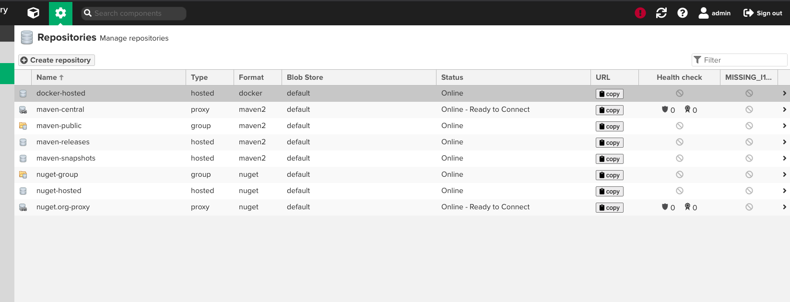
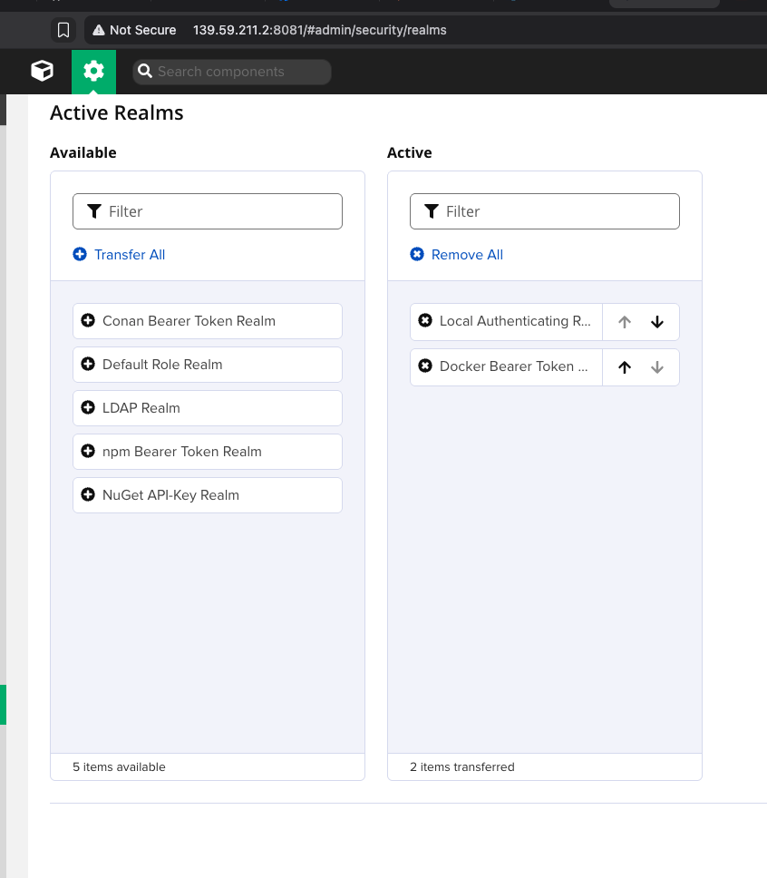
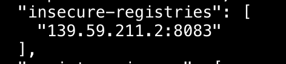
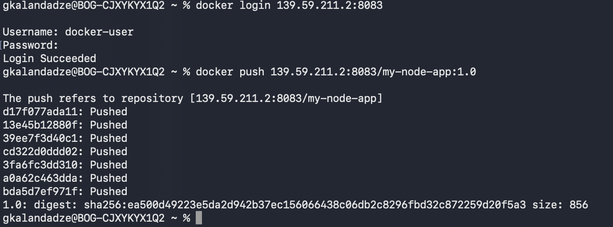
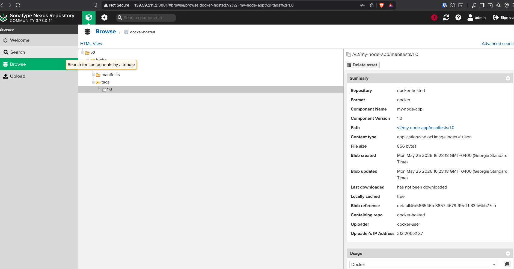

# Module 7 — Containers with Docker

## Demo Project: Create Docker Repository on Nexus and Push to It

**Technologies:** Docker · Nexus · DigitalOcean · Linux

**Application source:** [app/](./app/)

**Part of:** [TWN DevOps Bootcamp](https://github.com/GiorgiKalandadze/twn-devops-bootcamp)

---

Provision a Nexus artifact repository on a DigitalOcean Droplet, create a Docker-hosted repository with a dedicated connector port, configure authentication realms correctly, build a simple Node.js app locally, and push the image to the private registry over HTTP.

---

## Project Description

- Provision a 4 GB Ubuntu Droplet on DigitalOcean and install Nexus Repository OSS
- Create a `docker (hosted)` repository with an HTTP connector on port 8083
- Configure Nexus Realms so Docker's Bearer Token auth flow works correctly
- Create a dedicated Nexus role and user with repository-scoped privileges
- Configure Docker Desktop to allow pushes to an HTTP (insecure) registry
- Build a minimal Node.js hello-world image and tag it as `my-node-app:1.0`
- Push `my-node-app:1.0` to the private Nexus registry
- Pull the image back from Nexus and run the container to verify end-to-end

---

## Architecture

```
  Local Machine (laptop)
       │
       │  docker login <DROPLET_IP>:8083
       │  docker push  <DROPLET_IP>:8083/my-node-app:1.0
       │  docker pull  <DROPLET_IP>:8083/my-node-app:1.0
       ▼
  DigitalOcean Droplet — FRA1 — Ubuntu 24.04 LTS
  module-7-demo-5
  ┌────────────────────────────────────────────────────┐
  │  Nexus Repository OSS (run as nexus user)          │
  │                                                    │
  │  port 8081 — Nexus Web UI (HTTP)                   │
  │  port 8083 — Docker connector (HTTP)               │
  │               └── docker-hosted repository         │
  │                    └── my-node-app / 1.0           │
  └────────────────────────────────────────────────────┘

  Cloud Firewall
  ┌────────────────────────────────────────────────────┐
  │  TCP 22   — SSH                — your IP only      │
  │  TCP 8081 — Nexus UI           — your IP only      │
  │  TCP 8083 — Docker connector   — your IP only      │
  └────────────────────────────────────────────────────┘
```

> **Why two ports?**
> Nexus speaks its own API on **8081** — that is the web UI and Maven/npm repository traffic.
> Docker uses a completely different wire protocol (Docker Registry HTTP API v2) that requires its own dedicated **connector** port. You configure that connector when creating the `docker (hosted)` repository and pick any free port — **8083** is the convention. Without the connector, Docker has no way to reach the repository.

---

## Critical Configuration — Three Things That Break Docker Login

> **All three must be correct simultaneously. One misconfiguration silently breaks auth.**
>
> **1. Realms** (Settings → Security → Realms)
> The **Active** column must contain **both**:
> - `Local Authenticating Realm` — validates the username/password itself. Do **not** remove this.
> - `Docker Bearer Token Realm` — issues the Bearer token that Docker needs after the initial challenge.
>
> Only adding `Docker Bearer Token Realm` while removing `Local Authenticating Realm` causes all logins to fail. Both must be active.
>
> **2. Docker connector** on the `docker-hosted` repo must have HTTP port 8083 enabled and **Force basic authentication** must be **unchecked** — it conflicts with Bearer Token Realm.
>
> **3. Insecure-registries** in Docker Desktop must include `<DROPLET_IP>:8083`, and Docker Desktop must be **fully restarted** (wait for the whale icon to stop animating) before `docker login` will work.
>
> **Diagnostic command:**
> ```bash
> curl -v -u <user>:<pass> http://<DROPLET_IP>:8083/v2/ 2>&1 | grep -i www-authenticate
> ```
> - Expected: `WWW-Authenticate: Bearer realm="http://<DROPLET_IP>:8083/v2/token"...`
> - Wrong: `WWW-Authenticate: BASIC realm=...` → Bearer Token Realm is not active (go back to step 7)

---

## Steps

### Step 1 — Create Droplet on DigitalOcean

Create a new Droplet:

- **Image:** Ubuntu 24.04 (LTS) x64
- **Size:** s-2vcpu-4gb ($24/month) — Nexus requires at least 4 GB RAM
- **Region:** Frankfurt (FRA1)
- **Authentication:** SSH key
- **Hostname:** `module-7-demo-5`

---

### Step 2 — Configure Cloud Firewall

Create and attach a Cloud Firewall. Start with SSH only — you will add ports 8081 and 8083 after Nexus is running:

| Type   | Protocol | Port | Source       |
|--------|----------|------|--------------|
| Custom | TCP      | 22   | Your IP only |

---

### Step 3 — SSH In, Download, Install, and Start Nexus

Nexus 3.x ships with a **bundled JRE** — no separate Java installation required.

```bash
ssh root@<DROPLET_IP>
cd /opt
wget https://download.sonatype.com/nexus/3/nexus-unix-x86-64-3.78.0-14.tar.gz
tar -zxvf nexus-unix-x86-64-3.78.0-14.tar.gz
mv nexus-3.78.0-14 nexus
adduser nexus
chown -R nexus:nexus /opt/nexus /opt/sonatype-work
echo 'run_as_user="nexus"' > /opt/nexus/bin/nexus.rc
su - nexus
/opt/nexus/bin/nexus start
```

Wait ~60 seconds for startup, then verify the port is listening:

```bash
ss -tlnp | grep 8081
```

---

### Step 4 — Add Firewall Rules for Nexus and Docker Connector

| Type   | Protocol | Port | Source       |
|--------|----------|------|--------------|
| Custom | TCP      | 22   | Your IP only |
| Custom | TCP      | 8081 | Your IP only |
| Custom | TCP      | 8083 | Your IP only |

---

### Step 5 — Get Admin Password and Complete Setup Wizard

```bash
cat /opt/sonatype-work/nexus3/admin.password
```

Open `http://<DROPLET_IP>:8081` in a browser → Sign in as `admin` with the password above → set a new admin password → disable anonymous access.

---

### Step 6 — Create the Docker-Hosted Repository

Settings (gear icon) → Repository → Repositories → **Create repository** → `docker (hosted)`:

- **Name:** `docker-hosted`
- **HTTP connector:** checked, port `8083`
- **Allow anonymous pull:** unchecked
- **Deployment policy:** Allow redeploy
- **Force basic authentication:** **UNCHECKED** — this conflicts with Bearer Token Realm

Click **Create repository**.



---

### Step 7 — CRITICAL: Configure Realms

Settings (gear icon) → Security → **Realms**:

Move `Docker Bearer Token Realm` from Available to **Active**.  
Verify that `Local Authenticating Realm` is **already in Active** — do not remove it.

The Active column must show both:
- `Local Authenticating Realm`
- `Docker Bearer Token Realm`

Click **Save**, then reload the page to confirm both are still in Active.



---

### Step 8 — Create a Nexus Role

Settings → Security → Roles → **Create role** → Nexus role:

- **Role ID:** `nx-docker-deployer`
- **Privileges:** search for `nx-repository-view-docker-docker-hosted-*` → add the `*` (all actions) privilege

---

### Step 9 — Create a Nexus User

Settings → Security → Users → **Create local user**:

- **ID:** `docker-user`
- **Email:** docker@example.com
- **Password:** set a strong one
- **Status:** Active
- **Roles:** `nx-docker-deployer`

---

### Step 10 — Configure Docker Desktop to Allow HTTP Registry

Docker Desktop → Settings → Docker Engine. Add the `insecure-registries` key:

```json
{
  "insecure-registries": ["<DROPLET_IP>:8083"]
}
```

Click **Apply & Restart**. Wait for the whale icon to stop animating before proceeding — `docker login` will fail if Docker hasn't fully restarted.



---

### Step 11 — Build Image, Login, Tag, and Push

Build the image from the local `app/` directory:

```bash
docker build -t my-node-app:1.0 .
docker images my-node-app
```

Login, tag, and push:

```bash
docker login <DROPLET_IP>:8083
# Username: docker-user
# Password: <your-password>
# Expected: Login Succeeded

docker tag my-node-app:1.0 <DROPLET_IP>:8083/my-node-app:1.0
docker push <DROPLET_IP>:8083/my-node-app:1.0
```



---

### Step 12 — Verify in Nexus UI and Pull Back

In the Nexus UI: Browse → `docker-hosted` → `v2` → `my-node-app` → `tags` → `1.0`.

Then pull the image back from Nexus to confirm the registry is fully functional:

```bash
docker rmi <DROPLET_IP>:8083/my-node-app:1.0
docker pull <DROPLET_IP>:8083/my-node-app:1.0
docker run -d -p 3000:3000 --name pulled-app <DROPLET_IP>:8083/my-node-app:1.0
curl http://localhost:3000
```



---

## What I Learned

- Nexus is a multi-format artifact manager — Maven, npm, and Docker repositories all run in a single instance, each on its own connector port
- Docker needs a dedicated connector port (8083) — it speaks Docker Registry HTTP API v2, which is a completely different protocol from Maven over 8081
- Docker refuses HTTP registries by default — `insecure-registries` config + Docker Desktop full restart are both required
- The image tag prefix determines push destination: `docker push <registry>/<name>:<tag>` routes to the registry in the prefix

---

## Useful Reference Commands

```bash
# On Droplet
/opt/nexus/bin/nexus start | stop | status
tail -f /opt/sonatype-work/nexus3/log/nexus.log

# Auth diagnostic
curl -v -u <user>:<pass> http://<DROPLET_IP>:8083/v2/ 2>&1 | grep -i www-authenticate

# On laptop
docker login <DROPLET_IP>:8083
docker logout <DROPLET_IP>:8083
docker tag <local-image>:<tag> <DROPLET_IP>:8083/<name>:<tag>
docker push <DROPLET_IP>:8083/<name>:<tag>
docker pull <DROPLET_IP>:8083/<name>:<tag>
cat ~/.docker/config.json    # inspect saved auth entries
```

---

## Cleanup

```bash
docker stop pulled-app && docker rm pulled-app
docker rmi <DROPLET_IP>:8083/my-node-app:1.0
docker logout <DROPLET_IP>:8083
# Remove the insecure-registries entry from Docker Desktop → Settings → Docker Engine
```

DigitalOcean console:
1. Destroy the Droplet (or keep a snapshot if reusing Nexus for later modules)
2. Delete the Cloud Firewall if not reused

---

## Screenshots

| # | Filename | Shows |
|---|---|---|
| 03 | `03-docker-hosted-repo.png` | Nexus UI: docker-hosted repo settings with HTTP port 8083 |
| 04 | `04-realms-configured.png` | Nexus Realms page: both Local Authenticating Realm and Docker Bearer Token Realm in Active column |
| 06 | `06-insecure-registries.png` | Docker Desktop Engine settings with Droplet IP in insecure-registries |
| 07 | `07-docker-login-push.png` | Terminal: `Login Succeeded` + `docker push` layers output |
| 08 | `08-image-in-nexus.png` | Nexus UI: `my-node-app/1.0` browseable in docker-hosted |

---

