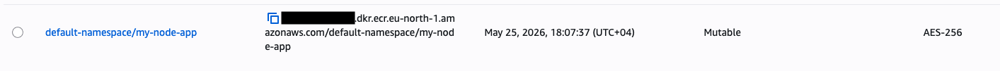
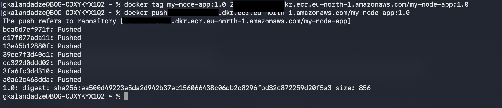
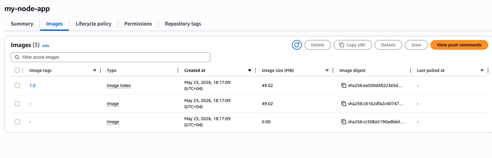
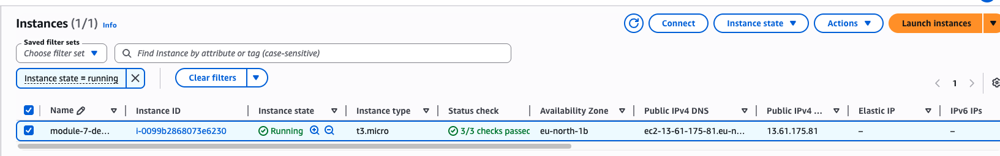
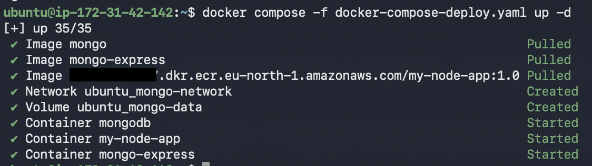
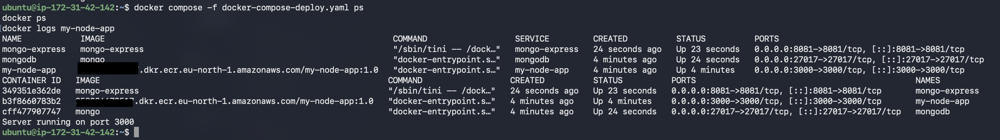
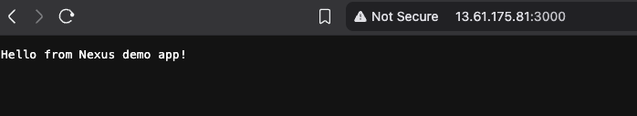

# Module 7 — Containers with Docker

## Demo Project: Deploy Docker Application on a Server with Docker Compose

**Technologies:** Docker · Docker Compose · Amazon ECR · AWS EC2 · Node.js · MongoDB · Mongo Express · Linux

**Part of:** [TWN DevOps Bootcamp](https://github.com/GiorgiKalandadze/twn-devops-bootcamp)

---

The final Module 7 demo. The app, the Compose file, the private registry concept — all carried forward from previous demos, but now running on AWS: the image lives in Amazon ECR (instead of Nexus) and the three-container stack runs on an EC2 instance (instead of a laptop or DigitalOcean Droplet) via Docker Compose.

---

## Prerequisites

Before starting this demo you need:

- An AWS account (free tier is sufficient)
- AWS CLI installed and configured locally (`aws --version`, `aws configure`)
- `my-node-app:1.0` image in your local Docker (built in Demo 2 — rebuild from Demo 2's `app/` directory if missing)
- The `docker-compose.yaml` from Demo 3 or 4 as a reference — the deploy YAML in this demo (`docker-compose-deploy.yaml`) is nearly identical but pulls the app image from ECR instead of building locally

---

## Project Description

- Create a private ECR repository and push `my-node-app:1.0` from your laptop
- Launch an Ubuntu EC2 instance with a security group and an IAM role granting ECR read access
- Install Docker and AWS CLI on the EC2 instance
- Authenticate Docker on the EC2 to ECR using the attached IAM role (no credentials stored)
- Deploy the three-container stack (app + MongoDB + Mongo Express) with `docker compose up -d`
- Verify the app and Mongo Express are reachable in a browser

---

## Architecture

```
  Your Laptop                          AWS Cloud (eu-north-1)
  ───────────                          ──────────────────────────────────────

  docker build                  ┌────► Amazon ECR (private registry)
  ──────────────►               │      <ACCOUNT_ID>.dkr.ecr.eu-north-1
        │                       │      .amazonaws.com/my-node-app:1.0
        │  aws ecr              │               ▲
        │  get-login-password   │               │ docker pull
        │  | docker login       │               │ (via IAM role)
        │  & docker push        │               │
        └───────────────────────┘      ┌────────┴──────────────────────┐
                                       │  EC2 Instance (Ubuntu)        │
                                       │  ──────────────────────────── │
                                       │   docker compose up -d        │
                                       │                               │
                                       │  ┌─────────────────────────┐ │
                                       │  │ my-node-app  :3000      │◄┼── browser :3000
                                       │  └────────────┬────────────┘ │
                                       │               │ mongo-network │
                                       │  ┌────────────▼────────────┐ │
                                       │  │ mongodb      :27017     │ │
                                       │  └────────────┬────────────┘ │
                                       │               │               │
                                       │  ┌────────────▼────────────┐ │
                                       │  │ mongo-express  :8081    │◄┼── browser :8081
                                       │  └─────────────────────────┘ │
                                       └───────────────────────────────┘

  Security Group (ec2-sg)
  ┌─────────────────────────────────────────┐
  │  TCP 22   — SSH        — your IP only   │
  │  TCP 3000 — App        — your IP only   │
  │  TCP 8081 — Mongo Exp  — your IP only   │
  └─────────────────────────────────────────┘
```

---

## Steps

### Step 1 — Create the ECR Repository

AWS Console → ECR → **Create repository**:

- **Visibility:** Private
- **Repository name:** `my-node-app`
- **Tag immutability:** Mutable

Click **Create repository**. Note the full URI shown:

```
<ACCOUNT_ID>.dkr.ecr.eu-north-1.amazonaws.com/my-node-app
```



---

### Step 2 — Authenticate Docker to ECR (Laptop)

```bash
aws ecr get-login-password --region eu-north-1 \
  | docker login --username AWS --password-stdin \
    <ACCOUNT_ID>.dkr.ecr.eu-north-1.amazonaws.com
```

This generates a temporary token (valid 12 hours) and pipes it as the Docker password. The username is always the literal string `AWS` for ECR.

---

### Step 3 — Tag and Push the Image

```bash
docker tag my-node-app:1.0 \
  <ACCOUNT_ID>.dkr.ecr.eu-north-1.amazonaws.com/my-node-app:1.0

docker push \
  <ACCOUNT_ID>.dkr.ecr.eu-north-1.amazonaws.com/my-node-app:1.0
```



---

### Step 4 — Verify Image in ECR

AWS Console → ECR → `my-node-app` → Images. Tag `1.0` should be listed with its digest and size.



---

### Step 5 — Create IAM Role for EC2

EC2 needs permission to pull from ECR. The right approach is an IAM role — never copy access keys to a server.

IAM → Roles → **Create role**:

- **Trusted entity:** AWS service → EC2
- **Permissions:** attach `AmazonEC2ContainerRegistryReadOnly`
- **Role name:** `EC2-ECR-ReadOnly`

---

### Step 6 — Launch the EC2 Instance

EC2 → **Launch Instance**:

- **Name:** `module-7-demo-7`
- **AMI:** Ubuntu Server 22.04 LTS (Free tier eligible)
- **Instance type:** t2.micro (free tier) or t3.small for more headroom
- **Key pair:** select or create one — download the `.pem` file to `~/.ssh/`
- **Security group:** create new with inbound rules:

| Type       | Protocol | Port | Source       |
|------------|----------|------|--------------|
| SSH        | TCP      | 22   | My IP        |
| Custom TCP | TCP      | 3000 | My IP        |
| Custom TCP | TCP      | 8081 | My IP        |

- **Advanced details → IAM instance profile:** attach `EC2-ECR-ReadOnly`

Click **Launch instance**.



---

### Step 7 — SSH In and Install Docker

```bash
chmod 400 ~/.ssh/<your-key>.pem
ssh -i ~/.ssh/<your-key>.pem ubuntu@<EC2_PUBLIC_IP>
```

On the EC2 instance:

```bash
curl -fsSL https://get.docker.com -o get-docker.sh
sudo sh get-docker.sh
sudo usermod -aG docker ubuntu
exit
```

SSH back in (required for the group change to take effect):

```bash
ssh -i ~/.ssh/<your-key>.pem ubuntu@<EC2_PUBLIC_IP>
docker --version
docker compose version
```

---

### Step 8 — Install AWS CLI on EC2

```bash
sudo apt update && sudo apt install -y unzip
curl "https://awscli.amazonaws.com/awscli-exe-linux-x86_64.zip" -o "awscliv2.zip"
unzip awscliv2.zip
sudo ./aws/install
aws --version
```

No `aws configure` needed — the IAM role attached in step 6 provides credentials automatically via EC2 instance metadata.

---

### Step 9 — Authenticate Docker on EC2 to ECR

```bash
aws ecr get-login-password --region eu-north-1 \
  | docker login --username AWS --password-stdin \
    <ACCOUNT_ID>.dkr.ecr.eu-north-1.amazonaws.com
```

Expected: `Login Succeeded`. The IAM role makes this work without any stored credentials.

---

### Step 10 — Upload and Deploy the Compose File

Copy the deploy Compose file to the instance (from your laptop):

```bash
scp -i ~/.ssh/<your-key>.pem \
  docker-compose-deploy.yaml \
  ubuntu@<EC2_PUBLIC_IP>:~/docker-compose-deploy.yaml
```

Then on the EC2 instance:

```bash
docker compose -f docker-compose-deploy.yaml up -d
```

Docker pulls MongoDB and Mongo Express from Docker Hub and `my-node-app:1.0` from ECR.



---

### Step 11 — Verify All Three Containers Are Running

```bash
docker compose -f docker-compose-deploy.yaml ps
docker ps
docker logs my-node-app
```



---

### Step 12 — Open in Browser

- **App:** `http://<EC2_PUBLIC_IP>:3000`
- **Mongo Express:** `http://<EC2_PUBLIC_IP>:8081` (login: `admin` / `admin`)

The full chain works: app image pulled from ECR, running on EC2, talking to MongoDB over a private Docker network on the same instance.



---

## What I Learned

- **Amazon ECR is AWS's managed private Docker registry** — same role as Nexus's Docker repo from Demo 5, but managed by AWS. No ports to configure, HTTPS by default, integrated IAM auth
- **ECR auth uses a temporary token**, not a username/password. `aws ecr get-login-password | docker login --username AWS --password-stdin` is the required flow. Tokens expire every 12 hours
- **IAM roles on EC2 are the right pattern** for granting AWS permissions. Never copy access keys to a server — attach a role and let EC2 instance metadata deliver the credentials
- **The same Compose file works almost anywhere.** Locally, on DigitalOcean, on EC2. The only change for deployment: swap `build:` for `image:` pointing at the registry URI
- **Production deploys split build from deploy.** Build once locally or in CI, push to a registry, pull the same immutable image everywhere. No rebuilding on the server
- **Security Groups are AWS's firewall.** Same principle as DigitalOcean Cloud Firewall — inbound rules per port, restrict to your IP only during development
---

## Useful Reference Commands

```bash
# ECR auth (laptop or EC2 with IAM role)
aws ecr get-login-password --region eu-north-1 \
  | docker login --username AWS --password-stdin \
    <ACCOUNT_ID>.dkr.ecr.eu-north-1.amazonaws.com

# Tag and push
docker tag my-node-app:1.0 <ACCOUNT_ID>.dkr.ecr.eu-north-1.amazonaws.com/my-node-app:1.0
docker push <ACCOUNT_ID>.dkr.ecr.eu-north-1.amazonaws.com/my-node-app:1.0

# List images in ECR
aws ecr list-images --repository-name my-node-app --region eu-north-1

# On EC2
docker compose -f docker-compose-deploy.yaml up -d
docker compose -f docker-compose-deploy.yaml down
docker compose -f docker-compose-deploy.yaml logs -f my-node-app
docker compose -f docker-compose-deploy.yaml ps
docker compose -f docker-compose-deploy.yaml pull    # fetch newer images
```

---

## Cleanup

> **IMPORTANT — EC2 and ECR cost money. Tear down when done.**

**EC2:**

1. AWS Console → EC2 → select the instance → **Terminate instance**
2. Delete the security group if not reused

**ECR:**

1. AWS Console → ECR → `my-node-app` → **Delete repository** (also deletes the image)

**IAM:**

- Keep the `EC2-ECR-ReadOnly` role if you'll reuse it for later demos; otherwise IAM → Roles → delete it
