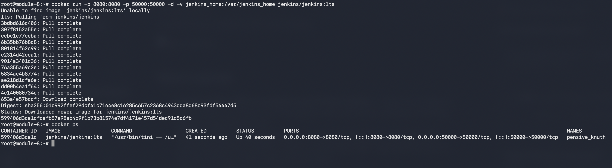
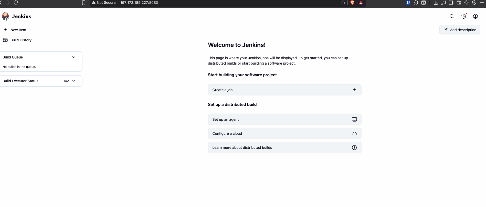

# Module 8 — CI/CD with Jenkins

## Demo Project: Install Jenkins on DigitalOcean

**Technologies:** Jenkins · Docker · DigitalOcean · Linux

**Part of:** [TWN DevOps Bootcamp](https://github.com/GiorgiKalandadze/twn-devops-bootcamp)

---

## Project Description

- Provision a 4 GB DigitalOcean Droplet to host Jenkins for the rest of Module 8
- Install Docker on the Droplet
- Run Jenkins as a Docker container with a persistent named volume
- Complete the Jenkins setup wizard and create an admin user

---

## Architecture

```
  Browser
     │
     │  HTTP :8080
     ▼
  DigitalOcean Droplet — FRA1 — Ubuntu 24.04 LTS
  module-8-demo-1
     │
     │  Docker daemon
     ▼
  jenkins container  (jenkins/jenkins:lts)
     │  -p 8080:8080    — Jenkins UI
     │  -p 50000:50000  — build agent communication
     ▼
  jenkins_home volume  (/var/jenkins_home)

  Firewall
  ┌─────────────────────────────────────────┐
  │  TCP 22   — SSH        — your IP only   │
  │  TCP 8080 — Jenkins UI — your IP only   │
  └─────────────────────────────────────────┘
```

---

## Steps

### Step 1 — Create Droplet

Create a new Droplet:

- **Image:** Ubuntu 24.04 (LTS) x64
- **Size:** 4 GB RAM / 2 vCPUs (s-2vcpu-4gb)
- **Region:** Frankfurt (FRA1)
- **Authentication:** SSH key
- **Hostname:** `module-8-demo-1`

---

### Step 2 — Configure Firewall

Create and attach a Cloud Firewall. Add inbound rules:

| Type   | Protocol | Port | Source       |
|--------|----------|------|--------------|
| SSH    | TCP      | 22   | My IP        |
| Custom | TCP      | 8080 | My IP        |

---

### Step 3 — SSH In and Install Docker

```bash
ssh root@<DROPLET_IP>
curl -fsSL https://get.docker.com | sh
docker --version
```

---

### Step 4 — Create Jenkins Volume

```bash
docker volume create jenkins_home
```

A named volume keeps all Jenkins state (jobs, plugins, credentials, build history) outside the container so it survives restarts and image upgrades.

---

### Step 5 — Run Jenkins Container

```bash
docker run -d \
  -p 8080:8080 -p 50000:50000 \
  --name jenkins \
  -v jenkins_home:/var/jenkins_home \
  jenkins/jenkins:lts
```

Wait ~60 seconds, then confirm Jenkins is ready:

```bash
docker logs jenkins
```

Look for: `Jenkins is fully up and running`.



---

### Step 6 — Get Initial Admin Password

```bash
docker exec jenkins cat /var/jenkins_home/secrets/initialAdminPassword
```

Copy the password — you will paste it in the next step.

---

### Step 7 — Unlock Jenkins in Browser

Open `http://<DROPLET_IP>:8080` and paste the initial admin password.

---

### Step 8 — Complete Setup Wizard

- Click **Install suggested plugins** and wait (~5 min)
- Create a new admin user with a username and password you will remember
- Accept the default Jenkins URL



---

## What I Learned

- **Jenkins as a container makes it reproducible** — upgrading is `docker pull jenkins/jenkins:lts && docker restart jenkins`, not a package manager dance
- **`/var/jenkins_home` holds all Jenkins state** — persist this volume and you persist everything: jobs, plugins, credentials, build history
- **Port 8080 is the UI; port 50000 is for build agents** — agents connect back to the controller on 50000 when you scale out
- **The initial admin password lives in the volume** at `secrets/initialAdminPassword`, accessible via `docker exec` without entering the container
- **This Droplet is reused for all Module 8 demos** — tear it down only after the module is complete

---

## Cleanup

> **Do not run this until Module 8 is complete.** If taking a break, stop the Droplet in the DO console — you are not billed for compute while stopped, only for the disk.

When Module 8 is fully done:

```bash
docker stop jenkins && docker rm jenkins
docker volume rm jenkins_home
```

Then destroy the Droplet from the DigitalOcean console.

---


