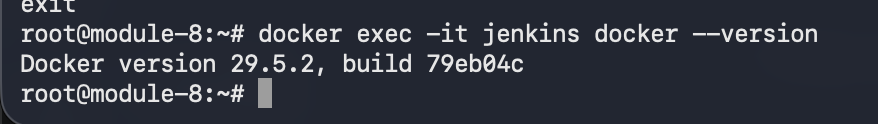
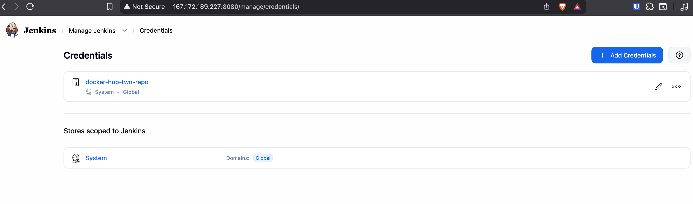
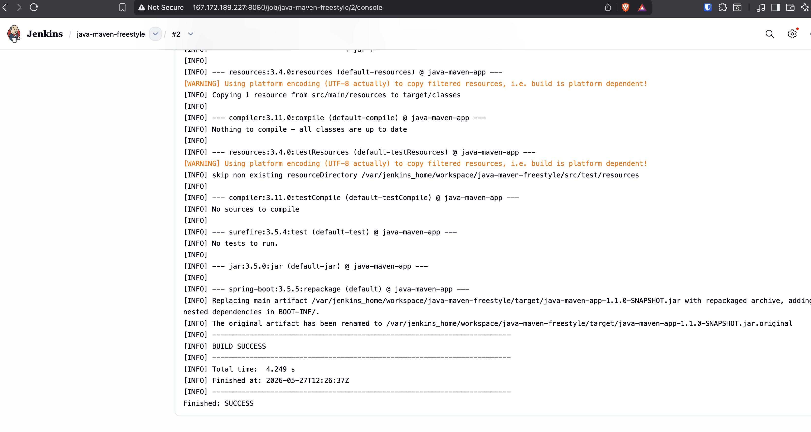
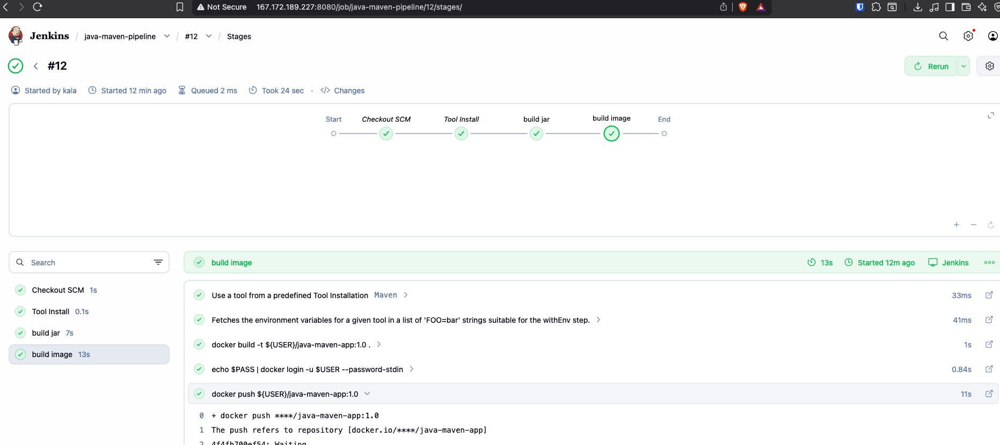
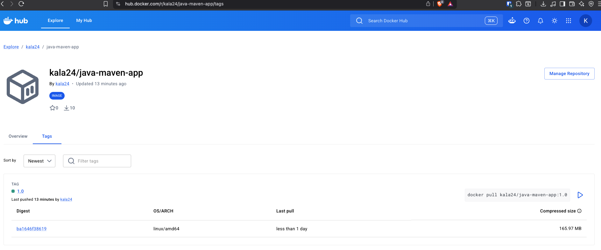
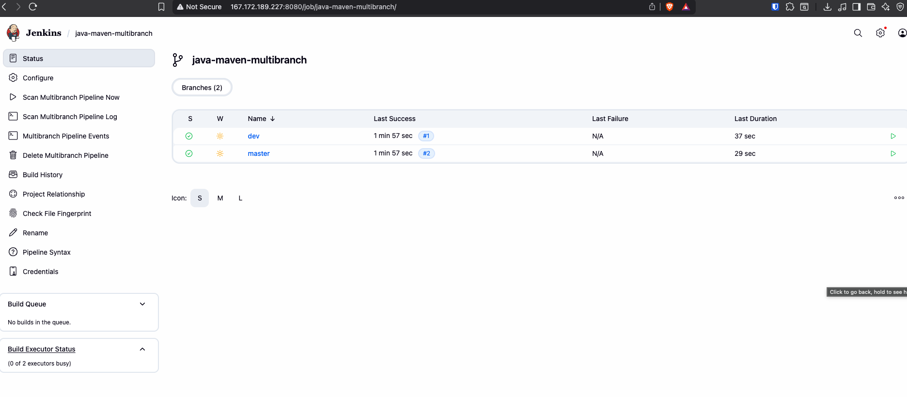
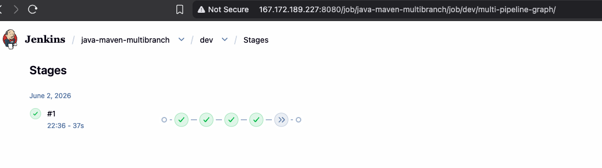

# Module 8 — CI/CD with Jenkins

## Demo Project: Create a CI Pipeline with Jenkinsfile

**Technologies:** Jenkins · Docker · Linux · Git · Java · Maven

**Application source:** [java-maven-app](https://gitlab.com/giorgikalandadze24/twn-java-maven-app)

**Part of:** [TWN DevOps Bootcamp](https://github.com/GiorgiKalandadze/twn-devops-bootcamp)

---

## Project Description

- Install the Maven plugin in Jenkins and configure a Maven tool
- Install Docker CLI inside the Jenkins container and mount the Docker socket so Jenkins can build and push images
- Create a DockerHub credential in Jenkins for pushing images
- Create a **Freestyle job** that runs `mvn test` and `mvn package` against the GitLab repo
- Create a **Pipeline job** driven by a `Jenkinsfile` that builds the JAR, builds a Docker image, and pushes it to DockerHub
- Create a **Multibranch Pipeline** that auto-discovers branches and runs branch-conditional stages

---

## Architecture

```
GitLab repo (java-maven-app)
        │
        │ push triggers (or manual)
        ▼
Jenkins (Droplet :8080)
        │
        ├─ Freestyle Job    → build JAR
        ├─ Pipeline Job     → build JAR → build Docker image → push DockerHub
        └─ Multibranch Job  → same pipeline, per branch
                │
                ▼
        DockerHub (private repo)
        kala24/java-maven-app:1.0, :1.1 ...
```

---

## Steps

### Step 1 — SSH to Droplet and Start Jenkins

SSH into the Droplet and run the Jenkins container with the Docker socket mounted from the start:

```bash
ssh root@<DROPLET_IP>

docker run -d \
  -p 8080:8080 -p 50000:50000 \
  --name jenkins \
  -v jenkins_home:/var/jenkins_home \
  -v /var/run/docker.sock:/var/run/docker.sock \
  jenkins/jenkins:lts
```

Wait ~60 seconds, then confirm Jenkins is ready:

```bash
docker logs jenkins | grep "Jenkins is fully up"
```

---

### Step 2 — Unlock Jenkins and Complete Setup Wizard

Get the initial admin password:

```bash
docker exec jenkins cat /var/jenkins_home/secrets/initialAdminPassword
```

Open `http://<DROPLET_IP>:8080`, paste the password, click **Install suggested plugins**, then create an admin user.

---

### Step 3 — Install Docker CLI Inside Jenkins Container

The Docker socket is already mounted from Step 1. Now install the CLI and grant the Jenkins user access to it:

```bash
docker exec -u 0 -it jenkins bash
curl -fsSL https://get.docker.com | sh
chmod 666 /var/run/docker.sock
exit
```

Verify Docker works inside the container:

```bash
docker exec -it jenkins docker --version
```



---

### Step 4 — Install Maven Plugin and Configure Maven Tool

In the Jenkins UI:

1. **Manage Jenkins → Plugins → Available plugins** → search `Maven Integration` → Install
2. **Manage Jenkins → Tools → Maven → Add Maven**
   - Name: `maven`
   - Enable: Install automatically

---

### Step 5 — Add DockerHub Credential

**DockerHub credential** — **Manage Jenkins → Credentials → System → Global credentials → Add Credentials**:

| Field    | Value                    |
|----------|--------------------------|
| Kind     | Username with password   |
| Password | DockerHub access token   |
| ID       | `docker-hub-twn-repo`    |

> The java-maven-app GitLab repo is a public TWN reference project — no credentials needed for Jenkins to clone it.



---

### Step 6 — Create Freestyle Job

**New Item → Freestyle project** → name `java-maven-freestyle`

Configure:

- **Source Code Management → Git**
  - Repository URL: `https://gitlab.com/giorgikalandadze24/twn-java-maven-app`
  - Credentials: none (public repo)
- **Build Steps → Invoke top-level Maven targets**
  - Goals: `test`
- **Add another Build Step → Invoke top-level Maven targets**
  - Goals: `package`

Click **Build Now** and confirm BUILD SUCCESS in the console output.



---

### Step 7 — Create Pipeline Job

**New Item → Pipeline** → name `java-maven-pipeline`

Configure under **Pipeline**:

- Definition: `Pipeline script from SCM`
- SCM: `Git`
- Repository URL: same GitLab URL
- Credentials: none (public repo)
- Script Path: `Jenkinsfile`

---

### Step 8 — Add Jenkinsfile to the GitLab Repo

Commit this `Jenkinsfile` to the root of `java-maven-app`:

```groovy
pipeline {
    agent any
    tools {
        maven 'Maven'
    }
    stages {
        stage('build jar') {
            steps {
                sh 'mvn package'
            }
        }
        stage('build image') {
            steps {
                withCredentials([usernamePassword(credentialsId: 'docker-hub-twn-repo', usernameVariable: 'USER', passwordVariable: 'PASS')]) {
                    sh 'docker build -t kala24/java-maven-app:1.0 .'
                    sh 'echo $PASS | docker login -u $USER --password-stdin'
                    sh 'docker push kala24/java-maven-app:1.0'
                }
            }
        }
    }
}
```

Run the Pipeline job. All stages should go green.



---

### Step 9 — Verify Image on DockerHub

Open `https://hub.docker.com/r/kala24/java-maven-app` and confirm the `1.0` tag is present.



---

### Step 10 — Create Multibranch Pipeline

**New Item → Multibranch Pipeline** → name `java-maven-multibranch`

Configure under **Branch Sources → Git**:

- Project Repository: same GitLab URL
- Credentials: none (public repo)

Under **Scan Multibranch Pipeline Triggers**: enable periodic scanning or configure a webhook.

Click **Save** — Jenkins scans the repo and creates a sub-pipeline for each discovered branch.

---

### Step 11 — Add Branch-Conditional Stage to Jenkinsfile

Update the `Jenkinsfile` with a deploy stage that only runs on `main`:

```groovy
pipeline {
    agent any
    tools {
        maven 'Maven'
    }
    stages {
        stage('build jar') {
            steps {
                sh 'mvn package'
            }
        }
        stage('build image') {
            steps {
                withCredentials([usernamePassword(credentialsId: 'docker-hub-twn-repo', usernameVariable: 'USER', passwordVariable: 'PASS')]) {
                    sh 'docker build -t kala24/java-maven-app:1.0 .'
                    sh 'echo $PASS | docker login -u $USER --password-stdin'
                    sh 'docker push kala24/java-maven-app:1.0'
                }
            }
        }
        stage('deploy') {
            when {
                expression { BRANCH_NAME == 'main' }
            }
            steps {
                echo 'deploying to production...'
            }
        }
    }
}
```

Create a `dev` branch in the GitLab repo. Jenkins auto-discovers it and builds both branches independently.



---

### Step 12 — Verify Branch Build Results

- **`main` branch** — all three stages run including `deploy`
- **`dev` branch** — `deploy` stage is skipped (condition not met)



---

## What I Learned

- **Three Jenkins job types:** Freestyle (simple, UI-driven), Pipeline (Jenkinsfile, full CI/CD), Multibranch (one pipeline per branch, auto-discovered)
- **Docker socket mount** (`-v /var/run/docker.sock:/var/run/docker.sock`) lets the Jenkins container issue Docker commands using the host's Docker daemon — no Docker daemon inside the container
- **`chmod 666 /var/run/docker.sock`** is required after starting the container — the Jenkins user needs permission to talk to the socket
- **Credentials in Jenkins are encrypted** and referenced by ID — never hardcoded in the Jenkinsfile
- **`when { expression { BRANCH_NAME == 'main' } }`** enables branch-conditional pipeline logic — deploy only from `main`, skip on feature branches
- **Pipeline as Code** means the `Jenkinsfile` lives in Git alongside the application code — version-controlled, reviewable, and reproducible

---

## Cleanup

> **Keep the Jenkins Droplet running for the rest of Module 8.**

When Module 8 is fully done, stop and remove the container and volume, then destroy the Droplet from the DigitalOcean console:

```bash
docker stop jenkins && docker rm jenkins
docker volume rm jenkins_home
```
