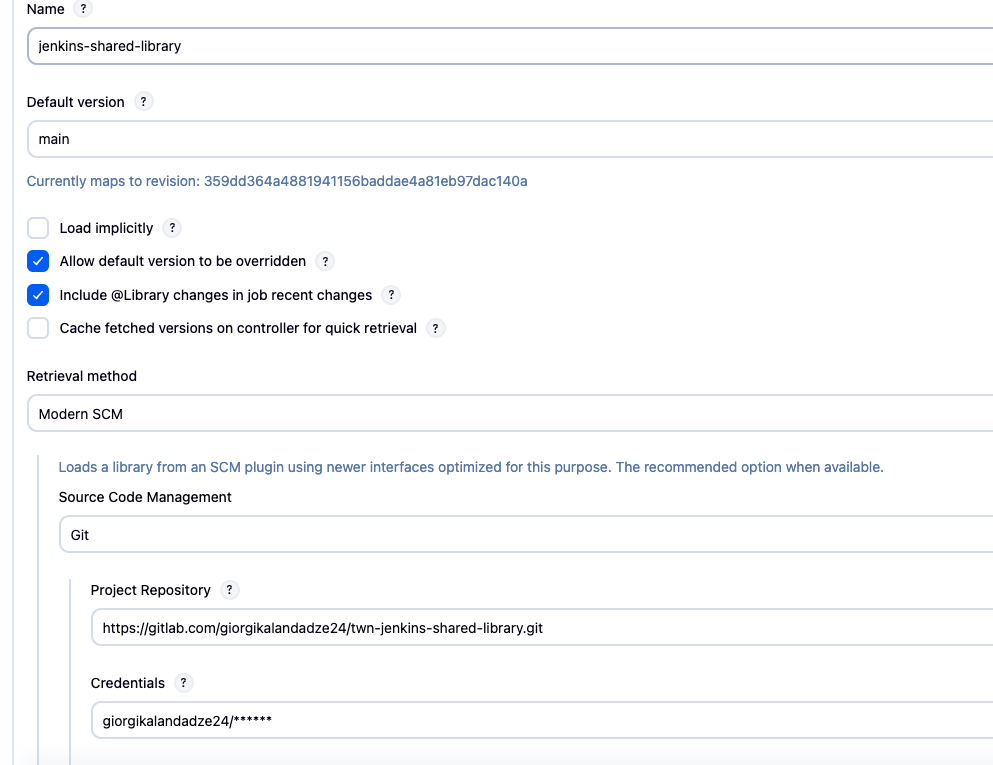
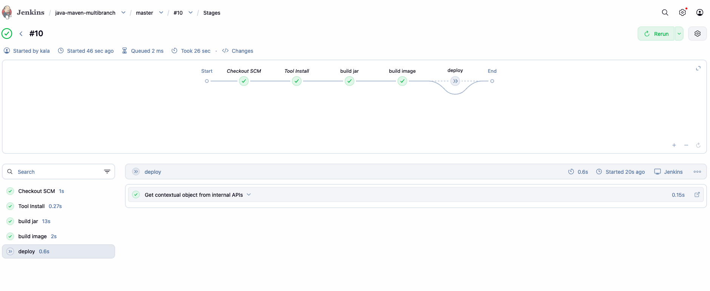
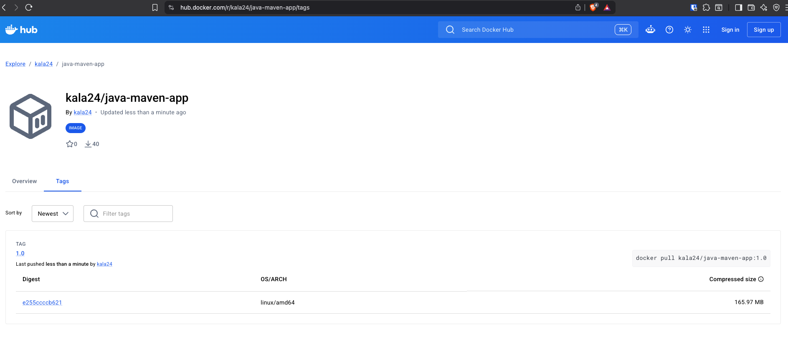

# Module 8 — CI/CD with Jenkins

## Demo Project: Jenkins Shared Library

**Technologies:** Jenkins · Docker · Linux · Git · Java · Maven · Groovy

**Application source:** [twn-java-maven-app](https://gitlab.com/giorgikalandadze24/twn-java-maven-app)

**Shared library repo:** [jenkins-shared-library](https://gitlab.com/giorgikalandadze24/jenkins-shared-library)

**Part of:** [TWN DevOps Bootcamp](https://github.com/GiorgiKalandadze/twn-devops-bootcamp)

---

## Project Description

- Extract the build and Docker logic from the Demo 2 `Jenkinsfile` into a reusable Jenkins Shared Library
- Create a separate Git repo for the library with the standard `vars/` and `src/` structure
- Implement `vars/buildJar.groovy` (Maven build step) and `vars/buildImage.groovy` (Docker build + push step)
- Implement `src/com/example/Docker.groovy` as a Groovy helper class called from `buildImage`
- Register the library globally in Jenkins (**Manage Jenkins → System → Global Trusted Pipeline Libraries**)
- Consume the library via `@Library` annotation in the app `Jenkinsfile`
- Run the pipeline and confirm the image is still built and pushed to DockerHub through the shared library

---

## Architecture

```
  jenkins-shared-library repo (GitLab)
  ├── vars/
  │   ├── buildJar.groovy       → call() { sh 'mvn package' }
  │   └── buildImage.groovy     → call(imageName) { Docker class + withCredentials }
  └── src/com/example/
      └── Docker.groovy         → buildDockerImage / dockerLogin / dockerPush

  twn-java-maven-app repo (GitLab)
  └── Jenkinsfile               → @Library('jenkins-shared-library') _
                                   calls buildJar() and buildImage(...)

         Both repos
              │
              ▼
  Jenkins (Droplet :8080)
  ┌──────────────────────────────────────┐
  │  Manage Jenkins → Global Libraries   │
  │  name: jenkins-shared-library        │
  │  branch: main                        │
  │  repo: gitlab.com/.../jenkins-...    │
  └──────────────────────────────────────┘
              │
              ▼
  Pipeline stages
  ├── build jar   → buildJar()
  ├── build image → buildImage('kala24/java-maven-app:1.0')
  └── deploy      → echo (main branch only)
              │
              ▼
  DockerHub  kala24/java-maven-app:1.0
```

---

## Steps

### Step 1 — Create the Shared Library Git Repo

Create a new **private** GitLab repo named `jenkins-shared-library`. Clone it locally and create the required directory structure:

```
jenkins-shared-library/
├── vars/
│   ├── buildJar.groovy
│   └── buildImage.groovy
└── src/
    └── com/
        └── example/
            └── Docker.groovy
```

Jenkins enforces this layout. `vars/` holds global step functions; `src/` holds Groovy classes.

---

### Step 2 — Add `vars/buildJar.groovy`

```groovy
def call() {
    sh 'mvn package'
}
```

The filename becomes the step name. `buildJar()` in a `Jenkinsfile` calls this `call()` method.

---

### Step 3 — Add `src/com/example/Docker.groovy`

```groovy
package com.example

def buildDockerImage(String imageName) {
    sh "docker build -t ${imageName} ."
}

def dockerLogin(String user, String pass) {
    sh "echo ${pass} | docker login -u ${user} --password-stdin"
}

def dockerPush(String imageName) {
    sh "docker push ${imageName}"
}
```

Classes in `src/` follow standard Groovy/Java package structure and must be imported explicitly.

---

### Step 4 — Add `vars/buildImage.groovy`

```groovy
import com.example.Docker

def call(String imageName) {
    withCredentials([usernamePassword(credentialsId: 'docker-hub-twn-repo', usernameVariable: 'USER', passwordVariable: 'PASS')]) {
        def docker = new Docker(this)
        docker.buildDockerImage(imageName)
        docker.dockerLogin(USER, PASS)
        docker.dockerPush(imageName)
    }
}
```

This bridges `vars/` and `src/`: the global step function delegates to the `Docker` class. Credentials are still referenced by ID — never hardcoded.

---

### Step 5 — Push the Library Repo to GitLab

```bash
git add .
git commit -m "Add shared library: buildJar, buildImage, Docker class"
git push origin main
```

---

### Step 6 — Register the Library Globally in Jenkins

**Manage Jenkins → System → Global Trusted Pipeline Libraries → Add**

| Field                   | Value                                                              |
|-------------------------|--------------------------------------------------------------------|
| Name                    | `jenkins-shared-library`                                           |
| Default version         | `main`                                                             |
| Load implicitly         | unchecked                                                          |
| Source Code Management  | Git                                                                |
| Project Repository      | `https://gitlab.com/giorgikalandadze24/jenkins-shared-library.git` |
| Credentials             | `gitlab-credential`                                                |

Click **Save**.



---

### Step 7 — Update the App Jenkinsfile to Use the Library

Replace the app's existing `Jenkinsfile` with:

```groovy
@Library('jenkins-shared-library') _

pipeline {
    agent any
    tools {
        maven 'Maven'
    }
    stages {
        stage('build jar') {
            steps {
                script {
                    buildJar()
                }
            }
        }
        stage('build image') {
            steps {
                script {
                    buildImage('kala24/java-maven-app:1.0')
                }
            }
        }
        stage('deploy') {
            when {
                expression { BRANCH_NAME == 'main' }
            }
            steps {
                echo 'deploying to production...'
            }
        }
    }
}
```

The `@Library('jenkins-shared-library') _` line tells Jenkins which registered library to load. The trailing `_` is required Groovy syntax when no specific class is imported.

Commit and push to the `twn-java-maven-app` repo.

---

### Step 8 — Run the Pipeline and Verify

Trigger the `java-maven-pipeline` job (or the multibranch equivalent). Jenkins fetches the library from GitLab, loads `buildJar` and `buildImage`, and runs the pipeline.

Confirm:
- All stages green in the stage view
- `kala24/java-maven-app:1.0` is updated on DockerHub





---

## What I Learned

- **DRY in CI/CD** — shared libraries extract repeated build logic out of individual `Jenkinsfile`s so every project benefits from fixes and improvements in one place
- **`vars/` vs `src/` vs `resources/`** — `vars/` holds global step functions callable by filename; `src/` holds Groovy classes with full OO structure; `resources/` holds static files (scripts, config templates) loadable via `libraryResource`
- **The `call()` convention** — any script in `vars/` with a `call()` method becomes a pipeline step invocable by its filename; parameters to `call()` become arguments to the step
- **Global vs per-project loading** — registering in Manage Jenkins makes the library available everywhere; `@Library('name@branch') _` in the `Jenkinsfile` loads it per-project and pins it to a specific branch or tag
- **Library versioning** — the `@` suffix in `@Library('name@v1.2')` pins to a tag; omitting it uses the default version configured in Jenkins; this lets you roll out library changes safely
- **Credentials still referenced by ID** — `withCredentials` inside library code works exactly as in a `Jenkinsfile`; the credential ID is the only thing that needs to match Jenkins configuration

---

## Cleanup

> **Keep the Jenkins Droplet running for the rest of Module 8.**

When Module 8 is fully done:

```bash
docker stop jenkins && docker rm jenkins
docker volume rm jenkins_home
```

Then destroy the Droplet from the DigitalOcean console.

---

## Screenshots

| # | Filename | Shows |
|---|----------|-------|
| 01 | `01-global-library-config.png` | Manage Jenkins → System showing the registered `jenkins-shared-library` entry |
| 02 | `02-pipeline-success.png` | Pipeline stage view with all three stages green |
| 03 | `03-image-on-dockerhub.png` | DockerHub showing `kala24/java-maven-app:1.0` updated |

---

