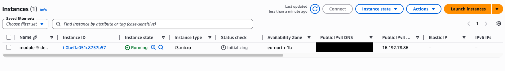
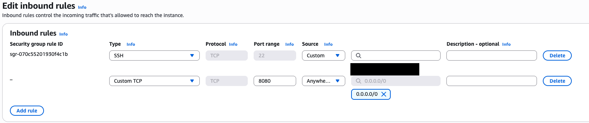
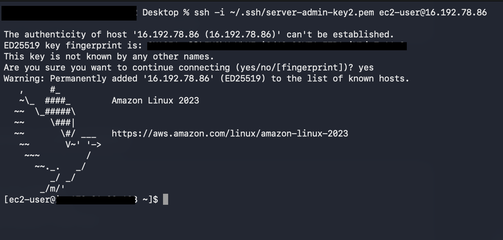
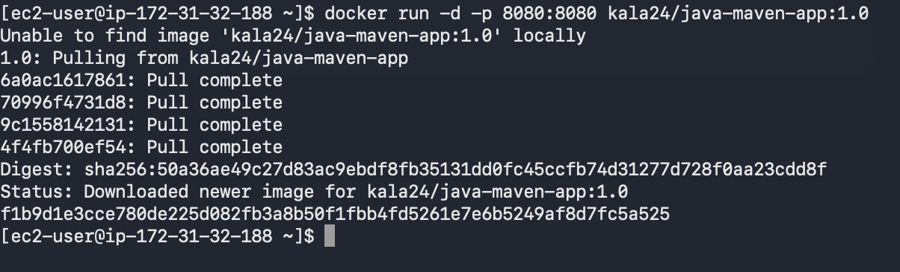
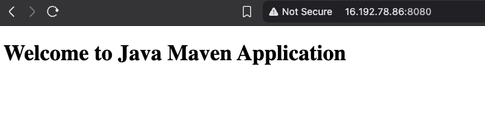

# Module 9 — AWS Services

## Demo Project: Deploy a Web Application Manually on an AWS EC2 Instance

**Technologies:** AWS (EC2, Security Groups) · Docker · Linux

**Application source:** [twn-java-maven-app](https://gitlab.com/giorgikalandadze24/twn-java-maven-app)

**Part of:** [TWN DevOps Bootcamp](https://github.com/GiorgiKalandadze/twn-devops-bootcamp)

---

## Project Description

- Launch and configure an EC2 instance on AWS (Amazon Linux 2, t3.micro)
- Create a key pair and secure the private key for SSH access
- Configure a Security Group with least-privilege inbound rules (SSH and app port)
- Install Docker on the instance and deploy a containerized web application
- Pull the application image from DockerHub and run it as a container
- Access the running web app from the browser over the public internet

---

## Architecture

```
  Developer Laptop                                    Browser
       │                                                 ▲
       │  SSH :22                                HTTP :8080
       ▼                                                 │
  ┌──────────────────────────────────────────────────────────┐
  │  Security Group                                            │
  │  ┌────────────────────────────────────────────────────┐  │
  │  │  EC2 Instance — eu-north-1 — Amazon Linux 2         │  │
  │  │  t3.micro                                           │  │
  │  │                                                     │  │
  │  │   Docker                                            │  │
  │  │   ┌─────────────────────────────────────┐          │  │
  │  │   │  container: java-maven-app           │          │  │
  │  │   │  listening on :8080                  │          │  │
  │  │   └─────────────────────────────────────┘          │  │
  │  └────────────────────────────────────────────────────┘  │
  │                                                            │
  │  TCP 22   — SSH  — your home IP only                       │
  │  TCP 8080 — App  — all IPv4                                │
  └──────────────────────────────────────────────────────────┘
```

---

## Steps

### Step 1 — Launch an EC2 Instance

Create a new EC2 instance:

- **Region:** eu-north-1
- **AMI:** Amazon Linux 2
- **Instance type:** t3.micro
- **Key pair:** create a new key pair, download the `.pem` file

Move the downloaded key into `~/.ssh` and lock down its permissions so SSH will accept it:

```bash
mv ~/Downloads/<KEY>.pem ~/.ssh/
chmod 400 ~/.ssh/<KEY>.pem
```



---

### Step 2 — Configure the Security Group

Add inbound rules so you can reach the instance:

| Type   | Protocol | Port | Source             |
|--------|----------|------|--------------------|
| SSH    | TCP      | 22   | Your home IP only  |
| Custom | TCP      | 8080 | All IPv4           |

Restricting port 22 to your home IP keeps SSH private, while port 8080 is open so the web app is reachable from any browser.



---

### Step 3 — SSH into the Instance

Confirm the key has the correct `400` permissions, then connect:

```bash
ls -la ~/.ssh/

ssh -i ~/.ssh/<KEY>.pem ec2-user@<EC2_PUBLIC_IP>
```



---

### Step 4 — Install Docker on the Instance

```bash
sudo yum update -y
sudo yum install -y docker
sudo systemctl start docker
sudo usermod -aG docker ec2-user
```

Adding `ec2-user` to the `docker` group lets you run Docker commands without `sudo`. Log out and back in for the group change to take effect.

---

### Step 5 — Log In to DockerHub and Pull the Image

```bash
docker login                       # username: kala24
docker pull kala24/java-maven-app
```

---

### Step 6 — Run the Container

```bash
docker run -d -p 8080:8080 kala24/java-maven-app
```

`-d` runs the container in the background and `-p 8080:8080` maps the container port to the host port that the Security Group exposes.



---

### Step 7 — Access the Web App in the Browser

```
http://<EC2_PUBLIC_IP>:8080
```



---

## What I Learned

- How to launch and configure an EC2 instance on AWS (region, AMI, instance type)
- How to create a key pair and secure the private key with `chmod 400` so SSH will accept it
- How to configure Security Group inbound rules using least-privilege (SSH restricted to my IP, app port open)
- How to SSH into an EC2 instance with a `.pem` key as `ec2-user`
- How to install and start Docker on Amazon Linux 2 and run Docker without `sudo`
- How to pull an image from DockerHub and run it as a containerized web app on a cloud server
- How port mapping (`-p 8080:8080`) connects a container to a host port exposed through the Security Group

---

## Cleanup

To avoid ongoing charges, tear down the resources when done:

- Terminate the EC2 instance
- Delete the Security Group
- Delete the key pair

---
