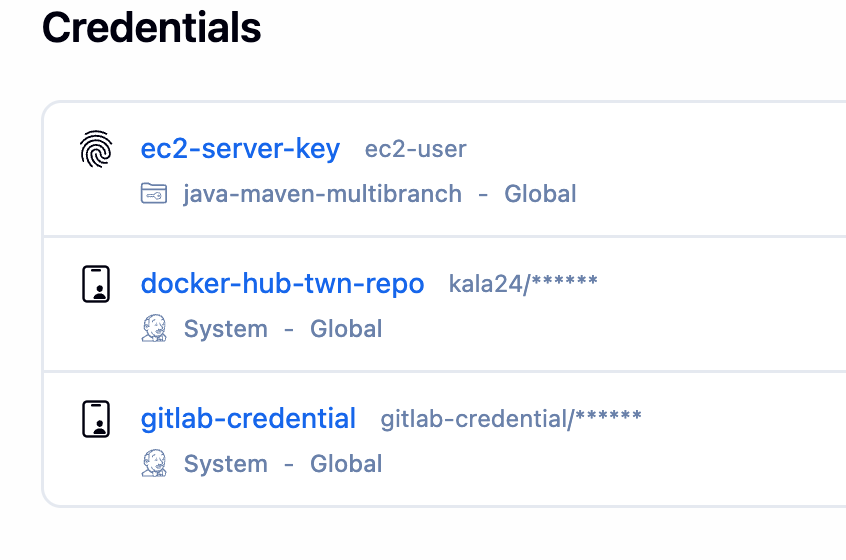
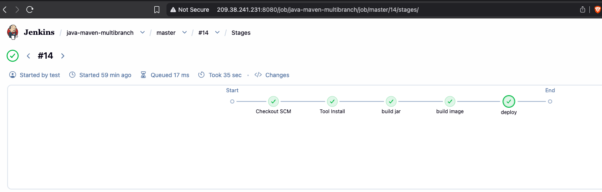
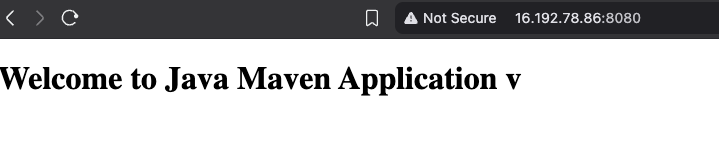

# Module 9 — AWS Services

## Demo Project: CD — Deploy Application from Jenkins Pipeline to EC2 Instance

**Technologies:** AWS (EC2, Security Groups) · Jenkins · Docker · Linux · Git · Java · Maven · DockerHub

**Application source:** [twn-java-maven-app](https://gitlab.com/giorgikalandadze24/twn-java-maven-app)

**Part of:** [TWN DevOps Bootcamp](https://github.com/GiorgiKalandadze/twn-devops-bootcamp)

---

## Project Description

- Extend the Jenkins CI pipeline with a Continuous Deployment stage that ships the app to an EC2 instance automatically
- Install the SSH Agent plugin and configure an SSH credential so Jenkins can authenticate to EC2
- Open the EC2 Security Group to the Jenkins Droplet on port 22 (SSH)
- Use an `sshAgent` block in the Jenkinsfile to SSH into EC2 and run the container
- Pull the image from DockerHub and run it on EC2 — fully automated, triggered by a `git push`
- Restrict deployment to the `master` branch

---

## Architecture

```
  Developer
      │
      │  git push (master)
      ▼
  GitLab — twn-java-maven-app
      │
      │  webhook POST
      ▼
  Jenkins — DigitalOcean Droplet (Docker container)
  java-maven-multibranch pipeline
      │
      ├─ build jar       (mvn clean package)
      ├─ build image     (docker build)
      ├─ push to DockerHub  → kala24/java-maven-app:1.0
      │
      └─ deploy  (when BRANCH_NAME == 'master')
            │
            │  sshAgent(['ec2-server-key'])
            │  ssh ec2-user@<EC2_PUBLIC_IP>
            ▼
  ┌──────────────────────────────────────────────────────────┐
  │  Security Group                                            │
  │  ┌────────────────────────────────────────────────────┐  │
  │  │  EC2 Instance — eu-north-1 — Amazon Linux 2         │  │
  │  │                                                     │  │
  │  │   docker pull kala24/java-maven-app:1.0             │  │
  │  │   docker run -d -p 8080:8080 ...:1.0                │  │
  │  │   ┌─────────────────────────────────────┐          │  │
  │  │   │  container: java-maven-app:1.0       │  ◄───── Browser
  │  │   │  listening on :8080                  │  HTTP :8080
  │  │   └─────────────────────────────────────┘          │  │
  │  └────────────────────────────────────────────────────┘  │
  │                                                            │
  │  TCP 22   — SSH  — Jenkins Droplet IP only                 │
  │  TCP 8080 — App  — all IPv4                                │
  └──────────────────────────────────────────────────────────┘
```

---

## Steps

### Step 1 — Install the SSH Agent Plugin

Jenkins needs the **SSH Agent** plugin to inject SSH credentials into a pipeline block.

**Manage Jenkins → Plugins → Available plugins** → search `SSH Agent` → **Install**.

---

### Step 2 — Create the EC2 SSH Credential on Jenkins

Add a credential so the pipeline can authenticate to EC2:

- **Kind:** SSH Username with private key
- **ID:** `ec2-server-key`
- **Username:** `ec2-user`
- **Private Key:** Enter directly → paste the contents of the `.pem` key pair file



---

### Step 3 — Open the Security Group to Jenkins

Add an inbound rule so the Jenkins Droplet can SSH into EC2. Port 8080 is already open from Demo 1:

| Type   | Protocol | Port | Source                  |
|--------|----------|------|-------------------------|
| SSH    | TCP      | 22   | Jenkins Droplet IP only |
| Custom | TCP      | 8080 | All IPv4                |

---

### Step 4 — Add a Deploy Stage to the Jenkinsfile

Extend the existing `Jenkinsfile` in the app repo with a `deploy` stage that uses the `sshAgent` block to run Docker on EC2:

```groovy
stage('deploy') {
    when {
        expression { BRANCH_NAME == 'master' }
    }
    steps {
        script {
            sshAgent(['ec2-server-key']) {
                sh """
                    ssh -o StrictHostKeyChecking=no ec2-user@<EC2_PUBLIC_IP> \
                        'docker pull kala24/java-maven-app:1.0 && \
                         docker run -d -p 8080:8080 kala24/java-maven-app:1.0'
                """
            }
        }
    }
}
```

Key points:
- `sshAgent(['ec2-server-key'])` loads the EC2 private key into the pipeline for the duration of the block
- `docker pull` then `docker run` deploys the freshly pushed image on EC2
- The `when` block restricts deployment to the `master` branch only

---

### Step 5 — Push to Master and Trigger the Pipeline

Commit and push the updated `Jenkinsfile` to the `master` branch in GitLab. The webhook fires and triggers the `java-maven-multibranch` pipeline automatically — no manual build needed.

---

### Step 6 — Watch the Pipeline Deploy

The pipeline runs end to end:

```
build jar → build image → push to DockerHub → deploy to EC2
```

The `deploy` stage SSHes into EC2 and runs the container. All stages go green.



---

### Step 7 — Verify the App in the Browser

```
http://<EC2_PUBLIC_IP>:8080
```

The application deployed by Jenkins is now serving from EC2.



---

## What I Learned

- How to extend a CI pipeline into Continuous Deployment so a `git push` ships the app to a server automatically
- How to install and use the **SSH Agent** plugin to inject SSH credentials into a Jenkins pipeline
- How to create an **SSH Username with private key** credential in Jenkins from a `.pem` key pair
- How the `sshAgent` block scopes the private key to just the deploy step, keeping it out of logs and the Jenkinsfile
- How to control network access with Security Group rules — allowing only the Jenkins Droplet to reach port 22 (least-privilege)
- How to deploy a containerized app remotely by running `docker pull` and `docker run` over SSH from the pipeline
- How to restrict deployment to a specific branch with a `when { expression { BRANCH_NAME == 'master' } }` condition

---

## Cleanup

Stop and remove the deployed container on EC2 when done:

```bash
docker stop <container_id>
docker rm <container_id>
```


