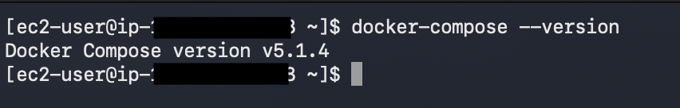
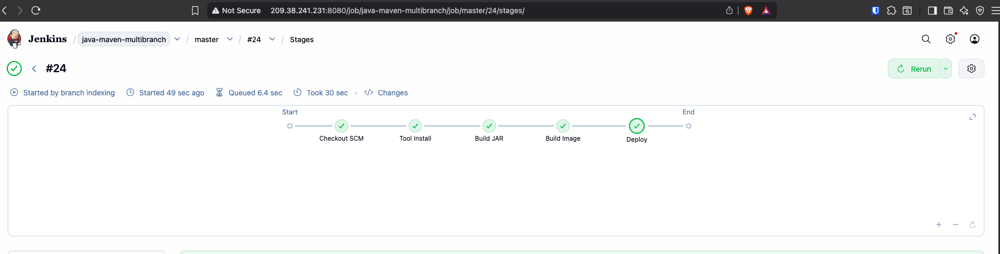
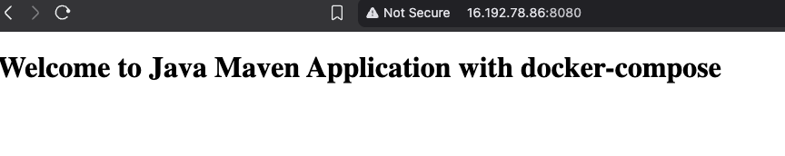

# Module 9 — AWS Services

## Demo Project: CD — Deploy Application from Jenkins Pipeline on EC2 with Docker Compose

**Technologies:** AWS (EC2, Security Groups) · Jenkins · Docker · Docker Compose · Linux · Git · Java · Maven · DockerHub

**Application source:** [twn-java-maven-app](https://gitlab.com/giorgikalandadze24/twn-java-maven-app)

**Part of:** [TWN DevOps Bootcamp](https://github.com/GiorgiKalandadze/twn-devops-bootcamp)

---

## Project Description

- Replace the raw `docker run` deployment with **Docker Compose** for cleaner, declarative container management on EC2
- Install Docker Compose on the EC2 instance
- Define the app as a service in a `docker-compose.yml` committed to the app repo
- Wrap the deploy commands in a reusable `server-cmds.sh` shell script
- Extend the Jenkinsfile to `scp` the Compose file and script to EC2, then run the script over SSH
- Keep the whole flow automated — a `git push` to `master` ships the app to EC2

---

## Architecture

```
  Developer
      │
      │  git push (master)
      ▼
  GitLab — twn-java-maven-app
      │
      │  webhook POST
      ▼
  Jenkins — DigitalOcean Droplet (Docker container)
  java-maven-multibranch pipeline
      │
      ├─ build jar       (mvn clean package)
      ├─ build image     (docker build + push)  → DockerHub  kala24/java-maven-app:1.0
      │
      └─ deploy  (when BRANCH_NAME == 'master')
            │
            │  scp :22  docker-compose.yml + server-cmds.sh
            │  ssh :22  bash server-cmds.sh
            ▼
  ┌──────────────────────────────────────────────────────────┐
  │  Security Group                                            │
  │  ┌────────────────────────────────────────────────────┐  │
  │  │  EC2 Instance — eu-north-1 — Amazon Linux 2         │  │
  │  │                                                     │  │
  │  │   docker-compose pull   ──────────────► DockerHub   │  │
  │  │   docker-compose up -d        kala24/java-maven-app:1.0
  │  │   ┌─────────────────────────────────────┐          │  │
  │  │   │  container: java-maven-app:1.0       │  ◄───── Browser
  │  │   │  listening on :8080                  │  HTTP :8080
  │  │   └─────────────────────────────────────┘          │  │
  │  └────────────────────────────────────────────────────┘  │
  │                                                            │
  │  TCP 22   — SSH  — Jenkins Droplet IP only                 │
  │  TCP 8080 — App  — all IPv4                                │
  └──────────────────────────────────────────────────────────┘
```

---

## Steps

### Step 1 — Install Docker Compose on EC2

SSH into the EC2 instance and install Docker Compose:

```bash
sudo curl -L "https://github.com/docker/compose/releases/latest/download/docker-compose-$(uname -s)-$(uname -m)" -o /usr/local/bin/docker-compose
sudo chmod +x /usr/local/bin/docker-compose
docker-compose --version
```



---

### Step 2 — Create `docker-compose.yml` in the App Repo

Add a `docker-compose.yml` to the repo root describing the app as a service:

```yaml
services:
  java-maven-app:
    image: ${IMAGE}
    ports:
      - "8080:8080"
  postgres:
    image: postgres
    ports:
      - "5432:5432"
    environment:
      - POSTGRES_PASSWORD=my-pwd
```

This replaces the inline `docker run` command with a declarative service definition, and adds a `postgres` database service alongside the app. The app image is read from an `${IMAGE}` environment variable so the tag isn't hardcoded — it's passed in at deploy time.

---

### Step 3 — Create `server-cmds.sh` in the App Repo

Add a shell script that pulls the latest image and (re)starts the container via Compose:

```bash
#!/usr/bin/env bash
export IMAGE=$1
docker-compose -f docker-compose.yml pull
docker-compose -f docker-compose.yml up --detach --force-recreate
```

- `$1` is the image name passed in by Jenkins; it's exported as `IMAGE` so `docker-compose.yml` can substitute `${IMAGE}`
- `pull` fetches the freshly pushed image from DockerHub
- `--force-recreate` ensures the running container is replaced with the new image
- `--detach` runs it in the background

---

### Step 4 — Update the Jenkinsfile Deploy Stage

Define the image name once as a pipeline-level `environment` variable, then reuse it in both the build and deploy stages. The deploy stage copies both files to EC2 with `scp`, then runs the script over SSH:

```groovy
environment {
    IMAGE_NAME = 'kala24/java-maven-app:1.0'
}

stages {
    stage('build image') {
        steps {
            script {
                buildImage(env.IMAGE_NAME)
            }
        }
    }
    stage('deploy') {
        when {
            expression { BRANCH_NAME == 'master' }
        }
        steps {
            script {
                def ec2Instance = "ec2-user@<EC2_PUBLIC_IP>"
                sshagent(['ec2-server-key']) {
                    sh "scp -o StrictHostKeyChecking=no docker-compose.yml ${ec2Instance}:/home/ec2-user"
                    sh "scp -o StrictHostKeyChecking=no server-cmds.sh ${ec2Instance}:/home/ec2-user"
                    sh "ssh -o StrictHostKeyChecking=no ${ec2Instance} 'bash server-cmds.sh ${IMAGE_NAME}'"
                }
            }
        }
    }
}
```

Key points:
- `IMAGE_NAME` is set once in the `environment` block and reused by `build image` and `deploy` — no duplicated tag string
- `scp` transfers `docker-compose.yml` and `server-cmds.sh` to the EC2 home directory
- `ssh ... 'bash server-cmds.sh ${IMAGE_NAME}'` runs the deploy script remotely, **passing the image name as an argument** so the Compose file's `${IMAGE}` resolves to the right tag
- The `when` block restricts deployment to the `master` branch only

---

### Step 5 — Push to Master and Trigger the Pipeline

Commit and push all changes — `Jenkinsfile`, `docker-compose.yml`, and `server-cmds.sh` — to the `master` branch in GitLab. The webhook fires and triggers the `java-maven-multibranch` pipeline automatically.

---

### Step 6 — Watch the Pipeline Deploy

The pipeline runs end to end:

```
build jar → build image → push to DockerHub → deploy (docker run) → deploy (docker-compose)
```

The Compose deploy stage `scp`s the files and runs `server-cmds.sh` on EC2. All stages go green.



---

### Step 7 — Verify the App in the Browser

```
http://<EC2_PUBLIC_IP>:8080
```

The application deployed via Docker Compose is now serving from EC2.



---

## What I Learned

- How to install Docker Compose on a Linux server and verify it
- How Docker Compose replaces long `docker run` commands with a declarative, version-controlled service definition
- How to wrap deploy commands in a reusable `server-cmds.sh` script instead of inlining them in the Jenkinsfile
- How to transfer files to a remote server from a pipeline with `scp` inside an `sshagent` block
- How to execute a remote script over SSH from Jenkins
- How `docker-compose pull` + `up --force-recreate` redeploys the latest image cleanly
- How committing infra files (`docker-compose.yml`, `server-cmds.sh`) to the app repo keeps deployment reproducible

---

## Cleanup

Stop and remove the containers on EC2 when done:

```bash
docker-compose down
```


