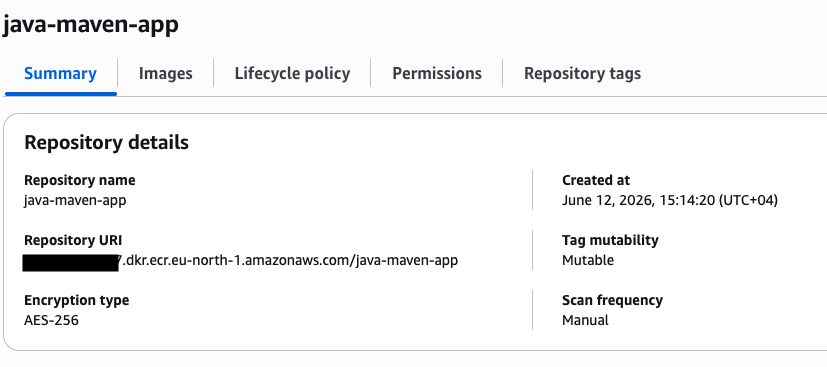
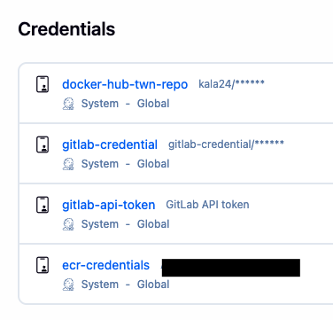
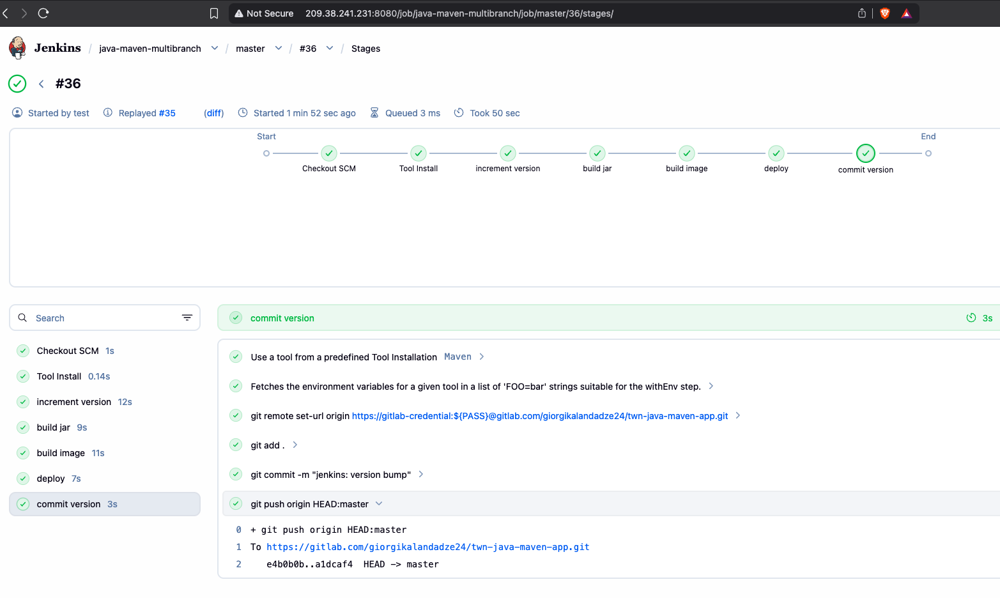
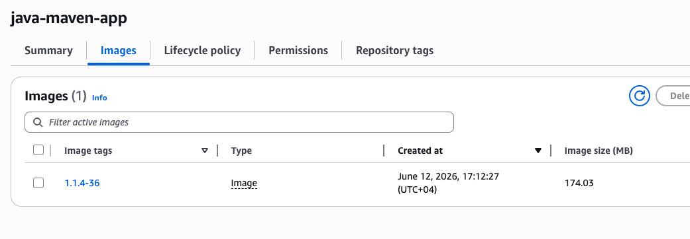
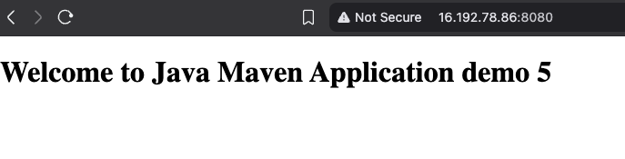

# Module 9 — AWS Services

## Demo Project: Create a Repository on AWS and Push to a Private Docker Registry (Amazon ECR)

**Technologies:** AWS (ECR, IAM) · Docker · Docker Compose · Jenkins · Linux · Git · Java · Maven

**Application source:** [twn-java-maven-app](https://gitlab.com/giorgikalandadze24/twn-java-maven-app)

**Part of:** [TWN DevOps Bootcamp](https://github.com/GiorgiKalandadze/twn-devops-bootcamp)

---

## Project Description

- Replace the public DockerHub registry with a **private Amazon ECR** repository
- Build the image in Jenkins and push it to ECR with the dynamic version tag
- Authenticate Jenkins to ECR with **stored AWS access keys** (Jenkins runs outside AWS)
- Pull the image on EC2 using an **attached IAM role** — no credentials stored on the server
- Deploy via Docker Compose, injecting the ECR image URI at deploy time
- Show that switching registries only changes the **auth + image URI**, not the build/push flow

---

## Architecture

```
  Developer
      │
      │  git push (master)
      ▼
  GitLab — twn-java-maven-app
      │
      │  webhook POST
      ▼
  Jenkins — DigitalOcean Droplet (OUTSIDE AWS)
  java-maven-multibranch pipeline
      │
      ├─ increment version   → IMAGE_TAG = <version>-<BUILD_NUMBER>
      ├─ build jar           mvn clean package
      ├─ build image
      │     aws ecr get-login-password | docker login        ┌────────────────────────┐
      │     docker build / docker push  ───────────────────► │  Amazon ECR (private)  │
      │        auth: STORED AWS ACCESS KEYS                   │  java-maven-app        │
      │        (ecr-credentials, AWS Credentials plugin)      │  <ACCT>.dkr.ecr.       │
      │                                                       │  eu-north-1.../...     │
      ├─ deploy  (master only)                                └───────────┬────────────┘
      │     scp + ssh to EC2                                              │
      │        │                                                   docker pull
      │        ▼                                          auth: IAM ROLE  │
      │   ┌──────────────────────────────────────────────┐ (no stored keys)
      │   │  EC2 — eu-north-1 — Amazon Linux 2 (IN AWS)  │ ◄───────────────┘
      │   │  IAM role: EC2-ECR-ReadOnly                  │
      │   │  docker-compose pull / up --force-recreate    │
      │   │  ┌─────────────────────────────┐             │
      │   │  │ container :8080             │ ◄──── Browser  HTTP :8080
      │   │  └─────────────────────────────┘             │
      │   └──────────────────────────────────────────────┘
      │
      └─ commit version  (master only)  → git push pom.xml bump to GitLab

  Two auth models:
    • Jenkins → ECR : stored AWS access keys (Jenkins lives outside AWS)
    • EC2     → ECR : attached IAM role      (EC2 lives inside AWS, no stored keys)
```

---

## Steps

### Step 1 — Attach an IAM Role to EC2 for ECR Pull Access

Give the EC2 instance permission to pull from ECR **without storing any credentials** on the server by attaching an IAM role.

**EC2 → Actions → Security → Modify IAM role** → attach `EC2-ECR-ReadOnly` (which carries the `AmazonEC2ContainerRegistryReadOnly` policy).

Verify from the instance that it can authenticate to ECR:

```bash
aws ecr get-login-password --region eu-north-1
```

A token is returned — the role works.

---

### Step 2 — Create a Private ECR Repository

In the AWS Console, create a **private** ECR repository named `java-maven-app` in `eu-north-1`. Note the repository URI:

```
<ACCOUNT_ID>.dkr.ecr.eu-north-1.amazonaws.com/java-maven-app
```

The URI is built from **account ID + region + repository name** — that's what makes it private and uniquely addressable.



---

### Step 3 — Add AWS Credentials to Jenkins

Jenkins runs **outside** AWS (on a DigitalOcean Droplet), so it can't use an IAM role — it needs stored access keys.

1. Create an IAM access key for the Jenkins user.
2. Install the **AWS Credentials** plugin if not present.
3. Add a Jenkins credential — **Kind:** AWS Credentials, **ID:** `ecr-credentials` — with the access key ID and secret.



---

### Step 4 — Update the Jenkinsfile to Push to ECR

Define the ECR registry and region once as pipeline-level `environment` variables, then change the `build image` stage to authenticate to ECR and push there instead of DockerHub, wrapping the AWS calls in the `ecr-credentials` binding:

```groovy
environment {
    ECR_REPO   = '<ACCOUNT_ID>.dkr.ecr.eu-north-1.amazonaws.com/java-maven-app'
    AWS_REGION = 'eu-north-1'
}

stage('build image') {
    steps {
        script {
            withCredentials([[$class: 'AmazonWebServicesCredentialsBinding', credentialsId: 'ecr-credentials']]) {
                sh "aws ecr get-login-password --region ${AWS_REGION} | docker login --username AWS --password-stdin ${ECR_REPO}"
                sh "docker build -t ${ECR_REPO}:${IMAGE_TAG} ."
                sh "docker push ${ECR_REPO}:${IMAGE_TAG}"
            }
        }
    }
}
```

Key points:
- `ECR_REPO` and `AWS_REGION` are set once in the `environment` block and reused across stages
- `AmazonWebServicesCredentialsBinding` injects the `ecr-credentials` access keys for the duration of the block
- `aws ecr get-login-password | docker login` is how you authenticate Docker to ECR
- The build/push flow is otherwise identical to DockerHub — **only the auth and the image URI changed**

---

### Step 5 — Keep `docker-compose.yml` Using the Dynamic Image

The Compose file already reads the image from an `${IMAGE}` variable, so it works unchanged — the ECR image URI is injected at deploy time:

```yaml
services:
  java-maven-app:
    image: ${IMAGE}
    ports:
      - "8080:8080"
```

---

### Step 6 — Update `server-cmds.sh` to Pull from ECR

The deploy script receives the ECR image URI, region, and repo URI as arguments, logs in to ECR using the **EC2 IAM role** (no stored keys), then redeploys via Compose:

```bash
#!/usr/bin/env bash
export IMAGE=$1
REGION=$2
ECR_REGISTRY=$3

# free port 8080 so the new container can bind cleanly
docker ps -q --filter "publish=8080" | xargs -r docker stop
docker ps -aq --filter "publish=8080" | xargs -r docker rm

# authenticate to ECR using the EC2 IAM role (no stored keys)
aws ecr get-login-password --region "$REGION" | docker login --username AWS --password-stdin "$ECR_REGISTRY"

docker-compose -f docker-compose.yml pull
docker-compose -f docker-compose.yml up --detach --force-recreate
```

- `$1` is the full ECR image URI with the dynamic tag, exported as `IMAGE` for Compose; `$2`/`$3` are the region and ECR registry passed in by the deploy stage
- the `docker stop`/`docker rm` lines clear any container holding port 8080 before redeploy
- `aws ecr get-login-password` works here **because of the attached IAM role** — the instance authenticates with no credentials on disk
- `pull` + `up --force-recreate` swaps in the new image

---

### Step 7 — Push to Master and Trigger the Pipeline

Commit and push all changes — `Jenkinsfile`, `docker-compose.yml`, and `server-cmds.sh` — to the `master` branch. The webhook fires and triggers the full `java-maven-multibranch` pipeline.

---

### Step 8 — Watch the Full Pipeline Run

All stages run green, end to end:

```
increment version → build jar → build image (push to ECR) → deploy (pull from ECR) → commit version
```



---

### Step 9 — Verify the Image in ECR

The AWS Console shows the ECR repository now contains the pushed image with the dynamic tag (e.g. `1.1.1-5`).



---

### Step 10 — Verify the App in the Browser

```
http://<EC2_PUBLIC_IP>:8080
```

The image pulled from the private ECR registry and deployed via Docker Compose is now serving from EC2.



---

## What I Learned

- The difference between a **public registry** (DockerHub) and a **private cloud registry** (Amazon ECR), and why teams often keep images private
- How to authenticate Docker to ECR with `aws ecr get-login-password | docker login --username AWS --password-stdin`
- **Two auth models for the same registry:**
  - **Jenkins → ECR:** stored AWS access keys via the AWS Credentials plugin, because Jenkins runs **outside** AWS (on DigitalOcean) and has no way to assume a role
  - **EC2 → ECR:** an attached **IAM role**, because EC2 runs **inside** AWS — no credentials are stored on the server, which is more secure (nothing to leak or rotate manually)
- Why the ECR URI is composed of **account ID + region + repository name**, making it uniquely addressable and private
- That switching registries only changes the **authentication and image URI** — the build, push, pull, and Compose deploy flow stay the same

---

## Cleanup

When done:

```bash
# on EC2
docker-compose down
```

- Delete the ECR repository (AWS Console → ECR)
- Detach the `EC2-ECR-ReadOnly` role from the EC2 instance
- Delete the Jenkins IAM user's access key

> **Keep the EC2 instance and Jenkins running if more demos follow.**
