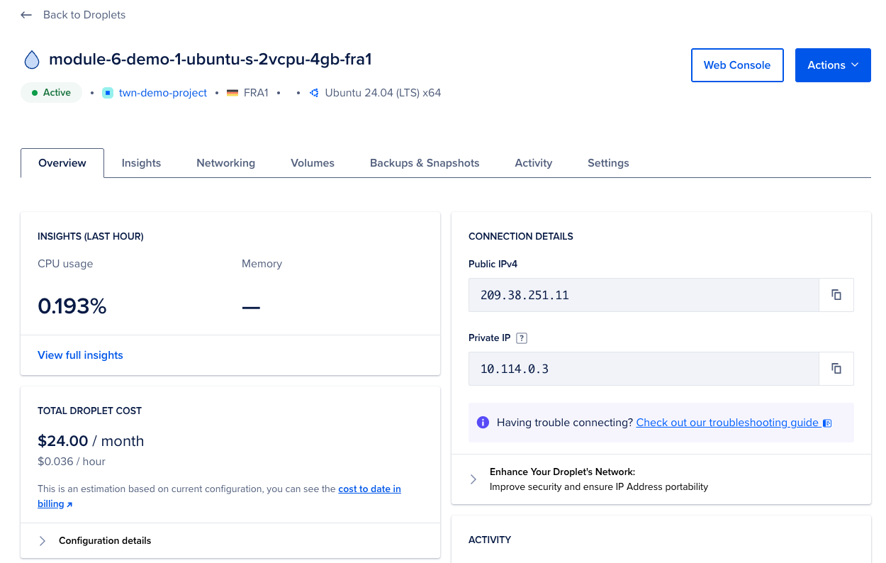
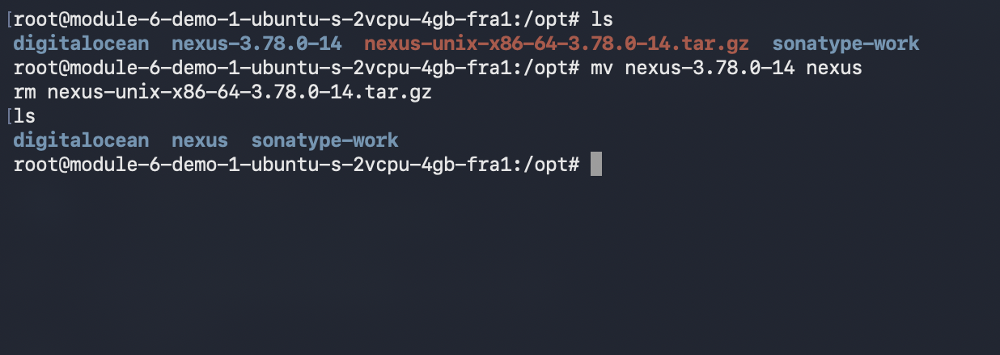
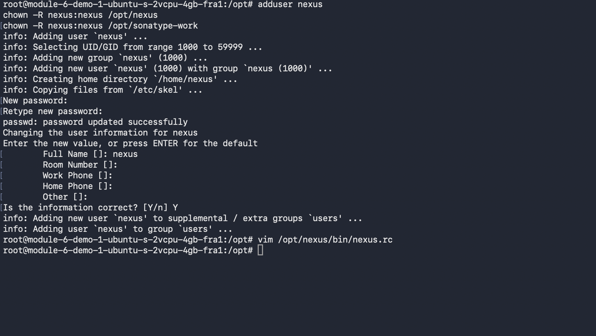
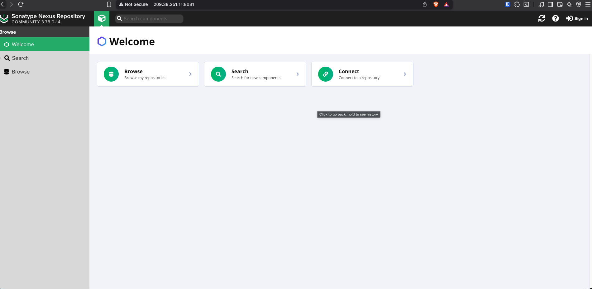
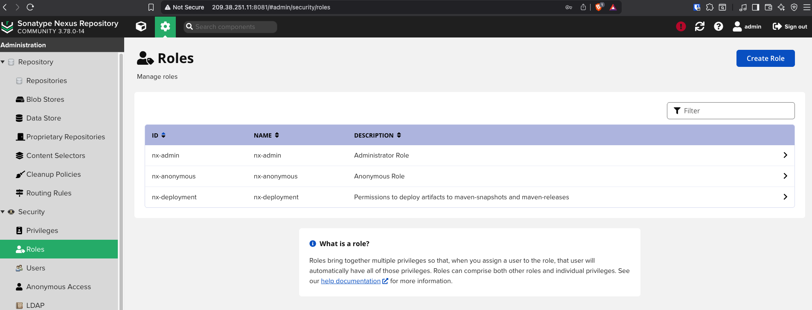
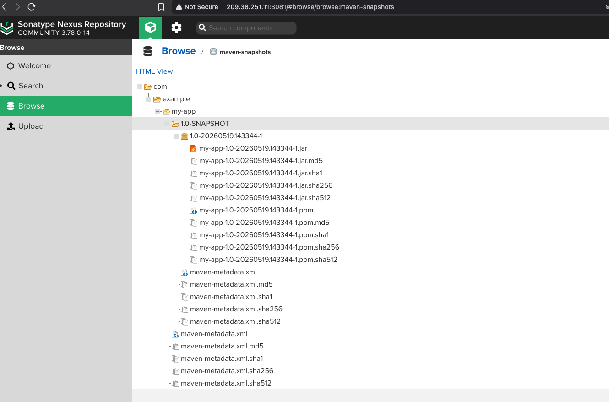

# Module 6 — Artifact Repository Manager with Nexus

## Demo Project: Run Nexus on Droplet and Publish Artifact to Nexus

**Technologies:** Nexus · DigitalOcean · Linux · Java · Gradle · Maven

**Application sources:**
- Java Gradle App: [twn-devops-bootcamp/latest/06-nexus/java-app](https://gitlab.com/twn-devops-bootcamp/latest/06-nexus/java-app)
- Java Maven App: [twn-devops-bootcamp/latest/06-nexus/java-maven-app](https://gitlab.com/twn-devops-bootcamp/latest/06-nexus/java-maven-app)

**Part of:** [TWN DevOps Bootcamp](https://github.com/GiorgiKalandadze/twn-devops-bootcamp)

---

## Project Description

- Install and configure Nexus from scratch on a cloud server
- Create a new user on Nexus with relevant permissions for publishing artifacts
- Build a Java Gradle project and upload the JAR to Nexus
- Build a Java Maven project and upload the JAR to Nexus

---

## Architecture

```
Local Machine                              DigitalOcean Droplet — FRA1
─────────────                              Ubuntu 24.04 LTS — 4 GB RAM
  │                                        module-6-demo-1-ubuntu-s-2vcpu-4gb-fra1
  │  Gradle / Maven build                          │
  │                                        ┌───────┴────────────┐
  │  publish (HTTP PUT)                    │ user: nexus         │
  ├────────────────────────────────────►   │ /opt/nexus          │
  │                                        │ /opt/sonatype-work  │
  │                                        └───────┬─────────────┘
  │                                                ▼
  │                                            :8081 Nexus Repository
  │                                                │
  │  Browser ◄───── http://<IP>:8081 ──────────────┘
  │
Firewall (demo-firewall)
┌─────────────────────────────────────────┐
│  TCP 22   — SSH        — your IP only   │
│  TCP 8081 — Nexus UI   — your IP only   │
└─────────────────────────────────────────┘
```

---

## Steps

### Step 1 — Create Droplet for Nexus

Nexus is JVM-based and memory-hungry. Create a fresh Droplet sized for it:

- **Image:** Ubuntu 24.04 (LTS) x64
- **Size:** s-2vcpu-4gb (4 GB RAM minimum)
- **Region:** Frankfurt (FRA1)
- **Hostname:** `module-6-demo-1-ubuntu-s-2vcpu-4gb-fra1`
- **Authentication:** SSH key



---

### Step 2 — Attach Firewall with SSH Rule

Attach the existing `demo-firewall` to the Droplet. Confirm port 22 inbound is restricted to your IP only.


---

### Step 3 — SSH in and Install Java 17

Nexus 3.70+ requires Java 17.

```bash
ssh root@<DROPLET_IP>

apt update
apt install -y openjdk-17-jre-headless
java -version
```


---

### Step 4 — Download and Extract Nexus

```bash
cd /opt
wget https://download.sonatype.com/nexus/3/nexus-unix-x86-64-3.78.0-14.tar.gz
tar -zxvf nexus-unix-x86-64-3.78.0-14.tar.gz
ls
```

You'll see two folders:
- `nexus-3.78.0-14/` — the Nexus binaries (read-only)
- `sonatype-work/` — runtime data, logs, repositories (writable)

Rename for cleanliness:

```bash
mv nexus-3.78.0-14 nexus
rm nexus-unix-x86-64-3.78.0-14.tar.gz
ls
```



> **Tip:** check [help.sonatype.com](https://help.sonatype.com/repomanager3/product-information/download) for the latest version before running `wget`.

---

### Step 5 — Create Dedicated `nexus` Linux User

Nexus must NOT run as root. Create a dedicated OS user and hand ownership over:

```bash
adduser nexus
chown -R nexus:nexus /opt/nexus
chown -R nexus:nexus /opt/sonatype-work
```

Tell Nexus to use this user:

```bash
vim /opt/nexus/bin/nexus.rc
```

Set:
```
run_as_user="nexus"
```



---

### Step 6 — Open Port 8081 in Firewall

Add an inbound rule for Nexus UI access — restricted to your IP only (Nexus is admin-facing):

| Type | Protocol | Port | Source |
| --- | --- | --- | --- |
| SSH | TCP | 22 | Your IP only |
| Custom | TCP | 8081 | Your IP only |


---

### Step 7 — Start Nexus and Reach the UI

Switch to the `nexus` user and start the service:

```bash
su - nexus
/opt/nexus/bin/nexus start
```

Nexus takes 30–60 seconds to fully start. Once it's up, open in your browser:

```
http://<DROPLET_IP>:8081
```



---

### Step 8 — Initial Login & Setup Wizard

Click **Sign In** (top right). The initial admin password is in a file on the server:

```bash
# back on the droplet, as the nexus user
cat /opt/sonatype-work/nexus3/admin.password
```

Copy the password. In the browser:
1. Username: `admin`, paste the password
2. Set a new admin password
3. Choose **Disable Anonymous Access** (security best practice)


---

### Step 9 — Create New Nexus Role for Publishing

**Settings (gear icon) → Security → Roles → Create role → Nexus role**

- **Role ID:** `nx-deployment`
- **Role name:** `nx-deployment`
- **Description:** Permissions to deploy artifacts to maven-snapshots

Add this privilege:
- `nx-repository-view-maven2-maven-snapshots-*`

Save.



---

### Step 10 — Create New Nexus User

**Settings → Security → Users → Create local user**

- **ID:** `developer`
- **First name:** Developer
- **Last name:** User
- **Email:** `developer@example.com`
- **Password:** (set a strong one — store it safely; you'll use it in build files)
- **Status:** Active
- **Roles:** assign `nx-deployment`

Save.


---

### Step 11 — Build Gradle Project & Upload to Nexus

On your **local machine**, clone the Gradle app:

```bash
git clone https://gitlab.com/twn-devops-bootcamp/latest/06-nexus/java-app.git
cd java-app
```

Open `build.gradle` and add the publishing configuration. The plugins block should include `maven-publish`:

```groovy
plugins {
    id 'java'
    id 'maven-publish'
}
```

Then at the bottom of the file:

```groovy
publishing {
    publications {
        maven(MavenPublication) {
            groupId = 'com.example'
            artifactId = 'my-app'
            version = '1.0-SNAPSHOT'
            from components.java
        }
    }
    repositories {
        maven {
            name = 'nexus'
            url = "http://<DROPLET_IP>:8081/repository/maven-snapshots/"
            allowInsecureProtocol = true
            credentials {
                username = project.findProperty('nexusUsername') ?: ''
                password = project.findProperty('nexusPassword') ?: ''
            }
        }
    }
}
```

To keep credentials out of the project, put them in `~/.gradle/gradle.properties` (your user home, not the project):

```properties
nexusUsername=developer
nexusPassword=<your-nexus-password>
```

Then build and publish:

```bash
./gradlew build
./gradlew publish
```

---

### Step 12 — Verify Gradle Artifact in Nexus

In the Nexus UI: **Browse → maven-snapshots → com → example → my-app → 1.0-SNAPSHOT/**

You should see the JAR uploaded.



---

## What I Learned (so far)

- How to install and configure Nexus Repository Manager from scratch on a cloud server
- Why Nexus must run as a dedicated non-root OS user (security + permission management)
- The difference between Nexus repository types: **proxy** (caches remote repos like Maven Central), **hosted** (your own artifacts), **group** (combines multiple repos behind a single URL)
- The difference between `maven-snapshots` (mutable, dev builds) and `maven-releases` (immutable, production builds)
- How to create Nexus roles with fine-grained privileges (`nx-repository-view-maven2-maven-snapshots-*`) and assign them to users — principle of least privilege
- How to configure a Gradle project with the `maven-publish` plugin to push artifacts to a remote repository
- How to keep Nexus credentials out of project source by storing them in `~/.gradle/gradle.properties`

*(Maven publishing section to follow)*