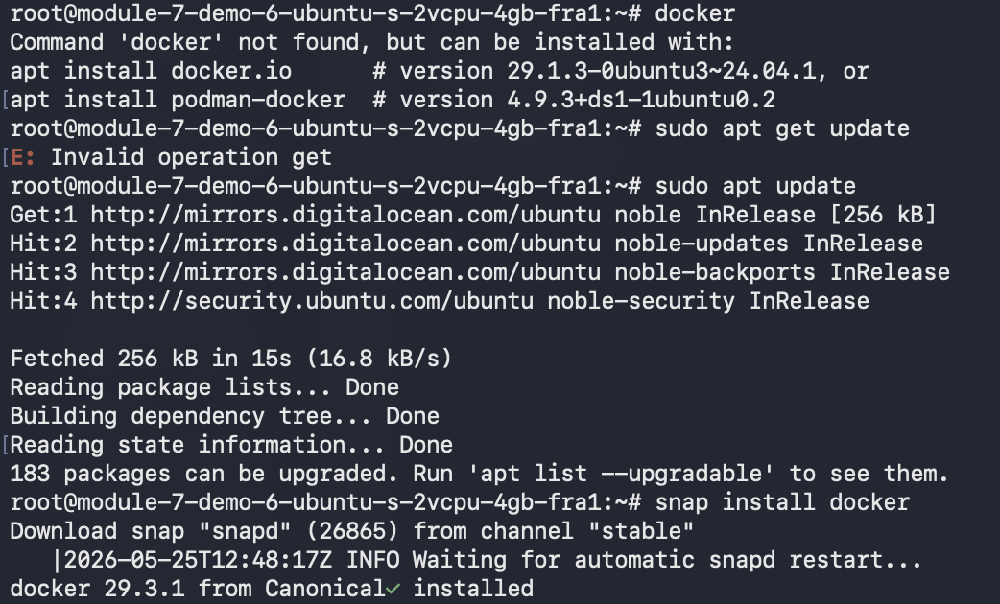
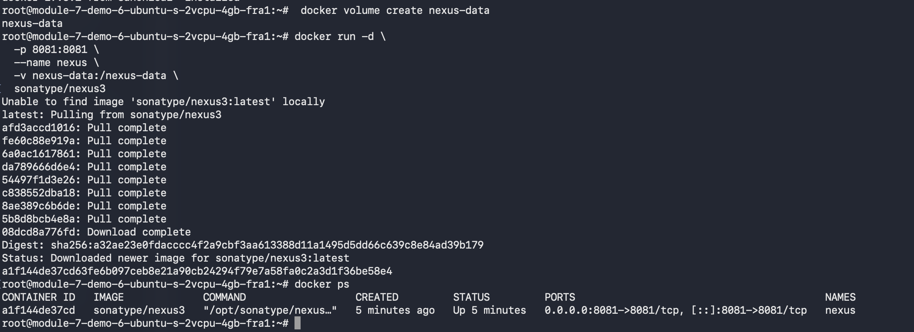
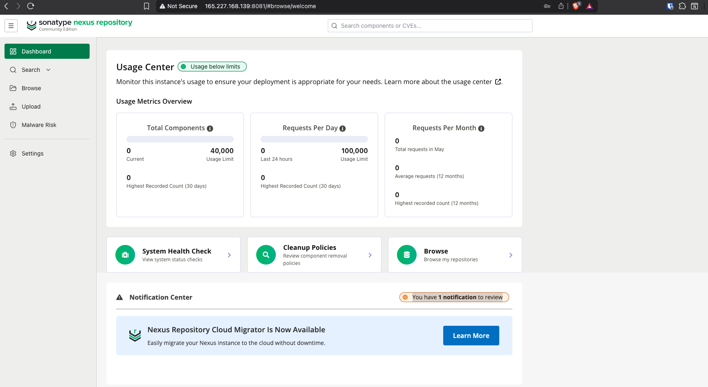

# Module 7 — Containers with Docker

## Demo Project: Deploy Nexus as Docker Container

**Technologies:** Docker · Nexus · DigitalOcean · Linux

**Part of:** [TWN DevOps Bootcamp](https://github.com/GiorgiKalandadze/twn-devops-bootcamp)

---

## Project Description

- Provision a 4 GB Ubuntu Droplet on DigitalOcean
- Install Docker on the Droplet using snap
- Create a named volume for Nexus data persistence
- Run the official `sonatype/nexus3` image as a detached container
- Complete the Nexus setup wizard via browser
- Destroy and recreate the container to prove data survives via the volume

---

## Architecture

```
  DigitalOcean Droplet — FRA1 — Ubuntu 24.04 LTS — 4 GB RAM
  ─────────────────────────────────────────────────────────

  ┌──────────────────────────────────────────────────────┐
  │   Docker daemon                                      │
  │                                                      │
  │   ┌──────────────────────────────────────────────┐  │
  │   │  nexus container                             │  │
  │   │  image: sonatype/nexus3                      │  │
  │   │  :8081  Nexus UI                             │◄─────── port 8081
  │   │                                              │   (mapped to host)
  │   │  /nexus-data  ← persistent data directory   │  │
  │   └─────────────────────┬────────────────────────┘  │
  │                         │ volume mount               │
  │                         ▼                            │
  │   ┌──────────────────────────────────────────────┐  │
  │   │  Docker volume: nexus-data                   │  │
  │   │  (survives container stop, rm, recreation)   │  │
  │   └──────────────────────────────────────────────┘  │
  └──────────────────────────────────────────────────────┘
                         ▲
                         │ HTTP :8081
                         │
                  Browser (your laptop)

  Firewall (demo-firewall)
  ┌─────────────────────────────────────────┐
  │  TCP 22   — SSH        — your IP only   │
  │  TCP 8081 — Nexus UI   — your IP only   │
  └─────────────────────────────────────────┘
```

---

## Traditional Install vs Containerized

| Step | Traditional (Module 6) | Containerized (this demo) |
|---|---|---|
| Install Java | `apt install openjdk-17` | Built into Nexus image |
| Download Nexus | `wget`, `tar -xvzf` | `docker pull sonatype/nexus3` |
| Create Linux user | `adduser nexus`, chown dirs | Done inside the image |
| Configure nexus.rc | Edit file manually | N/A |
| Start | `su - nexus && /opt/nexus/bin/nexus start` | `docker run` |
| Data persistence | `/opt/sonatype-work/` on host | Named Docker volume |
| Restart | manual | `docker restart nexus` |
| Upgrade | tarball + manual config migration | `docker pull && docker restart` |

---

## Steps

### Step 1 — Create Droplet and Cloud Firewall

Create a new Droplet:

- **Image:** Ubuntu 24.04 (LTS) x64
- **Size:** s-2vcpu-4gb ($24/month) — Nexus needs at least 4 GB RAM
- **Region:** Frankfurt (FRA1)
- **Authentication:** SSH key
- **Hostname:** `module-7-demo-6`

Attach a Cloud Firewall with a single inbound rule to start:

| Type   | Protocol | Port | Source       |
|--------|----------|------|--------------|
| Custom | TCP      | 22   | Your IP only |

---

### Step 2 — Install Docker on the Droplet

```bash
ssh root@<DROPLET_IP>
snap install docker
docker --version
```



---

### Step 3 — Create a Named Volume

```bash
docker volume create nexus-data
docker volume ls
```

A named volume is managed by Docker and lives outside any container. Deleting the container leaves the volume — and all Nexus data — untouched.

---

### Step 4 — Run the Nexus Container

```bash
docker run -d \
  -p 8081:8081 \
  --name nexus \
  -v nexus-data:/nexus-data \
  sonatype/nexus3
```

What each flag does:

| Flag | Purpose |
|---|---|
| `-d` | Run detached (in the background) |
| `-p 8081:8081` | Map host port 8081 → container port 8081 |
| `--name nexus` | Name the container so it can be referenced by name |
| `-v nexus-data:/nexus-data` | Mount the named volume to Nexus's data directory inside the container |
| `sonatype/nexus3` | Official Nexus image from Docker Hub |

---

### Step 5 — Verify and Watch Startup Logs

```bash
docker ps
docker logs -f nexus
```

Nexus takes ~60 seconds to start. Wait for the line:

```
Started Sonatype Nexus OSS ...
```

Then press `Ctrl+C` to exit the log tail.



---

### Step 6 — Open Firewall Port 8081

In the DigitalOcean console → Networking → Firewalls → your firewall → add an inbound rule:

| Type   | Protocol | Port | Source       |
|--------|----------|------|--------------|
| Custom | TCP      | 22   | Your IP only |
| Custom | TCP      | 8081 | Your IP only |

---

### Step 7 — Get Initial Admin Password

The initial admin password is generated on first run and stored inside the named volume at `/nexus-data/admin.password`:

```bash
docker exec nexus cat /nexus-data/admin.password
```

Copy the output — you need it for the next step.

---

### Step 8 — Complete Setup Wizard

Open `http://<DROPLET_IP>:8081` in a browser. Sign in as `admin` with the password from step 7. Complete the wizard:

1. Set a new admin password — **remember this, you will need it after the container recreation**
2. Disable anonymous access

After the wizard completes, Nexus deletes `/nexus-data/admin.password` automatically.



---

### Step 9 — Verify the Volume Exists

```bash
docker volume ls
docker volume inspect nexus-data
```

Confirm `nexus-data` is listed. The volume lives independently of the container — restarting or removing the container leaves it intact.


---

## What I Learned

- **Anything installable on Linux can be containerized.** Nexus as a Docker container vs Module 6's traditional install — same outcome, ~15× less effort
- **Named volumes decouple data from container lifecycle.** `docker rm nexus` destroys the container; `docker volume rm nexus-data` is a separate action that destroys the data. Two distinct intents
- **Stateful apps in containers need volumes mounted at the right path.** Nexus expects its data at `/nexus-data` — that's the mount target; mounting anywhere else means data loss on recreation
- **Container restart vs recreate:** `docker restart nexus` keeps the container; `docker rm && docker run` makes a fresh container but data persists via the volume
- **Initial credentials live inside the volume**, not in the image. That's why `docker exec nexus cat /nexus-data/admin.password` works, and why the file disappears after the setup wizard runs
- **Containerized infrastructure tools are the standard.** Jenkins, Nexus, Prometheus, Grafana — all commonly run as containers. This pattern transfers directly to later modules

---

## Useful Reference Commands

```bash
# Run Nexus container
docker run -d -p 8081:8081 --name nexus -v nexus-data:/nexus-data sonatype/nexus3

# Inspect
docker ps
docker logs -f nexus
docker exec nexus cat /nexus-data/admin.password

# Manage
docker restart nexus
docker stop nexus && docker rm nexus    # destroy container, volume intact
docker volume ls
docker volume inspect nexus-data
docker exec -it nexus bash              # shell inside container
```

---

## Cleanup

```bash
docker stop nexus && docker rm nexus
docker volume rm nexus-data    # also destroys all Nexus data
```

DigitalOcean console:
1. Destroy the Droplet
2. Delete the Cloud Firewall if not reusing it

To keep Nexus around for later modules, skip the volume removal step.

---

## Screenshots

| # | Filename | Shows |
|---|---|---|
| 01 | `01-docker-installed.png` | Terminal on Droplet: `docker --version` output after install |
| 02 | `02-nexus-container-running.png` | Terminal: `docker ps` showing nexus container + log line "Started Sonatype Nexus" |
| 03 | `03-nexus-ui-loaded.png` | Browser: Nexus UI at `http://<DROPLET_IP>:8081` after login |
| 04 | `04-volume-exists.png` | Terminal: `docker volume ls` and `docker volume inspect nexus-data` output |

---

## What to Blur / Not Commit

- Nexus admin password (initial or new) in any screenshot — blur
- Droplet IP in browser URL bar and SSH prompts — blur
- Your home IP in the firewall Source column — blur
- README uses `<DROPLET_IP>` placeholder throughout; no real values committed

---

*Estimated time: 30 minutes · Cost: ~$0.20 (4 GB Droplet at $0.036/hr)*
